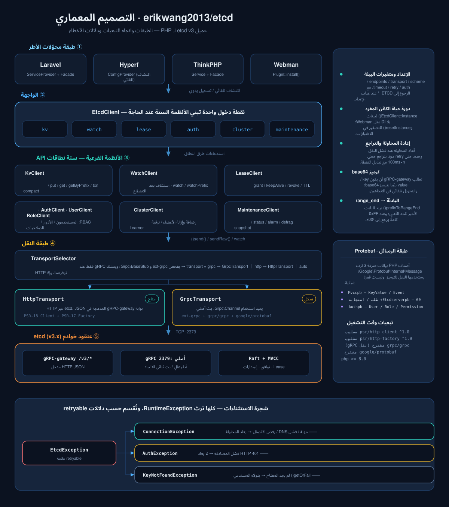
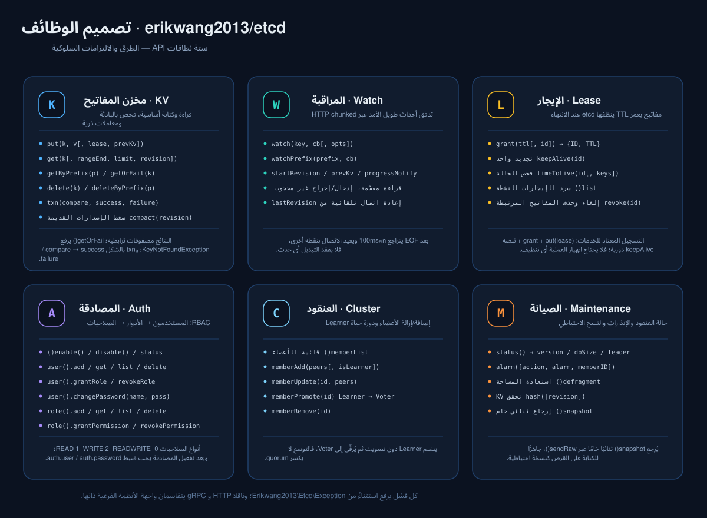
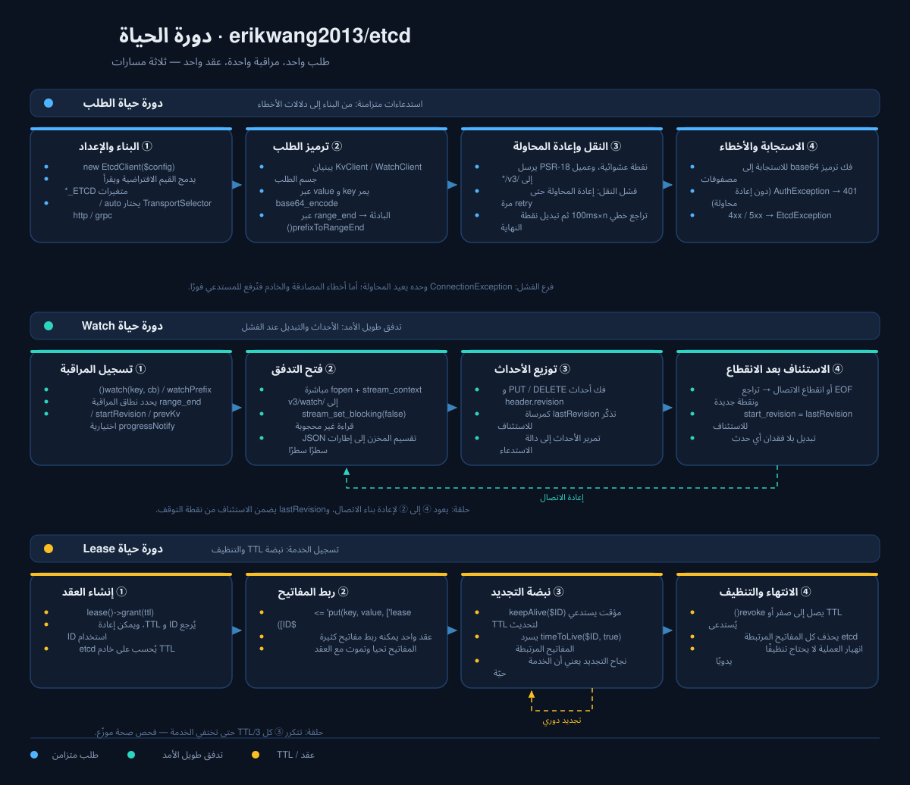

# erikwang2013/etcd

<p align="center">
  <a href="../../README.md">简体中文</a> ·
  <a href="README.en.md">English</a> ·
  <a href="README.ko.md">한국어</a> ·
  <a href="README.ru.md">Русский</a> ·
  <a href="README.de.md">Deutsch</a> ·
  <a href="README.fr.md">Français</a> ·
  <a href="README.es.md">Español</a> ·
  <a href="README.pt.md">Português</a> ·
  <a href="README.hi.md">हिन्दी</a> ·
  <a href="README.ar.md">العربية</a> ·
  <a href="README.bn.md">বাংলা</a> ·
  <a href="README.id.md">Bahasa Indonesia</a> ·
  <a href="README.ja.md">日本語</a>
</p>

<p align="center">
  
</p>

<p align="center">
  <b>Etchy</b> · فيل صغير يحمل على رأسه عنقود Raft من ثلاث عُقد، ويتدلّى من طرف خرطومه <code>k/v</code> و<code>rev</code> ——<br/>
  يحرس إعداداتك وعقودك: إن انقطع الاتصال أعاد الاتصال بنفسه، وإن انتهى العقد نظّف نفسه.
</p>

عميل etcd v3 للغة PHP —— نقل مزدوج gRPC + HTTP، يغطي كامل واجهات etcd v3 (KV / Watch / Lease / Auth / Cluster / Maintenance)، وجاهز للاستخدام مباشرة مع **Laravel / Hyperf / ThinkPHP / Webman**.

## المتطلبات

- PHP >= 8.1
- خادم etcd v3.x
- يكفي أحد مسارات HTTP: ext-curl أو غلاف التدفقات في PHP (allow_url_fopen) أو عميل PSR-18 خاص بك — يُختار تلقائيًا، مع رسالة واضحة عند عدم توفر أي منها

## التثبيت

```bash
composer require erikwang2013/etcd
```

### PHP الخام (بدون إطار عمل)

لا حاجة إلى إطار عمل ولا إلى تطبيق PSR-18 ولا إلى ext-curl — يُستخدم ext-curl عند تحميله، وإلا يتحول العميل تلقائيًا إلى غلاف التدفقات في PHP.

```php
<?php
require __DIR__ . '/vendor/autoload.php';   // مسار autoload الخاص بك

use Erikwang2013\Etcd\EtcdClient;

$etcd = new EtcdClient(['endpoints' => ['127.0.0.1:2379']]);

$etcd->kv()->put('/app/config', '{"debug":true}');
echo $etcd->kv()->getOrFail('/app/config')['value'], "\n";

// المسار المستخدم فعليًا: curl / stream / none
var_dump(Erikwang2013\Etcd\Transport\HttpTransport::detectDriver());
```

لفرض مسار معيّن استخدم `'driver' => 'stream'` (الافتراضي `auto`). وإذا لم يتوفر أي من الثلاثة، يرفع الطلب استثناء `ConnectionException` يمكن التقاطه ويوضح ما يجب تمكينه.

## البدء السريع

```php
use Erikwang2013\Etcd\EtcdClient;

$etcd = new EtcdClient(['endpoints' => ['127.0.0.1:2379']]);

// كتابة
$etcd->kv()->put('/app/config', '{"debug":true}');

// قراءة
$result = $etcd->kv()->get('/app/config');
print_r($result['kvs'][0]);  // ['key' => '/app/config', 'value' => '{"debug":true}', ...]

// يرفع استثناءً عند عدم العثور
$kv = $etcd->kv()->getOrFail('/app/config');

// فحص بالبادئة
$all = $etcd->kv()->getByPrefix('/app/');
echo "عدد المفاتيح: {$all['count']}\n";

// حذف
$etcd->kv()->delete('/app/config');
$etcd->kv()->deleteByPrefix('/cache/');

// كتابة مع lease (تُحذف تلقائيًا بعد 60 ثانية)
$lease = $etcd->lease()->grant(60);
$etcd->kv()->put('/session/123', 'active', ['lease' => $lease['ID']]);

// تجديد
$etcd->lease()->keepAlive($lease['ID']);
```

## الإعداد

```php
$etcd = new EtcdClient([
    'endpoints' => ['192.168.1.10:2379', '192.168.1.11:2379'],  // عُقد متعددة
    'transport' => 'auto',  // auto(افتراضي)| http | grpc
    'driver'    => 'auto',  // auto (الافتراضي) | curl | stream
    'scheme'    => 'http',  // http(افتراضي)| https
    'timeout'   => 5.0,     // ثوانٍ
    'retry'     => 3,       // عدد محاولات إعادة الاتصال
    'auth'      => [        // اختياري، Basic Auth
        'user'     => 'root',
        'password' => 'secret',
    ],
]);
```

### متغيرات البيئة

عند عدم تمرير إعدادات، تُقرأ متغيرات البيئة تلقائيًا:

| المتغير | القيمة الافتراضية | الوصف |
|------|--------|------|
| `ETCD_ENDPOINTS` | `127.0.0.1:2379` | عناوين العُقد متعددة، مفصولة بفواصل |
| `ETCD_TRANSPORT` | `auto` | auto / http / grpc |
| `ETCD_TIMEOUT` | `5.0` | مهلة الطلب (بالثواني) |
| `ETCD_SCHEME` | `http` | http / https |
| `ETCD_RETRY` | `2` | عدد محاولات إعادة الاتصال |
| `ETCD_DRIVER` | `auto` | مسار HTTP: auto / curl / stream |
| `ETCD_USER` | — | اسم مستخدم etcd |
| `ETCD_PASSWORD` | — | كلمة مرور etcd |

## مرجع API

### KV — عمليات المفاتيح والقيم

```php
// كتابة
$etcd->kv()->put('key', 'value', [
    'lease'       => 12345,    // ربط معرّف العقد
    'prevKv'      => true,     // إرجاع القيمة القديمة قبل الكتابة
    'ignoreValue' => false,
    'ignoreLease' => false,
]);

// قراءة مفتاح واحد
$etcd->kv()->get('/exact/key');

// يرفع استثناءً فور عدم العثور
$kv = $etcd->kv()->getOrFail('/exact/key');

// فحص بالبادئة
$etcd->kv()->getByPrefix('/prefix/');

// استعلام بنطاق (المعاملات الكاملة)
$etcd->kv()->get('/start', [
    'rangeEnd'    => '/startz',      // مفتاح نهاية النطاق
    'limit'       => 100,             // أقصى عدد عناصر مُرجعة
    'revision'    => 42,              // رقم إصدار اللقطة
    'sortOrder'   => 'ascend',        // none | ascend | descend
    'sortTarget'  => 'key',           // key | version | create | mod | value
    'serializable'=> true,            // تخطي توافق Raft (أسرع، وقد يكون قديمًا)
    'keysOnly'    => true,            // إرجاع المفاتيح فقط دون القيم
    'countOnly'   => false,           // إرجاع العدد فقط
]);

// حذف
$etcd->kv()->delete('/key');
$etcd->kv()->deleteByPrefix('/prefix/');
$etcd->kv()->delete('/key', ['prevKv' => true]);  // إرجاع القيمة المحذوفة أيضًا

// معاملة (CAS ذرية)
$etcd->kv()->txn(
    compare: [
        ['result' => 0, 'target' => 3, 'key' => '/counter', 'value' => '100']
    ],
    success: [
        ['request_put' => ['key' => '/counter', 'value' => '101']]
    ],
    failure: [
        ['request_put' => ['key' => '/counter', 'value' => '1']]
    ]
);

// ضغط الإصدارات القديمة (تحرير المساحة)
$etcd->kv()->compact(1000);
```

**ثوابت هدف المقارنة (target):** `0`=VERSION, `1`=CREATE, `2`=MOD, `3`=VALUE, `4`=LEASE  
**ثوابت نتيجة المقارنة (result):** `0`=EQUAL, `1`=GREATER, `2`=LESS, `3`=NOT_EQUAL

### Watch — مراقبة التغييرات

```php
// مراقبة مفتاح واحد (وضع حاجب، يُفضَّل داخل coroutine أو عملية مستقلة)
$etcd->watch()->watch('/config/key', function (array $events) {
    foreach ($events as $event) {
        // $event: ['type' => 'PUT'|'DELETE', 'kv' => [...], 'prev_kv' => [...]|null]
        echo "{$event['type']} {$event['kv']['key']} = {$event['kv']['value']}\n";
    }
});

// مراقبة تغييرات كل المفاتيح تحت بادئة
$etcd->watch()->watchPrefix('/config/', $callback, [
    'startRevision' => 100,       // البدء من إصدار محدد
    'prevKv'        => true,      // إرجاع القيمة الأصلية في حدث DELETE
    'progressNotify'=> true,      // إرسال أحداث فارغة دوريًا (نبضة)
]);
```

**إعادة الاتصال بعد الانقطاع:** عند انقطاع اتصال Watch يُستأنف تلقائيًا من آخر revision تم استلامه، فلا تُفقد أي أحداث.

### Lease — الإيجار

```php
// إنشاء عقد
$lease = $etcd->lease()->grant(300);             // TTL مدته 300 ثانية
$lease = $etcd->lease()->grant(300, 99999);      // تحديد معرّف العقد

// تجديد (مرة واحدة)
$result = $etcd->lease()->keepAlive($lease['ID']);
echo "TTL المتبقي: {$result['TTL']} ثانية";

// عرض حالة العقد
$info = $etcd->lease()->timeToLive($lease['ID']);
$info = $etcd->lease()->timeToLive($lease['ID'], true);  // مع قائمة المفاتيح المرتبطة

// سرد كل العقود النشطة
$leases = $etcd->lease()->list();

// إلغاء العقد (تُحذف كل المفاتيح المرتبطة فورًا)
$etcd->lease()->revoke($lease['ID']);
```

**سيناريو نموذجي:** عند تسجيل خدمة، أنشئ إيجارًا واكتب المفتاح، ثم استدعِ `keepAlive()` دوريًا كنبضة تجديد؛ وبعد توقف الخدمة ينتهي الإيجار ويُنظَّف تلقائيًا.

### Auth — المصادقة والصلاحيات

```php
$auth = $etcd->auth();

// === إدارة المستخدمين ===
$auth->user()->add('alice', 'password123');          // إنشاء مستخدم
$auth->user()->get('alice');                         // عرض المستخدم وأدواره
$auth->user()->list();                               // سرد كل المستخدمين
$auth->user()->changePassword('alice', 'newpass');    // تغيير كلمة المرور
$auth->user()->grantRole('alice', 'admin');          // منح دور
$auth->user()->revokeRole('alice', 'admin');         // إلغاء دور
$auth->user()->delete('alice');                      // حذف المستخدم

// === إدارة الأدوار ===
$auth->role()->add('reader');                        // إنشاء دور
$auth->role()->get('reader');                        // عرض صلاحيات الدور
$auth->role()->list();                               // سرد كل الأدوار

// منح صلاحية (permType: 0=READ, 1=WRITE, 2=READWRITE)
$auth->role()->grantPermission('reader', 0, '/data/', "\0");   // صلاحية قراءة على البادئة /data/
$auth->role()->grantPermission('writer', 2, '/data/', "\0");   // صلاحية قراءة وكتابة
$auth->role()->revokePermission('reader', '/data/', "\0");     // إلغاء الصلاحية
$auth->role()->delete('reader');

// === مفتاح المصادقة ===
$auth->enable();           // تفعيل المصادقة
$auth->disable();          // تعطيل المصادقة
$status = $auth->status(); // ['enabled' => true, 'authRevision' => 5]
```

**ملاحظة:** بعد تفعيل المصادقة، يجب ضبط `auth.user` و`auth.password` في العميل لمواصلة العمل.

### Cluster — إدارة العنقود

```php
// عرض أعضاء العنقود
$members = $etcd->cluster()->memberList();

// إضافة عضو
$etcd->cluster()->memberAdd(['http://node3:2380']);        // إضافة عضو Voting
$etcd->cluster()->memberAdd(['http://node4:2380'], true);  // إضافة عضو Learner

// تعديل peer URL للعضو
$etcd->cluster()->memberUpdate(123456, ['http://newnode:2380']);

// ترقية Learner إلى Voter
$etcd->cluster()->memberPromote(789012);

// إزالة عضو
$etcd->cluster()->memberRemove(345678);
```

### Maintenance — الصيانة

```php
// عرض حالة العقدة
$status = $etcd->maintenance()->status();
// ['version' => '3.5.0', 'dbSize' => 24576, 'leader' => 123, 'raftIndex' => 1000, ...]

// إدارة الإنذارات
$alarms = $etcd->maintenance()->alarm();                    // عرض الإنذارات
$etcd->maintenance()->alarm(action: 2, alarm: 1);           // مسح إنذار NOSPACE

// إعادة تنظيم (استعادة المساحة)
$etcd->maintenance()->defragment();

// تحقق تجزئة KV
$hash = $etcd->maintenance()->hash();

// الحصول على snapshot (بيانات ثنائية تُكتب في ملف)
$snapshot = $etcd->maintenance()->snapshot();
file_put_contents('/backup/etcd-snapshot.db', $snapshot);
```

## أوضاع النقل

| الوضع | الحالة | التبعيات | حالة الاستخدام |
|------|------|------|---------|
| **HTTP** | متاح | ext-curl / stream / PSR-18 (أي واحد) | بلا اعتماد على أي امتداد، وجاهز فورًا |
| **gRPC** | هيكل | ext-grpc + grpc/grpc + google/protobuf | أداء عالٍ وبث أصلي |
| **auto** | افتراضي | اكتشاف تلقائي | gRPC إن توفر، وإلا HTTP |

منطق الاكتشاف في وضع `auto`:
1. `extension_loaded('grpc')` — هل امتداد C محمّل؟
2. `class_exists('Grpc\BaseStub')` — هل حزمة composer ‏`grpc/grpc` مثبتة؟

لا يُسلك مسار gRPC إلا عند تحقق الشرطين معًا، وإلا يُستخدم HTTP.

### إعداد عميل PSR-18 HTTP يدويًا

```php
use Erikwang2013\Etcd\Transport\HttpTransport;
use GuzzleHttp\Client;
use GuzzleHttp\Psr7\HttpFactory;

$transport = new HttpTransport(['127.0.0.1:2379'], ['timeout' => 3.0]);
$transport->setHttpClient(
    new Client(['timeout' => 3]),
    new HttpFactory(),
    new HttpFactory()
);
```

## تكامل الأطر

### Laravel

يعمل بمجرد التثبيت. يكتشف `extra.laravel` في composer.json مزوّد الخدمة والواجهة (ServiceProvider و Facade) تلقائيًا.

```php
// عبر Facade
use Etcd;
Etcd::kv()->put('/foo', 'bar');
$val = Etcd::kv()->get('/foo');

// عبر حقن التبعيات
use Erikwang2013\Etcd\EtcdClient;

class MyService
{
    public function __construct(private EtcdClient $etcd) {}

    public function work(): void
    {
        $this->etcd->kv()->put('/key', 'value');
    }
}
```

نشر ملف الإعداد:

```bash
php artisan vendor:publish --tag=etcd-config
# → config/etcd.php
```

إعداد `.env`:

```env
ETCD_ENDPOINTS=10.0.0.1:2379,10.0.0.2:2379
ETCD_USER=root
ETCD_PASSWORD=secret
```

### Hyperf

يعمل بمجرد التثبيت. يكتشف Hyperf الـ `ConfigProvider` تلقائيًا.

```php
use Erikwang2013\Etcd\EtcdClient;
use Hyperf\Di\Annotation\Inject;

class MyService
{
    #[Inject]
    private EtcdClient $etcd;

    public function work(): void
    {
        $this->etcd->kv()->put('/key', 'value');
    }
}

// أو عبر make مباشرة
$etcd = make(EtcdClient::class);
```

نشر الإعداد:

```bash
php bin/hyperf.php vendor:publish erikwang2013/etcd
# → config/autoload/etcd.php
```

### ThinkPHP

1. بعد التثبيت، سجّله في `app/service.php`:

```php
return [
    Erikwang2013\Etcd\Adapter\ThinkPHP\Service::class,
];
```

2. أنشئ ملف الإعداد `config/etcd.php`.

الاستخدام:

```php
// عبر Facade
use think\facade\Etcd;
Etcd::kv()->put('/key', 'value');

// عبر الحاوية
app('etcd')->kv()->get('/key');
```

### Webman

يعمل بمجرد التثبيت، دون أي إعداد إضافي.

```php
use Erikwang2013\Etcd\EtcdClient;

$etcd = EtcdClient::instance();
$etcd->kv()->put('/key', 'value');
```

إذا احتجت إعدادًا مخصصًا، فحرّر `plugin/erikwang2013/etcd/config/etcd.php`.

## معالجة الاستثناءات

```php
use Erikwang2013\Etcd\Exception\{
    EtcdException,
    ConnectionException,
    AuthException,
    KeyNotFoundException,
};

try {
    $etcd->kv()->put('/key', 'value');
} catch (ConnectionException $e) {
    // تعذّر الاتصال بعقدة etcd (عطل شبكي أو توقف الخدمة)
} catch (AuthException $e) {
    // فشل المصادقة (اسم مستخدم أو كلمة مرور خاطئة)
} catch (KeyNotFoundException $e) {
    // المفتاح غير موجود عند getOrFail()
} catch (EtcdException $e) {
    // أخطاء أخرى من خادم etcd
}
```

## بنية المشروع

```
erikwang2013/etcd/
├── composer.json                    # تعريف الحزمة: تحميل تلقائي PSR-4 + اكتشاف تلقائي لـ Laravel / Hyperf
├── phpunit.xml                      # إعداد PHPUnit (مجموعتا unit / integration)
├── config/etcd.php                  # الإعداد الافتراضي، يُنشر لكل إطار (يقرأ متغيرات ETCD_*)
├── .github/workflows/release.yml    # نشر تلقائي عند إنشاء tag
├── scripts/i18n/                    #   أدوات التوثيق: الكتالوجات، بناء المخططات، فحص الترجمات
├── docs/                            # التوثيق والمخططات
│   ├── design-cn.md                 #   مستند التصميم
│   ├── i18n/                        #   ملفات README والمخططات المترجمة لـ 13 لغة
│   ├── pet.svg                      #   حيوان المشروع Etchy
│   ├── architecture.svg             #   مخطط التصميم المعماري
│   ├── features.svg                 #   مخطط تصميم الوظائف
│   └── lifecycle.svg                #   مخطط دورة الحياة
├── src/
│   ├── EtcdClient.php               # الواجهة العليا + الكائن المفرد: kv / watch / lease / auth / cluster / maintenance
│   ├── Mascot.php                   # نقطة الوصول إلى حيوان المشروع Etchy (svg / dataUri / path)
│   ├── Install.php                  # خطّاف إضافة Webman (WEBMAN_PLUGIN)
│   ├── Transport/                   # طبقة النقل
│   │   ├── TransportInterface.php   #   تجريد النقل: send / sendRaw / watch
│   │   ├── TransportSelector.php    #   اختيار تلقائي لـ auto / http / grpc
│   │   ├── HttpTransport.php        #   نقل HTTP JSON (كامل وجاهز)
│   │   └── GrpcTransport.php        #   نقل gRPC (هيكل)
│   ├── Kv/KvClient.php              # قراءة/كتابة KV / فحص بالبادئة / معاملات / ضغط
│   ├── Watch/WatchClient.php        # مراقبة تغييرات Watch + استئناف بعد الانقطاع
│   ├── Lease/LeaseClient.php        # عقد Lease عبر grant / keepAlive / revoke
│   ├── Auth/                        # مصادقة وتخويل Auth
│   │   ├── AuthClient.php           #   مفتاح المصادقة وحالتها
│   │   ├── UserClient.php           #   CRUD للمستخدمين + ربط الأدوار
│   │   └── RoleClient.php           #   CRUD للأدوار + الصلاحيات
│   ├── Cluster/ClusterClient.php    # إدارة أعضاء العنقود Cluster
│   ├── Maintenance/                 # صيانة Maintenance: status / alarm / defrag / snapshot
│   ├── Exception/                   # تدرّج الاستثناءات
│   ├── Protobuf/                    # رسائل Protobuf (أصناف PHP صرفة لا ترث Message)
│   │   ├── Mvccpb/                  #   KeyValue / Event
│   │   ├── Etcdserverpb/            #   60+ رسالة طلب / استجابة
│   │   └── Authpb/                  #   User / Role / Permission
│   └── Adapter/                     # محوّلات الأطر
│       ├── Laravel/                 #   ServiceProvider + Facade
│       ├── Hyperf/                  #   ConfigProvider
│       ├── ThinkPHP/                #   Service + Facade
│       └── Webman/                  #   Plugin
└── tests/
    ├── Unit/                        # اختبارات وحدة (لكل عميل / نقل / محوّل / صنف رسالة)
    ├── Integration/                 # اختبارات تكامل (مع etcd حقيقي)
    └── Support/                     # FakeTransport وبدائل PSR HTTP
```

## المعمارية والمخططات

المخططات الثلاثة مرتّبة وفق «البنية ← القدرات ← التتابع الزمني»، ويمكن فتح كل منها على حدة:

| المخطط | السؤال الذي يجيب عنه | الملف |
|----|-----------|------|
| التصميم المعماري | إلى أي طبقات ينقسم، وإلى أين تتجه التبعيات، وكيف تتفرع الأخطاء | [`docs/architecture.svg`](diagrams/ar/architecture.svg) |
| تصميم الوظائف | ما الطرق التي يوفرها كل نظام فرعي، وما التزاماتها السلوكية | [`docs/features.svg`](diagrams/ar/features.svg) |
| دورة الحياة | كيف تكتمل دورة الطلب / المراقبة / الإيجار كلٌّ على حدة | [`docs/lifecycle.svg`](diagrams/ar/lifecycle.svg) |

### التصميم المعماري



### تصميم الوظائف



### دورة الحياة



### استخدام Etchy في الكود

تُنشر الرسوم مع الحزمة، و`Mascot` هو نقطة الوصول الوحيدة إليها، فلا حاجة إلى نسخ نسخة أخرى عند بناء لوحة إدارة أو صفحة حالة:

```php
use Erikwang2013\Etcd\Mascot;

echo Mascot::svg();                                          // كود SVG، يُضمَّن مباشرة
echo '';    // data URI، دون الحاجة إلى مجلد web
copy(Mascot::path(), __DIR__ . '/public/etcd.svg');          // أو انسخه بنفسك إلى مجلد ثابت
```

في Laravel يمكن النشر مباشرة إلى `public/`:

```bash
php artisan vendor:publish --tag=etcd-assets
# → public/vendor/etcd/pet.svg
```

## مفتوح المصدر ليس سهلًا، ودعمكم مرحّب به / Support This Project

<p align="center">
  <table>
    <tr>
      <td align="center"><b>微信 / WeChat</b></td>
      <td align="center"><b>支付宝 / Alipay</b></td>
    </tr>
    <tr>
      <td align="center"></td>
      <td align="center"></td>
    </tr>
  </table>
</p>

---

## License

MIT — Copyright (c) 2026 [erik](https://erik.xyz) <erik@erik.xyz>
