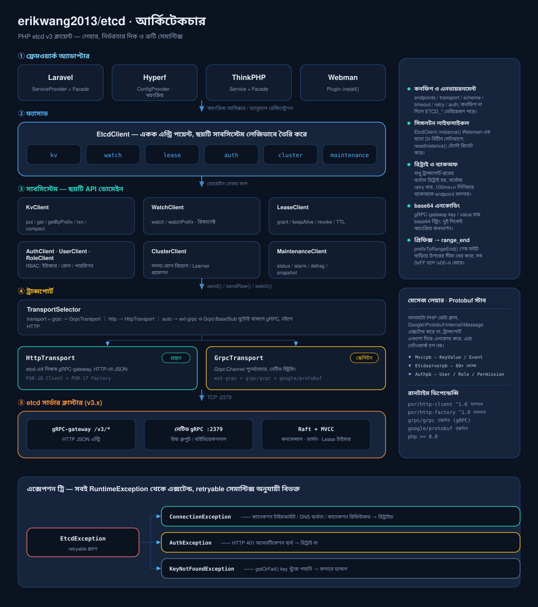
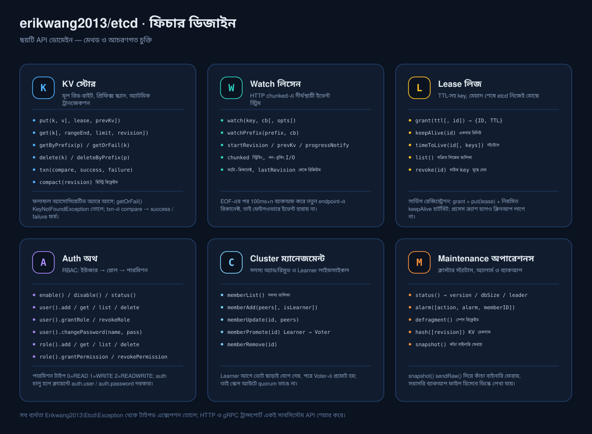
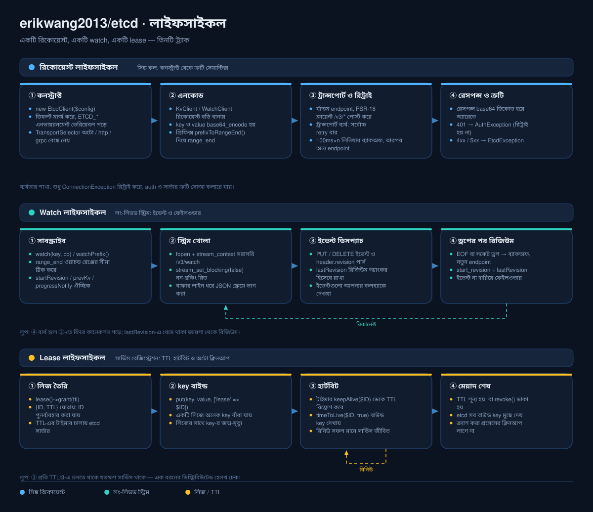

# erikwang2013/etcd

<p align="center">
  <a href="../../README.md">简体中文</a> ·
  <a href="README.en.md">English</a> ·
  <a href="README.ko.md">한국어</a> ·
  <a href="README.ru.md">Русский</a> ·
  <a href="README.de.md">Deutsch</a> ·
  <a href="README.fr.md">Français</a> ·
  <a href="README.es.md">Español</a> ·
  <a href="README.pt.md">Português</a> ·
  <a href="README.hi.md">हिन्दी</a> ·
  <a href="README.ar.md">العربية</a> ·
  <a href="README.bn.md">বাংলা</a> ·
  <a href="README.id.md">Bahasa Indonesia</a> ·
  <a href="README.ja.md">日本語</a>
</p>

<p align="center">
  
</p>

<p align="center">
  <b>Etchy</b> · মাথায় তিন-নোডের Raft ক্লাস্টার, শুঁড়ে <code>k/v</code> আর <code>rev</code> ঝুলিয়ে রাখা ছোট্ট হাতি ——<br/>
  তোমার কনফিগ আর লিজ পাহারা দেয়: কানেকশন গেলে নিজেই রিকানেক্ট, মেয়াদ শেষে নিজেই ক্লিনআপ।
</p>

PHP etcd v3 ক্লায়েন্ট —— দ্বৈত মোড ট্রান্সপোর্ট (HTTP পূর্ণ সুবিধা / gRPC ইউনারি RPC), etcd v3-এর সম্পূর্ণ API (KV / Watch / Lease / Auth / Cluster / Maintenance / Election / Lock) কভার করে, আর **Laravel / Hyperf / ThinkPHP / Webman**-এ আউট-অব-দ্য-বক্স চলে।

## প্রয়োজনীয়তা

- PHP >= 8.1
- etcd v3.x সার্ভার
- যেকোনো একটি HTTP পথই যথেষ্ট: ext-curl, PHP stream wrapper (allow_url_fopen), বা আপনার নিজের PSR-18 ক্লায়েন্ট — স্বয়ংক্রিয়ভাবে বেছে নেওয়া হয়, কোনোটিই না থাকলে স্পষ্ট ত্রুটি দেয়

## ইনস্টলেশন

```bash
composer require erikwang2013/etcd
```

### খাঁটি PHP (ফ্রেমওয়ার্ক ছাড়া)

ফ্রেমওয়ার্ক, PSR-18 implementation বা ext-curl — কোনোটিই লাগে না। ext-curl লোড থাকলে সেটাই ব্যবহৃত হয়, না থাকলে ক্লায়েন্ট নিজে থেকেই PHP-র stream wrapper-এ চলে যায়।

```php
<?php
require __DIR__ . '/vendor/autoload.php';   // আপনার autoload

use Erikwang2013\Etcd\EtcdClient;

$etcd = new EtcdClient(['endpoints' => ['127.0.0.1:2379']]);

$etcd->kv()->put('/app/config', '{"debug":true}');
echo $etcd->kv()->getOrFail('/app/config')['value'], "\n";

// এখন কোন পথ ব্যবহার হচ্ছে: curl / stream / none
var_dump(Erikwang2013\Etcd\Transport\HttpTransport::detectDriver());
```

নির্দিষ্ট পথ বাধ্যতামূলক করতে `'driver' => 'stream'` (ডিফল্ট `auto`) দিন। তিনটির কোনোটিই না থাকলে অনুরোধ catch করা যায় এমন `ConnectionException` ছোড়ে, যাতে কী চালু করতে হবে তা বলা থাকে।

## দ্রুত শুরু

```php
use Erikwang2013\Etcd\EtcdClient;

$etcd = new EtcdClient(['endpoints' => ['127.0.0.1:2379']]);

// লেখা
$etcd->kv()->put('/app/config', '{"debug":true}');

// পড়া
$result = $etcd->kv()->get('/app/config');
print_r($result['kvs'][0]);  // ['key' => '/app/config', 'value' => '{"debug":true}', ...]

// না মিললে এক্সেপশন তোলে
$kv = $etcd->kv()->getOrFail('/app/config');

// prefix স্ক্যান
$all = $etcd->kv()->getByPrefix('/app/');
echo "মোট {$all['count']}টি কী\n";

// মুছে ফেলা
$etcd->kv()->delete('/app/config');
$etcd->kv()->deleteByPrefix('/cache/');

// lease সহ লেখা (60 সেকেন্ড পরে স্বয়ংক্রিয়ভাবে মুছে যায়)
$lease = $etcd->lease()->grant(60);
$etcd->kv()->put('/session/123', 'active', ['lease' => $lease['ID']]);

// রিনিউ
$etcd->lease()->keepAlive($lease['ID']);
```

## কনফিগারেশন

```php
$etcd = new EtcdClient([
    'endpoints' => ['192.168.1.10:2379', '192.168.1.11:2379'],  // একাধিক নোড
    'transport' => 'auto',  // auto (ডিফল্ট) | http | grpc
    'driver'    => 'auto',  // auto (ডিফল্ট) | curl | stream
    'scheme'    => 'http',  // http (ডিফল্ট) | https
    'timeout'   => 5.0,     // সেকেন্ড
    'retry'     => 3,       // কানেকশন ব্যর্থ হলে রিট্রাই সংখ্যা
    'auth'      => [        // ঐচ্ছিক; ক্রেডেনশিয়াল token-এ বদলাতে https দরকার
        'user'     => 'root',
        'password' => 'secret',
    ],
]);
```

### এনভায়রনমেন্ট ভেরিয়েবল

কনফিগ না দিলে স্বয়ংক্রিয়ভাবে এনভায়রনমেন্ট ভেরিয়েবল পড়া হয়:

| ভেরিয়েবল | ডিফল্ট | বর্ণনা |
|------|--------|------|
| `ETCD_ENDPOINTS` | `127.0.0.1:2379` | কমা দিয়ে আলাদা করা একাধিক নোডের ঠিকানা |
| `ETCD_TRANSPORT` | `auto` | auto / http / grpc |
| `ETCD_TIMEOUT` | `5.0` | রিকোয়েস্ট টাইমআউট (সেকেন্ড) |
| `ETCD_SCHEME` | `http` | http / https |
| `ETCD_RETRY` | `2` | কানেকশন রিট্রাই সংখ্যা |
| `ETCD_DRIVER` | `auto` | HTTP পথ: auto / curl / stream |
| `ETCD_USER` | — | etcd ইউজারনেম |
| `ETCD_PASSWORD` | — | etcd পাসওয়ার্ড |

## API রেফারেন্স

### KV — কি-ভ্যালু অপারেশন

```php
// লেখা
$etcd->kv()->put('key', 'value', [
    'lease'       => 12345,    // লিজ ID বাইন্ড
    'prevKv'      => true,     // লেখার আগের পুরনো value ফেরায়
    'ignoreValue' => false,
    'ignoreLease' => false,
]);

// একক key পড়া
$etcd->kv()->get('/exact/key');

// না মিললেই এক্সেপশন তোলে
$kv = $etcd->kv()->getOrFail('/exact/key');

// prefix স্ক্যান
$etcd->kv()->getByPrefix('/prefix/');

// range কোয়েরি (সম্পূর্ণ প্যারামিটার)
$etcd->kv()->get('/start', [
    'rangeEnd'    => '/startz',      // range-এর শেষ key
    'limit'       => 100,             // সর্বোচ্চ কতটি ফেরাবে
    'revision'    => 42,              // স্ন্যাপশট revision
    'sortOrder'   => 'ascend',        // none | ascend | descend
    'sortTarget'  => 'key',           // key | version | create | mod | value
    'serializable'=> true,            // Raft কনসেন্সাস বাদ (দ্রুত, তবে পুরনো হতে পারে)
    'keysOnly'    => true,            // শুধু key ফেরায়, value নয়
    'countOnly'   => false,           // শুধু সংখ্যা ফেরায়
    'minModRevision'    => 100,       // এই revision বা তার পরের পরিবর্তিত key
    'maxModRevision'    => 200,
    'minCreateRevision' => 100,       // creation revision দিয়ে ফিল্টার
    'maxCreateRevision' => 200,
]);

// মুছে ফেলা
$etcd->kv()->delete('/key');
$etcd->kv()->deleteByPrefix('/prefix/');
$etcd->kv()->delete('/key', ['prevKv' => true]);  // মুছে ফেলা value-ও ফেরায়

// ট্রানজেকশন (অ্যাটমিক CAS)
$etcd->kv()->txn(
    compare: [
        ['result' => 0, 'target' => 3, 'key' => '/counter', 'value' => '100']
    ],
    success: [
        ['request_put' => ['key' => '/counter', 'value' => '101']]
    ],
    failure: [
        ['request_put' => ['key' => '/counter', 'value' => '1']]
    ]
);

// নেস্টেড ট্রানজেকশন: শাখার ভেতরে আরেকটি ট্রানজেকশন থাকতে পারে
$etcd->kv()->txn(
    compare: [['result' => 0, 'target' => 3, 'key' => '/lock', 'value' => 'free']],
    success: [[
        'request_put' => ['key' => '/lock', 'value' => 'mine'],
        'request_txn' => [                       // ভেতরের ট্রানজেকশন
            'compare' => [['result' => 0, 'target' => 1, 'key' => '/lock', 'create_revision' => 0]],
            'success' => [['request_put' => ['key' => '/log', 'value' => 'acquired']]],
            'failure' => [],
        ],
    ]],
    failure: []
);

// পুরনো revision কম্প্যাক্ট (স্টোরেজ খালি করে)
$etcd->kv()->compact(1000);
```

**তুলনা টার্গেট (target) কনস্ট্যান্ট:** `0`=VERSION, `1`=CREATE, `2`=MOD, `3`=VALUE, `4`=LEASE  
**তুলনা ফলাফল (result) কনস্ট্যান্ট:** `0`=EQUAL, `1`=GREATER, `2`=LESS, `3`=NOT_EQUAL

### Watch — পরিবর্তন মনিটরিং

```php
// একক key ওয়াচ (ব্লকিং মোড, করুটিন/আলাদা প্রসেসে চালানো ভালো)
$etcd->watch()->watch('/config/key', function (array $events) {
    foreach ($events as $event) {
        // $event: ['type' => 'PUT'|'DELETE', 'kv' => [...], 'prev_kv' => [...]|null]
        echo "{$event['type']} {$event['kv']['key']} = {$event['kv']['value']}\n";
    }
});

// prefix-এর সব key-র পরিবর্তন ওয়াচ
$etcd->watch()->watchPrefix('/config/', $callback, [
    'startRevision' => 100,       // নির্দিষ্ট revision থেকে শুরু
    'prevKv'        => true,      // DELETE ইভেন্টে আগের value ফেরায়
    'progressNotify'=> true,      // নিয়মিত খালি ইভেন্ট (হার্টবিট) পাঠায়
]);
```

**watch থামানো:** `watch()` অনবরত ব্লক থাকে; তাকে একটি `WatchHandle` দিলে বাইরে থেকে থামানো যায় (SIGTERM-এ শেষ হওয়া দীর্ঘকালীন প্রসেসের চিরাচরিত প্রয়োজন):

```php
use Erikwang2013\Etcd\Support\WatchHandle;

$handle = new WatchHandle();
pcntl_async_signals(true);
pcntl_signal(SIGTERM, fn() => $handle->cancel());

$etcd->watch()->watchPrefix('/config/', $onEvent, ['handle' => $handle]);
```

`cancel()`-এর পর `watch()` **স্বাভাবিকভাবে ফেরে** (কোনো এক্সেপশন নয়, catch লাগে না)। খালি key-তেও এটি প্রায় এক সেকেন্ডের মধ্যে বেরিয়ে আসে — curl ড্রাইভার cURL-এর পর্যায়ক্রমিক কলব্যাক দিয়ে, stream ড্রাইভার 200ms রিড-টাইমআউটের আইডল চক্র দিয়ে।

**ডিসকানেক্টে রিকানেক্ট:** Watch কানেকশন কেটে গেলে `lastRevision + 1` থেকে আবার সাবস্ক্রাইব হয় (`start_revision` **সহগামী**, পুরোনো মান দিয়ে চালু করলে শেষ ইভেন্টটি আবার চলে আসে)। ফেলওভারে কোনো ইভেন্ট হারায় না, দুবারও পৌঁছায় না।

**রিট্রাই নীতি:** কেবল সেই ব্যর্থতাই আবার চেষ্টা করা হয় যা প্রমাণ করে কানেকশনই তৈরি হয়নি (কানেকশন রিফিউজড / DNS ব্যর্থতা), আর শুধু-পাঠ RPC (range, status, memberlist ইত্যাদি) এর বাইরে 5xx ও টাইমআউটও সহ্য করে। লেখার কাজ 5xx বা পড়ার টাইমআউটে **আবার চেষ্টা করা হয় না** — অনুরোধ আগেই কার্যকর হয়ে থাকতে পারে, আর আবার চালালে CAS-এর মতো অনুরোধ দুবার প্রয়োগ হয়, বা "আত্মবিশ্বাসী ভুল উত্তর" মেলে (রিট্রাই নিজের প্রথম লেখাটি দেখে CAS ব্যর্থ বলে জানায়, অথচ সেটি জিতেছিল)।

### Lease — লিজ

```php
// লিজ তৈরি
$lease = $etcd->lease()->grant(300);             // 300 সেকেন্ড TTL
$lease = $etcd->lease()->grant(300, 99999);      // নির্দিষ্ট lease ID

// রিনিউ (একবার)
$result = $etcd->lease()->keepAlive($lease['ID']);
echo "TTL বাকি: {$result['TTL']} সেকেন্ড";

// লিজের স্ট্যাটাস দেখা
$info = $etcd->lease()->timeToLive($lease['ID']);
$info = $etcd->lease()->timeToLive($lease['ID'], true);  // বাউন্ড key-র তালিকাসহ

// সক্রিয় সব লিজের তালিকা
$leases = $etcd->lease()->list();

// লিজ রিভোক (বাউন্ড সব key সাথে সাথে মুছে যায়)
$etcd->lease()->revoke($lease['ID']);
```

**সাধারণ ব্যবহার:** সার্ভিস রেজিস্ট্রেশনের সময় লিজ তৈরি করে key লেখা হয়, নির্দিষ্ট বিরতিতে `keepAlive()` হার্টবিট দেওয়া হয়; সার্ভিস বন্ধ হলে TTL শেষে লিজ নিজেই পরিষ্কার হয়ে যায়।

### Auth — অথ ও পারমিশন

```php
$auth = $etcd->auth();

// === ইউজার ম্যানেজমেন্ট ===
$auth->user()->add('alice', 'password123');          // ইউজার তৈরি
$auth->user()->get('alice');                         // ইউজার ও তার রোল দেখা
$auth->user()->list();                               // সব ইউজারের তালিকা
$auth->user()->changePassword('alice', 'newpass');    // পাসওয়ার্ড বদল
$auth->user()->grantRole('alice', 'admin');          // রোল দেওয়া
$auth->user()->revokeRole('alice', 'admin');         // রোল প্রত্যাহার
$auth->user()->delete('alice');                      // ইউজার মুছে ফেলা

// === রোল ম্যানেজমেন্ট ===
$auth->role()->add('reader');                        // রোল তৈরি
$auth->role()->get('reader');                        // রোলের পারমিশন দেখা
$auth->role()->list();                               // সব রোলের তালিকা

// পারমিশন দেওয়া (permType: 0=READ, 1=WRITE, 2=READWRITE)
$auth->role()->grantPermission('reader', 0, '/data/', "\0");   // /data/ prefix-এ রিড পারমিশন
$auth->role()->grantPermission('writer', 2, '/data/', "\0");   // রিড-রাইট পারমিশন
$auth->role()->revokePermission('reader', '/data/', "\0");     // পারমিশন প্রত্যাহার
$auth->role()->delete('reader');

// === অথ চালু/বন্ধ ===
$auth->enable();           // অথ চালু
$auth->disable();          // অথ বন্ধ
$status = $auth->status(); // ['enabled' => true, 'authRevision' => 5]
```

**অথ কীভাবে হয়:** etcd v3 HTTP Basic গ্রহণ করে না — সে আগে ক্রেডেনশিয়াল token-এ বদলাতে বলে (`POST /v3/auth/authenticate`), তারপর token-টি কোনো উপসর্গ ছাড়া `Authorization: <token>` হিসেবে পাঠায় (`Bearer` উপসর্গও প্রত্যাখ্যাত হয়)। `auth.user` / `auth.password` সেট করলে ক্লায়েন্ট এটি **স্বয়ংক্রিয়ভাবে** করে এবং token ক্যাশ করে, 401 এলে একবার আবার অথ করে — হাতে কিছু কল করার দরকার নেই। আপনি নিজেও বদলাতে পারেন:

```php
$token = $etcd->auth()->authenticate('root', 'secret');  // পাওয়া token পরের রিকোয়েস্টগুলোতে পুনরায় ব্যবহৃত হয়
```

ক্রেডেনশিয়াল পাঠাতে `scheme => 'https'` দরকার: সাদা http-তে কনস্ট্রাক্টরই সরাসরি অস্বীকার করে (যাতে পাসওয়ার্ড কখনও খোলাখুলি না যায়)।

### Cluster — ক্লাস্টার ম্যানেজমেন্ট

```php
// ক্লাস্টার সদস্য দেখা
$members = $etcd->cluster()->memberList();

// সদস্য যোগ
$etcd->cluster()->memberAdd(['http://node3:2380']);        // Voting সদস্য যোগ
$etcd->cluster()->memberAdd(['http://node4:2380'], true);  // Learner সদস্য যোগ

// সদস্যের peer URL বদল
$etcd->cluster()->memberUpdate(123456, ['http://newnode:2380']);

// Learner-কে Voter-এ প্রমোট
$etcd->cluster()->memberPromote(789012);

// সদস্য সরানো
$etcd->cluster()->memberRemove(345678);
```

### Election — leader নির্বাচন

```php
// নির্বাচন: আগে lease নিন, তারপর প্রার্থী হোন; জিতলেই ফেরে, হেরে যাওয়ারা অপেক্ষা করে ($timeout দিয়ে সীমা)
$lease  = $etcd->lease()->grant(30);
$leader = $etcd->election()->campaign('/my-election', 'node-a', $lease['ID'], 5.0);
// → ['name' => ..., 'key' => ..., 'rev' => ..., 'lease' => ...]

// বর্তমান leader (কেউ নির্বাচিত না হলে null)
$current = $etcd->election()->leader('/my-election');

// পদ ছাড়া
$etcd->election()->resign($leader);
```

HTTP গেটওয়েতে `campaign()` একটি **বাফারড রেসপন্স** — জেতার আগে ফেরে না, তাই অপেক্ষা সীমিত করতে `$timeout` দিন। দীর্ঘমেয়াদে leader পরিবর্তন ট্র্যাক করতে `observe()` ব্যবহার করুন।

**লক্ষ্য করুন (মাপা নীরব ফাঁদ):** `proclaim()` / `resign()`-এর জন্য **সম্পূর্ণ leader ডেসক্রিপ্টর অ্যারে** দরকার (name, key, rev — তিনটিই থাকতে হবে)। একটিও বাদ পড়লে etcd **HTTP 200 ফিরিয়ে দেয় কিন্তু কিছুই করে না** — দেখে মনে হয় রিলিজ সফল, অথচ leader তখনও আছে। তাই এই দুটি মেথড পাঠানোর আগে ডেসক্রিপ্টর যাচাই করে এবং অসম্পূর্ণ হলে এক্সেপশন ছোড়ে; সবসময় `campaign()` / `leader()`-এর ফেরত মান ব্যবহার করুন, নিজে বানাবেন না।

**অন্য মাপা আচরণ:** মাঝপথে ব্যর্থ নির্বাচন সার্ভার **প্রত্যাহার করে** (তাই `acquire()`-এর টাইমআউট নিরাপদে ব্যর্থতা জানাতে পারে, 'লুকানো ধারক' হয়ে যায় না); কেউ নির্বাচিত না হলে `leader()` `null` ফেরে (সার্ভার 500 `election: no leader` দেয়, যা স্বাভাবিক অবস্থা, ত্রুটি নয়)।

### Lock — বিতরণকৃত লক

```php
$lock = $etcd->lock()->acquire('/my-lock', ttl: 30, timeout: 5.0);
// ... ক্রিটিক্যাল সেকশন ...
$etcd->lock()->release($lock);
```

**এটি Election-এর উপর তৈরি ক্লায়েন্ট-সাইড বাস্তবায়ন, সার্ভার-সাইড লক নয়।** etcd 3.5-এর HTTP গেটওয়ে `/v3/lock/*` **উন্মুক্ত করে না** (মাপা: 404), তাই মিউচুয়াল এক্সক্লুশন আসে «Election নির্বাচন + lease» থেকে — etcd-এর নিজের Go `concurrency` প্যাকেজের মতোই পদ্ধতি। ধারককে `SIGKILL` করলে lease শেষ হলেই লক নিজে থেকে ছাড়া হয়, হাতে পরিষ্কার করার দরকার নেই।

### Maintenance — অপারেশনস

```php
// নোড স্ট্যাটাস দেখা
$status = $etcd->maintenance()->status();
// ['version' => '3.5.0', 'dbSize' => 24576, 'leader' => 123, 'raftIndex' => 1000, ...]

// অ্যালার্ম ম্যানেজমেন্ট
$alarms = $etcd->maintenance()->alarm();                    // অ্যালার্ম দেখা
$etcd->maintenance()->alarm(action: 2, alarm: 1);           // NOSPACE অ্যালার্ম পরিষ্কার

// ডিফ্র্যাগমেন্ট (স্টোরেজ খালি করে)
$etcd->maintenance()->defragment();

// KV হ্যাশ চেক
$hash = $etcd->maintenance()->hash();

// স্ন্যাপশট নেওয়া (বাইনারি ডেটা ফেরায়, ফাইলে লিখলেই হয়)
$snapshot = $etcd->maintenance()->snapshot();
file_put_contents('/backup/etcd-snapshot.db', $snapshot);

// বড় ডেটাবেসের জন্য ডিস্কে স্ট্রিম করুন: পুরো DB মেমোরিতে পড়বেন না
$bytes = $etcd->maintenance()->snapshotTo('/backup/etcd-snapshot.db');
// আগে একটি অস্থায়ী ফাইল লেখে এবং শেষ 32 বাইটের sha256 ডাইজেস্ট যাচাই
// পাস হওয়ার পরেই নাম বদলায়, তাই মাঝপথে থেমে যাওয়া লেখা 'ব্যাকআপের মতো দেখতে' ফাইল রেখে যায় না; লেখা বাইট ফেরত দেয়।
```

## ট্রান্সপোর্ট মোড

| মোড | অবস্থা | ডিপেন্ডেন্সি | উপযোগী ক্ষেত্র |
|------|------|------|---------|
| **HTTP** | প্রস্তুত | ext-curl / stream / PSR-18 (যেকোনো একটি) | এক্সটেনশন ডিপেন্ডেন্সি ছাড়াই সাথে সাথে চলে |
| **gRPC** | ইউনারি RPC | ext-grpc + grpc/grpc + জেনারেট করা protobuf মেসেজ | উচ্চ পারফরম্যান্স; স্ট্রিমিং ও Election-এর জন্য HTTP দরকার |
| **auto** | ডিফল্ট | — | এখন `http`-এর সমান (নিচে দেখুন) |

`auto` আর `http` সমান: gRPC এখন শুধু ইউনারি RPC কভার করে — watch / snapshot-এর মতো স্ট্রিমিং কল আর Election এখনও HTTP দিয়েই যেতে হবে, তাই নিজে থেকে বদলে গেলে এক্সটেনশন ইনস্টল করা ব্যবহারকারীদের অর্ধেক সুবিধা চুপচাপ হারিয়ে যেত। স্পষ্টভাবে `'transport' => 'grpc'` দিলেই এটি বেছে নেওয়া হয়।

**gRPC ট্রান্সপোর্টের বর্তমান অবস্থা (লক্ষ্য করুন):**
- **যা আছে**: ইউনারি RPC (`send()`) — etcd v3.5-এর `rpc.proto` থেকে `protoc` দিয়ে তৈরি মেসেজ ক্লাস; রিকোয়েস্ট বডি টাইপড মেসেজ হিসেবে গঠিত হয়, আর ফিল্ডের নাম ও টাইপ proto নিশ্চিত করে।
- **যা নেই**: watch, snapshot-এর মতো স্ট্রিমিং কল, এবং `/v3/election/*` (ওটা আলাদা proto, `v3electionpb`) — এই পাথগুলো **নাম ধরে প্রত্যাখ্যান** করা হয় ও কারণ জানানো হয়, চুপচাপ ফেল করে না।
- **এন্ড-টু-এন্ড যাচাই নেই**: এই প্রজেক্টের ডেভেলপমেন্ট এনভায়রনমেন্টে `ext-grpc` নেই, তাই চ্যানেল খোলা, ক্রেডেনশিয়াল metadata, `_simpleRequest`, টাইমআউট আর স্টেটাস কোড ম্যাপিং সবই **grpc_php_plugin-এর আউটপুট প্যাটার্ন দেখে হাতে লেখা, কোনো সত্যিকারের কল দিয়ে চালানো হয়নি**। মেসেজ জেনারেশন আর রিকোয়েস্ট অ্যাসেম্বলির টেস্ট আছে, নেটওয়ার্ক রাউন্ড-ট্রিপের নেই। gRPC ব্যবহার করতে চাইলে প্রোডাকশনে যাওয়ার আগে নিজে যাচাই করুন।

### ম্যানুয়ালি PSR-18 HTTP ক্লায়েন্ট কনফিগার

```php
use Erikwang2013\Etcd\Transport\HttpTransport;
use GuzzleHttp\Client;
use GuzzleHttp\Psr7\HttpFactory;

$transport = new HttpTransport(['127.0.0.1:2379'], ['timeout' => 3.0]);
$transport->setHttpClient(
    new Client(['timeout' => 3]),
    new HttpFactory(),
    new HttpFactory()
);
```

## ফ্রেমওয়ার্ক ইন্টিগ্রেশন

### Laravel

ইনস্টল করলেই চলবে। composer.json-এর `extra.laravel` ServiceProvider ও Facade স্বয়ংক্রিয়ভাবে খুঁজে নেয়।

```php
// Facade পদ্ধতি
use Etcd;
Etcd::kv()->put('/foo', 'bar');
$val = Etcd::kv()->get('/foo');

// ডিপেন্ডেন্সি ইনজেকশন পদ্ধতি
use Erikwang2013\Etcd\EtcdClient;

class MyService
{
    public function __construct(private EtcdClient $etcd) {}

    public function work(): void
    {
        $this->etcd->kv()->put('/key', 'value');
    }
}
```

কনফিগ ফাইল পাবলিশ করুন:

```bash
php artisan vendor:publish --tag=etcd-config
# → config/etcd.php
```

`.env` কনফিগ:

```env
ETCD_ENDPOINTS=10.0.0.1:2379,10.0.0.2:2379
ETCD_USER=root
ETCD_PASSWORD=secret
```

### Hyperf

ইনস্টল করলেই চলবে। Hyperf নিজেই `ConfigProvider` খুঁজে নেয়।

```php
use Erikwang2013\Etcd\EtcdClient;
use Hyperf\Di\Annotation\Inject;

class MyService
{
    #[Inject]
    private EtcdClient $etcd;

    public function work(): void
    {
        $this->etcd->kv()->put('/key', 'value');
    }
}

// অথবা সরাসরি make
$etcd = make(EtcdClient::class);
```

কনফিগ পাবলিশ:

```bash
php bin/hyperf.php vendor:publish erikwang2013/etcd
# → config/autoload/etcd.php
```

### ThinkPHP

1. ইনস্টল করার পর `app/service.php`-তে রেজিস্টার করুন:

```php
return [
    Erikwang2013\Etcd\Adapter\ThinkPHP\Service::class,
];
```

2. `config/etcd.php` কনফিগ ফাইল তৈরি করুন।

ব্যবহার:

```php
// Facade পদ্ধতি
use think\facade\Etcd;
Etcd::kv()->put('/key', 'value');

// কন্টেইনার পদ্ধতি
app('etcd')->kv()->get('/key');
```

### Webman

ইনস্টল করলেই চলবে, বাড়তি কোনো কনফিগ লাগে না।

```php
use Erikwang2013\Etcd\EtcdClient;

$etcd = EtcdClient::instance();
$etcd->kv()->put('/key', 'value');
```

নিজস্ব কনফিগ দরকার হলে `plugin/erikwang2013/etcd/config/etcd.php` সম্পাদনা করুন।

## এক্সেপশন হ্যান্ডলিং

```php
use Erikwang2013\Etcd\Exception\{
    EtcdException,
    ConnectionException,
    AuthException,
    KeyNotFoundException,
};

try {
    $etcd->kv()->put('/key', 'value');
} catch (ConnectionException $e) {
    // etcd নোডে কানেক্ট করা যায় না (নেটওয়ার্ক সমস্যা, ডাউন)
} catch (AuthException $e) {
    // অথ ব্যর্থ (ইউজারনেম/পাসওয়ার্ড ভুল)
} catch (KeyNotFoundException $e) {
    // getOrFail()-এ key নেই
} catch (EtcdException $e) {
    // অন্যান্য etcd সার্ভার ত্রুটি
}
```

## প্রজেক্ট স্ট্রাকচার

```
erikwang2013/etcd/
├── composer.json                    # প্যাকেজ ডেফিনিশন: PSR-4 অটোলোড + Laravel / Hyperf অটো-ডিসকভারি
├── phpunit.xml.dist                 # PHPUnit কনফিগ (unit / integration দুটি স্যুট)
├── protos/                          # etcd v3.5 আপস্ট্রিম proto + জেনারেশন স্ক্রিপ্ট + জেনারেট করা আউটপুট (gRPC-এর জন্য)
├── .github/workflows/ci.yml         # মার্জের আগে গেট: ইউনিট ম্যাট্রিক্স / সিনট্যাক্স বেসলাইন / ইন্টিগ্রেশন / i18n ডক্স
├── config/etcd.php                  # ডিফল্ট কনফিগ, ফ্রেমওয়ার্কে পাবলিশের জন্য (ETCD_* এনভায়রনমেন্ট ভেরিয়েবল পড়ে)
├── .github/workflows/release.yml    # tag দিলে স্বয়ংক্রিয় পাবলিশ
├── scripts/i18n/                    #   ডক্স টুলিং: ক্যাটালগ, ডায়াগ্রাম বিল্ডার, অনুবাদ যাচাই
├── docs/                            # ডকুমেন্টেশন ও ডিজাইন ডায়াগ্রাম
│   ├── design-cn.md                 #   ডিজাইন ডকুমেন্ট
│   ├── i18n/                        #   13টি ভাষায় README ও স্থানীয়কৃত ডায়াগ্রাম
│   ├── pet.svg                      #   প্রজেক্ট পেট Etchy
│   ├── architecture.svg             #   আর্কিটেকচার ডায়াগ্রাম
│   ├── features.svg                 #   ফিচার ডায়াগ্রাম
│   └── lifecycle.svg                #   লাইফসাইকল ডায়াগ্রাম
├── src/
│   ├── EtcdClient.php               # টপ-লেভেল ফ্যাসাড + সিঙ্গলটন: আটটি সাবসিস্টেমের অ্যাকসেসর
│   ├── Mascot.php                   # প্রজেক্ট পেট Etchy পাওয়ার এন্ট্রি (svg / dataUri / path)
│   ├── Install.php                  # Webman প্লাগইন হুক (WEBMAN_PLUGIN)
│   ├── Transport/                   # ট্রান্সপোর্ট লেয়ার
│   │   ├── TransportInterface.php   #   ট্রান্সপোর্ট অ্যাবস্ট্রাকশন: send / sendRaw / watch
│   │   ├── TransportSelector.php    #   auto / http / grpc অটো সিলেকশন
│   │   ├── HttpTransport.php        #   HTTP JSON ট্রান্সপোর্ট (সম্পূর্ণ প্রস্তুত)
│   │   ├── GrpcTransport.php        #   gRPC ট্রান্সপোর্ট (ইউনারি RPC; স্ট্রিমিং কারণসহ প্রত্যাখ্যাত)
│   │   └── GrpcStub.php             #   Grpc\BaseStub-এর সাবক্লাস (আলাদা ফাইল, এক্সটেনশন না থাকলে লোড হয় না)
│   ├── Kv/KvClient.php              # KV রিড-রাইট / prefix স্ক্যান / ট্রানজেকশন / কম্প্যাক্ট
│   ├── Watch/WatchClient.php        # Watch পরিবর্তন মনিটরিং + ডিসকানেক্টে রিজিউম
│   ├── Lease/LeaseClient.php        # Lease লিজ grant / keepAlive / revoke
│   ├── Auth/                        # Auth অথ ও পারমিশন
│   │   ├── AuthClient.php           #   অথ সুইচ ও স্ট্যাটাস
│   │   ├── UserClient.php           #   ইউজার CRUD + রোল বাইন্ডিং
│   │   └── RoleClient.php           #   রোল CRUD + পারমিশন
│   ├── Cluster/ClusterClient.php    # Cluster ক্লাস্টার সদস্য ম্যানেজমেন্ট
│   ├── Election/                    # Election নির্বাচন (campaign / leader / observe / resign)
│   ├── Lock/LockClient.php          # Lock বিতরণকৃত লক (Election-এর উপর; গেটওয়েতে /v3/lock/* নেই)
│   ├── Maintenance/                 # Maintenance অপারেশনস: status / alarm / defrag / snapshot
│   ├── Exception/                   # এক্সেপশন হায়ারার্কি
│   ├── Support/                     # সাধারণ ডিকোডিং: KeyValue / Int64, WatchHandle বাতিল হ্যান্ডেল
│   └── Adapter/                     # ফ্রেমওয়ার্ক অ্যাডাপ্টার
│       ├── Laravel/                 #   ServiceProvider + Facade
│       ├── Hyperf/                  #   ConfigProvider
│       ├── ThinkPHP/                #   Service + Facade
│       └── Webman/                  #   Plugin
└── tests/
    ├── Unit/                        # ইউনিট টেস্ট (প্রতিটি ক্লায়েন্ট / ট্রান্সপোর্ট / অ্যাডাপ্টার / মেসেজ ক্লাস)
    ├── Integration/                 # ইন্টিগ্রেশন টেস্ট (আসল etcd-র সাথে)
    └── Support/                     # FakeTransport, PSR HTTP স্টাব
```

## পরীক্ষা

```bash
composer install
vendor/bin/phpunit --no-coverage tests/Unit     # ইউনিট টেস্ট (ইন-মেমোরি স্টাব)

# ইন্টিগ্রেশন: স্যুটটি নিজের নকল গেটওয়ে নিয়ে আসে যা আসলটির মতো আচরণ করে (chunked ফ্রেমিং + {"result":…} খাম + int64 স্ট্রিং)
php -d zend.assertions=1 -d assert.exception=1 tests/transport_test.php
```

**আসল ক্লাস্টারে যাচাই (প্রস্তাবিত):** একই স্যুটকে আসল etcd-এর ঠিকানা দিন — একই কেস চলবে এবং যাচাই হবে নকল ও আসল গেটওয়ে মিলে (ফ্রেমিং, খাম, int64 এনকোডিং):

```bash
docker run -d --name etcd -p 2379:2379 quay.io/coreos/etcd:v3.5.17 \
  /usr/local/bin/etcd --name n1 --data-dir /d \
  --listen-client-urls http://0.0.0.0:2379 --advertise-client-urls http://127.0.0.1:2379 \
  --listen-peer-urls http://0.0.0.0:2380 --initial-advertise-peer-urls http://127.0.0.1:2380 \
  --initial-cluster n1=http://127.0.0.1:2380

ETCD_REAL=127.0.0.1:2379 php -d zend.assertions=1 -d assert.exception=1 tests/transport_test.php
```

> কেন এটি মূল্যবান: এই প্রকল্পে একসময় একগুচ্ছ ত্রুটি (watch সম্পূর্ণ অচল, আর্গুমেন্টহীন নয়টি মেথড 400,
> keepAlive সবসময় exception) ৪০+ টেস্ট সবুজ থাকা অবস্থায় ছিল — স্টাব ও আসল গেটওয়ে **ফ্রেমিং ও খাম দুটোতেই**
> আলাদা ছিল। সেগুলো ঠিক হয়েছে, আর এই ডিফারেনশিয়াল মোডই একই ধরনের বাগ আবার নিকটে দেয় না।

ডকুমেন্ট ও ডায়াগ্রামের সঙ্গতিও স্ক্রিপ্টে রক্ষিত:

```bash
python3 scripts/i18n/check_translations.py      # ১৩টি অনুবাদ: সুইচার, লিংক, ক্যাটালগ, ফেন্স গঠন
python3 scripts/i18n/build_diagrams.py --check --all   # ১৩ ভাষার ডায়াগ্রাম: প্রতিটি স্ট্রিং মাপা
python3 scripts/i18n/sync_zh_readme.py --check  # zh কপি রুট README-এর সঙ্গে সিঙ্ক
```

CI (`.github/workflows/ci.yml`) উপরের সবকিছু চালায়: PHP 8.2/8.3-এ ইউনিট টেস্ট, PHP 8.0/8.1-এ সিনট্যাক্স ফ্লোর, ইন্টিগ্রেশন (সার্ভিস কন্টেইনারে আসল etcd-এর বিপরীতে ডিফারেনশিয়ালসহ), এবং ওই তিনটি ডকুমেন্ট যাচাই।

## আর্কিটেকচার ও ডিজাইন ডায়াগ্রাম

তিনটি ডায়াগ্রাম "স্ট্রাকচার → সক্ষমতা → টাইমলাইন" ক্রমে সাজানো, আলাদা করেও দেখা যায়:

| ডায়াগ্রাম | যে প্রশ্নের উত্তর দেয় | ফাইল |
|----|-----------|------|
| আর্কিটেকচার ডিজাইন | কয়টি লেয়ার, নির্ভরতা কোন দিকে যায়, ত্রুটি কীভাবে ভাগ হয় | [`docs/architecture.svg`](diagrams/bn/architecture.svg) |
| ফিচার ডিজাইন | প্রতিটি সাবসিস্টেম কোন কোন মেথড দেয়, কী কী আচরণগত চুক্তি আছে | [`docs/features.svg`](diagrams/bn/features.svg) |
| লাইফসাইকল | একটি রিকোয়েস্ট / একটি watch / একটি lease কীভাবে শেষ পর্যন্ত চলে | [`docs/lifecycle.svg`](diagrams/bn/lifecycle.svg) |

### আর্কিটেকচার ডিজাইন



### ফিচার ডিজাইন



### লাইফসাইকল



### কোডে Etchy ব্যবহার

ডায়াগ্রামগুলো প্যাকেজের সাথেই আসে, `Mascot` একমাত্র এন্ট্রি পয়েন্ট —— অ্যাডমিন প্যানেল বা স্ট্যাটাস পেজ বানাতে আলাদা কপি রাখতে হয় না:

```php
use Erikwang2013\Etcd\Mascot;

echo Mascot::svg();                                          // SVG সোর্স, সরাসরি ইনলাইন
echo '';    // data URI, web ডিরেক্টরির উপর নির্ভর করে না
copy(Mascot::path(), __DIR__ . '/public/etcd.svg');          // অথবা নিজে স্ট্যাটিক ডিরেক্টরিতে রাখুন
```

Laravel-এ সরাসরি `public/`-এ পাবলিশ করা যায়:

```bash
php artisan vendor:publish --tag=etcd-assets
# → public/vendor/etcd/pet.svg
```

## ওপেন সোর্স সহজ নয়, সমর্থন জানান / Support This Project

<p align="center">
  <table>
    <tr>
      <td align="center"><b>微信 / WeChat</b></td>
      <td align="center"><b>支付宝 / Alipay</b></td>
    </tr>
    <tr>
      <td align="center"></td>
      <td align="center"></td>
    </tr>
  </table>
</p>

---

## License

MIT — Copyright (c) 2026 [erik](https://erik.xyz) <erik@erik.xyz>
