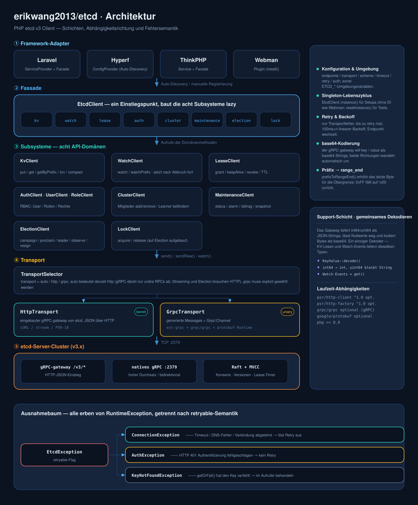
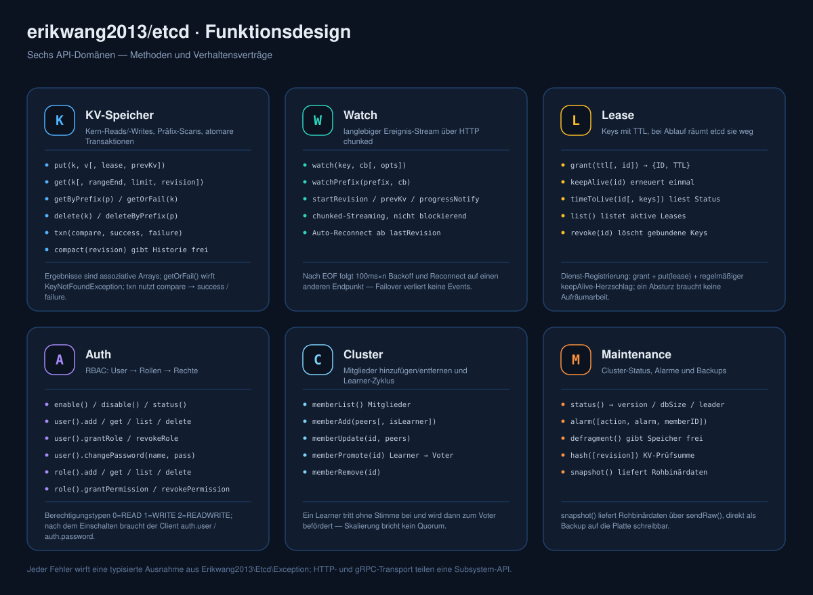
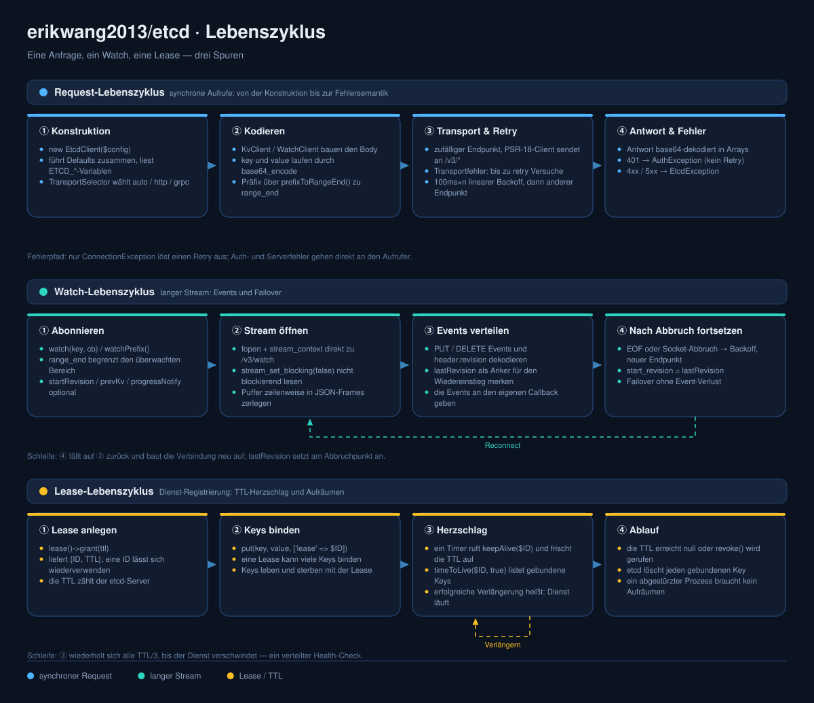

# erikwang2013/etcd

<p align="center">
  <a href="../../README.md">简体中文</a> ·
  <a href="README.en.md">English</a> ·
  <a href="README.ko.md">한국어</a> ·
  <a href="README.ru.md">Русский</a> ·
  <a href="README.de.md">Deutsch</a> ·
  <a href="README.fr.md">Français</a> ·
  <a href="README.es.md">Español</a> ·
  <a href="README.pt.md">Português</a> ·
  <a href="README.hi.md">हिन्दी</a> ·
  <a href="README.ar.md">العربية</a> ·
  <a href="README.bn.md">বাংলা</a> ·
  <a href="README.id.md">Bahasa Indonesia</a> ·
  <a href="README.ja.md">日本語</a>
</p>

<p align="center">
  
</p>

<p align="center">
  <b>Etchy</b> · ein kleiner Elefant mit einem Drei-Knoten-Raft-Cluster auf dem Kopf und <code>k/v</code> sowie <code>rev</code> am Rüssel —<br/>
  er bewacht Konfiguration und Leases: bei Abbruch verbindet er sich neu, bei Ablauf räumt er auf.
</p>

PHP etcd v3 Client — dualer Transport (HTTP mit vollem Funktionsumfang / gRPC für unäre RPCs), vollständige Abdeckung der etcd v3 API (KV / Watch / Lease / Auth / Cluster / Maintenance / Election / Lock), out of the box passend für **Laravel / Hyperf / ThinkPHP / Webman**.

## Voraussetzungen

- PHP >= 8.1
- etcd v3.x-Server
- Einer der HTTP-Pfade genügt: ext-curl, PHPs Stream-Wrapper (allow_url_fopen) oder ein eigener PSR-18-Client — automatisch gewählt, mit klarer Meldung, wenn keiner verfügbar ist

## Installation

```bash
composer require erikwang2013/etcd
```

### Reines PHP (ohne Framework)

Weder Framework noch PSR-18-Implementierung noch ext-curl nötig — ist ext-curl geladen, wird es genutzt, sonst wechselt der Client automatisch auf den Stream-Wrapper von PHP.

```php
<?php
require __DIR__ . '/vendor/autoload.php';   // dein Autoload

use Erikwang2013\Etcd\EtcdClient;

$etcd = new EtcdClient(['endpoints' => ['127.0.0.1:2379']]);

$etcd->kv()->put('/app/config', '{"debug":true}');
echo $etcd->kv()->getOrFail('/app/config')['value'], "\n";

// welcher Pfad gerade genutzt wird: curl / stream / none
var_dump(Erikwang2013\Etcd\Transport\HttpTransport::detectDriver());
```

Erzwingen lässt sich ein Pfad mit `'driver' => 'stream'` (Standard `auto`). Ist keiner der drei verfügbar, wirft die Anfrage eine fangbare `ConnectionException`, die erklärt, was zu aktivieren ist.

## Schnellstart

```php
use Erikwang2013\Etcd\EtcdClient;

$etcd = new EtcdClient(['endpoints' => ['127.0.0.1:2379']]);

// schreiben
$etcd->kv()->put('/app/config', '{"debug":true}');

// lesen
$result = $etcd->kv()->get('/app/config');
print_r($result['kvs'][0]);  // ['key' => '/app/config', 'value' => '{"debug":true}', ...]

// wirft eine Ausnahme, wenn nicht gefunden
$kv = $etcd->kv()->getOrFail('/app/config');

// Präfix-Scan
$all = $etcd->kv()->getByPrefix('/app/');
echo "{$all['count']} Keys\n";

// löschen
$etcd->kv()->delete('/app/config');
$etcd->kv()->deleteByPrefix('/cache/');

// Schreiben mit Lease (automatisch nach 60 s gelöscht)
$lease = $etcd->lease()->grant(60);
$etcd->kv()->put('/session/123', 'active', ['lease' => $lease['ID']]);

// verlängern
$etcd->lease()->keepAlive($lease['ID']);
```

## Konfiguration

```php
$etcd = new EtcdClient([
    'endpoints' => ['192.168.1.10:2379', '192.168.1.11:2379'],  // mehrere Knoten
    'transport' => 'auto',  // auto (Standard) | http | grpc
    'driver'    => 'auto',  // auto (Standard) | curl | stream
    'scheme'    => 'http',  // http (Standard) | https
    'timeout'   => 5.0,     // Sekunden
    'retry'     => 3,       // Anzahl Wiederholungen bei Verbindungsfehlern
    'auth'      => [        // optional; für den Tausch der Zugangsdaten gegen ein token ist https nötig
        'user'     => 'root',
        'password' => 'secret',
    ],
]);
```

### Umgebungsvariablen

Ohne übergebene Konfiguration werden die Umgebungsvariablen automatisch gelesen:

| Variable | Standard | Beschreibung |
|------|--------|------|
| `ETCD_ENDPOINTS` | `127.0.0.1:2379` | kommagetrennte Adressen mehrerer Knoten |
| `ETCD_TRANSPORT` | `auto` | auto / http / grpc |
| `ETCD_TIMEOUT` | `5.0` | Request-Timeout (Sekunden) |
| `ETCD_SCHEME` | `http` | http / https |
| `ETCD_RETRY` | `2` | Anzahl der Verbindungswiederholungen |
| `ETCD_DRIVER` | `auto` | HTTP-Pfad: auto / curl / stream |
| `ETCD_USER` | — | etcd-Benutzername |
| `ETCD_PASSWORD` | — | etcd-Passwort |

## API-Referenz

### KV — Schlüssel-Wert-Operationen

```php
// schreiben
$etcd->kv()->put('key', 'value', [
    'lease'       => 12345,    // Lease-ID binden
    'prevKv'      => true,     // vorherigen Wert zurückgeben
    'ignoreValue' => false,
    'ignoreLease' => false,
]);

// einzelnen Key lesen
$etcd->kv()->get('/exact/key');

// wirft eine Ausnahme, wenn nicht gefunden
$kv = $etcd->kv()->getOrFail('/exact/key');

// Präfix-Scan
$etcd->kv()->getByPrefix('/prefix/');

// Bereichsabfrage (alle Parameter)
$etcd->kv()->get('/start', [
    'rangeEnd'    => '/startz',      // Ende des Bereichs
    'limit'       => 100,             // maximale Trefferzahl
    'revision'    => 42,              // Snapshot-Revision
    'sortOrder'   => 'ascend',        // none | ascend | descend
    'sortTarget'  => 'key',           // key | version | create | mod | value
    'serializable'=> true,            // Raft-Konsens überspringen (schneller, evtl. veraltet)
    'keysOnly'    => true,            // nur Keys, ohne Values
    'countOnly'   => false,           // nur die Anzahl
    'minModRevision'    => 100,       // nur Keys ab dieser Änderungsrevision
    'maxModRevision'    => 200,
    'minCreateRevision' => 100,       // nach Erstellungsrevision filtern
    'maxCreateRevision' => 200,
]);

// löschen
$etcd->kv()->delete('/key');
$etcd->kv()->deleteByPrefix('/prefix/');
$etcd->kv()->delete('/key', ['prevKv' => true]);  // gibt auch den gelöschten Wert zurück

// Transaktion (atomares CAS)
$etcd->kv()->txn(
    compare: [
        ['result' => 0, 'target' => 3, 'key' => '/counter', 'value' => '100']
    ],
    success: [
        ['request_put' => ['key' => '/counter', 'value' => '101']]
    ],
    failure: [
        ['request_put' => ['key' => '/counter', 'value' => '1']]
    ]
);

// verschachtelte Transaktion: ein Zweig darf wieder eine Transaktion enthalten
$etcd->kv()->txn(
    compare: [['result' => 0, 'target' => 3, 'key' => '/lock', 'value' => 'free']],
    success: [[
        'request_put' => ['key' => '/lock', 'value' => 'mine'],
        'request_txn' => [                       // innere Transaktion
            'compare' => [['result' => 0, 'target' => 1, 'key' => '/lock', 'create_revision' => 0]],
            'success' => [['request_put' => ['key' => '/log', 'value' => 'acquired']]],
            'failure' => [],
        ],
    ]],
    failure: []
);

// Historie komprimieren (Speicher freigeben)
$etcd->kv()->compact(1000);
```

**Vergleichsziele (target):** `0`=VERSION, `1`=CREATE, `2`=MOD, `3`=VALUE, `4`=LEASE  
**Vergleichsergebnisse (result):** `0`=EQUAL, `1`=GREATER, `2`=LESS, `3`=NOT_EQUAL

### Watch — Änderungsbenachrichtigungen

```php
// einzelnen Key überwachen (blockierend; in einer Coroutine oder einem eigenen Prozess ausführen)
$etcd->watch()->watch('/config/key', function (array $events) {
    foreach ($events as $event) {
        // $event: ['type' => 'PUT'|'DELETE', 'kv' => [...], 'prev_kv' => [...]|null]
        echo "{$event['type']} {$event['kv']['key']} = {$event['kv']['value']}\n";
    }
});

// alle Key-Änderungen unter einem Präfix überwachen
$etcd->watch()->watchPrefix('/config/', $callback, [
    'startRevision' => 100,       // ab einer bestimmten Revision
    'prevKv'        => true,      // DELETE-Events liefern den alten Wert
    'progressNotify'=> true,      // regelmäßige leere Events (Herzschlag)
]);
```

**Watch beenden:** `watch()` blockiert dauerhaft; mit einem `WatchHandle` lässt er sich von außen stoppen (der übliche Bedarf, wenn ein langlebiger Prozess auf SIGTERM herunterfährt):

```php
use Erikwang2013\Etcd\Support\WatchHandle;

$handle = new WatchHandle();
pcntl_async_signals(true);
pcntl_signal(SIGTERM, fn() => $handle->cancel());

$etcd->watch()->watchPrefix('/config/', $onEvent, ['handle' => $handle]);
```

Nach `cancel()` **kehrt `watch()` normal zurück** (keine Ausnahme, kein catch nötig). Auch auf einem untätigen Key endet er binnen etwa einer Sekunde — der curl-Treiber erkennt es über cURLs periodischen Callback, der stream-Treiber über einen Leerlaufzyklus mit 200 ms Lese-Timeout.

**Reconnect:** Bricht die Watch-Verbindung ab, wird ab `lastRevision + 1` neu abonniert (`start_revision` ist **inklusiv**, ein Wiederaufsetzen beim alten Wert würde das letzte Event erneut abspielen). Beim Failover geht kein Event verloren, und keines wird doppelt zugestellt.

**Wiederholungsstrategie:** Wiederholt werden nur Fehler, die belegen, dass die Verbindung nie zustande kam (Verbindung abgelehnt / DNS-Fehler); reine Lese-RPCs (range, status, memberlist usw.) tolerieren zusätzlich 5xx und Timeouts. Schreiboperationen werden bei 5xx oder Lese-Timeout **nicht** wiederholt — die Anfrage kann bereits gewirkt haben, und ein Replay wendet ein CAS zweimal an oder liefert sogar eine „selbstsicher falsche“ Antwort (der Wiederholungsversuch sieht sein eigenes erstes Schreiben und meldet ein fehlgeschlagenes CAS, obwohl es gewonnen hat).

### Lease — TTL

```php
// Lease anlegen
$lease = $etcd->lease()->grant(300);             // 300 Sekunden TTL
$lease = $etcd->lease()->grant(300, 99999);      // mit expliziter Lease-ID

// einmal verlängern
$result = $etcd->lease()->keepAlive($lease['ID']);
echo "Restliche TTL: {$result['TTL']} s";

// Lease-Status prüfen
$info = $etcd->lease()->timeToLive($lease['ID']);
$info = $etcd->lease()->timeToLive($lease['ID'], true);  // inklusive gebundener Keys

// alle aktiven Leases auflisten
$leases = $etcd->lease()->list();

// widerrufen (alle gebundenen Keys sofort löschen)
$etcd->lease()->revoke($lease['ID']);
```

**Typischer Einsatz:** Bei der Dienst-Registrierung eine Lease anlegen und den Key schreiben, dann ruft ein Timer `keepAlive()` als Herzschlag auf; stoppt der Dienst, läuft die Lease ab und alles wird automatisch aufgeräumt.

### Auth — Authentifizierung und Berechtigungen

```php
$auth = $etcd->auth();

// === Benutzerverwaltung ===
$auth->user()->add('alice', 'password123');          // Benutzer anlegen
$auth->user()->get('alice');                         // Benutzer und seine Rollen ansehen
$auth->user()->list();                               // alle Benutzer auflisten
$auth->user()->changePassword('alice', 'newpass');    // Passwort ändern
$auth->user()->grantRole('alice', 'admin');          // Rolle zuweisen
$auth->user()->revokeRole('alice', 'admin');         // Rolle entziehen
$auth->user()->delete('alice');                      // Benutzer löschen

// === Rollenverwaltung ===
$auth->role()->add('reader');                        // Rolle anlegen
$auth->role()->get('reader');                        // Berechtigungen der Rolle ansehen
$auth->role()->list();                               // alle Rollen auflisten

// Berechtigung vergeben (permType: 0=READ, 1=WRITE, 2=READWRITE)
$auth->role()->grantPermission('reader', 0, '/data/', "\0");   // Leserecht auf das Präfix /data/
$auth->role()->grantPermission('writer', 2, '/data/', "\0");   // Lese- und Schreibrecht
$auth->role()->revokePermission('reader', '/data/', "\0");     // Berechtigung entziehen
$auth->role()->delete('reader');

// === Auth-Schalter ===
$auth->enable();           // Auth einschalten
$auth->disable();          // Auth ausschalten
$status = $auth->status(); // ['enabled' => true, 'authRevision' => 5]
```

**Wie die Authentifizierung abläuft:** etcd v3 akzeptiert kein HTTP Basic — es verlangt zuerst den Tausch der Zugangsdaten gegen ein token (`POST /v3/auth/authenticate`) und danach das Senden des token als reines `Authorization: <token>` (auch ein `Bearer`-Präfix wird abgelehnt). Sind `auth.user` / `auth.password` konfiguriert, erledigt der Client das **automatisch** und cached das token; bei einem 401 authentifiziert er sich einmal neu — ein manueller Aufruf ist nicht nötig. Man kann es auch selbst tauschen:

```php
$token = $etcd->auth()->authenticate('root', 'secret');  // der erhaltene token wird für spätere Anfragen wiederverwendet
```

Zum Senden der Zugangsdaten ist `scheme => 'https'` nötig: bei reinem http lehnt der Konstruktor sofort ab (damit das Passwort nie im Klartext übertragen wird).

### Cluster — Cluster-Verwaltung

```php
// Cluster-Mitglieder ansehen
$members = $etcd->cluster()->memberList();

// Mitglied hinzufügen
$etcd->cluster()->memberAdd(['http://node3:2380']);        // Voting-Mitglied hinzufügen
$etcd->cluster()->memberAdd(['http://node4:2380'], true);  // Learner-Mitglied hinzufügen

// peer-URL eines Mitglieds ändern
$etcd->cluster()->memberUpdate(123456, ['http://newnode:2380']);

// Learner zum Voter befördern
$etcd->cluster()->memberPromote(789012);

// Mitglied entfernen
$etcd->cluster()->memberRemove(345678);
```

### Election — Leader-Wahl

```php
// Kandidatur: erst Lease holen, dann antreten; Rückkehr nur bei Sieg, Verlierer warten (begrenzt durch $timeout)
$lease  = $etcd->lease()->grant(30);
$leader = $etcd->election()->campaign('/my-election', 'node-a', $lease['ID'], 5.0);
// → ['name' => ..., 'key' => ..., 'rev' => ..., 'lease' => ...]

// aktueller leader (null, wenn niemand gewählt ist)
$current = $etcd->election()->leader('/my-election');

// abtreten
$etcd->election()->resign($leader);
```

Am HTTP-Gateway ist `campaign()` eine **gepufferte Antwort** — sie kehrt erst nach dem Sieg zurück, also begrenzt `$timeout` die Wartezeit. Um Leader-Wechsel dauerhaft zu verfolgen, `observe()` verwenden.

**Achtung (gemessene stille Falle):** `proclaim()` / `resign()` brauchen ein **vollständiges Leader-Deskriptor-Array** (name, key und rev alle vorhanden). Fehlt eines davon, antwortet etcd mit **HTTP 200 und tut nichts** — es sieht nach erfolgreicher Freigabe aus, der Leader ist aber noch da. Beide Methoden prüfen den Deskriptor daher vor dem Senden und werfen bei Unvollständigkeit; verwenden Sie immer die Rückgaben von `campaign()` / `leader()` und bauen Sie nichts selbst.

**Weiteres gemessenes Verhalten:** Eine Kandidatur, die mitten im Request scheitert, wird vom Server **zurückgezogen** (ein `acquire()`-Timeout darf also gefahrlos Fehlschlag melden und wird kein „versteckter Halter“); ist niemand gewählt, liefert `leader()` `null` (der Server antwortet 500 `election: no leader` — ein normaler Zustand, kein Fehler).

### Lock — verteiltes Lock

```php
$lock = $etcd->lock()->acquire('/my-lock', ttl: 30, timeout: 5.0);
// ... kritischer Abschnitt ...
$etcd->lock()->release($lock);
```

**Dies ist eine clientseitige Implementierung auf Basis von Election, kein serverseitiges Lock.** Das HTTP-Gateway von etcd 3.5 **exponiert** `/v3/lock/*` **nicht** (gemessen: 404), die gegenseitige Ausschließung kommt daher aus „Election-Kandidatur + Lease“ — derselbe Ansatz wie im Go-Paket `concurrency` von etcd selbst. Wird der Halter per `SIGKILL` beendet, löst sich das Lock nach Ablauf der Lease von selbst, ohne manuelles Aufräumen.

### Maintenance — Betrieb

```php
// Knotenstatus ansehen
$status = $etcd->maintenance()->status();
// ['version' => '3.5.0', 'dbSize' => 24576, 'leader' => 123, 'raftIndex' => 1000, ...]

// Alarm-Verwaltung
$alarms = $etcd->maintenance()->alarm();                    // Alarme ansehen
$etcd->maintenance()->alarm(action: 2, alarm: 1);           // NOSPACE-Alarm löschen

// defragmentieren (Speicher freigeben)
$etcd->maintenance()->defragment();

// KV-Hash-Prüfung
$hash = $etcd->maintenance()->hash();

// Snapshot holen (Rohbinärdaten, einfach in eine Datei schreiben)
$snapshot = $etcd->maintenance()->snapshot();
file_put_contents('/backup/etcd-snapshot.db', $snapshot);

// bei großen Datenbanken gestreamt auf die Platte schreiben: nicht die ganze DB in den Speicher lesen
$bytes = $etcd->maintenance()->snapshotTo('/backup/etcd-snapshot.db');
// erst wird eine temporäre Datei geschrieben und erst nach Prüfung des sha256-Digests
// in den letzten 32 Bytes umbenannt, ein Abbruch hinterlässt also nie eine Datei, die wie ein Backup aussieht; liefert die geschriebenen Bytes.
```

## Transportmodi

| Modus | Status | Abhängigkeit | Geeignet für |
|------|------|------|---------|
| **HTTP** | verfügbar | ext-curl / Streams / PSR-18 (eines davon) | keine Extension nötig, sofort einsatzbereit |
| **gRPC** | unäre RPCs | ext-grpc + grpc/grpc + generierte protobuf-Nachrichten | hoher Durchsatz; Streaming und Election brauchen weiter HTTP |
| **auto** | Standard | — | derzeit identisch mit `http` (siehe unten) |

`auto` ist gleichbedeutend mit `http`: gRPC deckt derzeit nur unäre RPCs ab — Streaming-Aufrufe wie watch / snapshot und auch Election müssen weiterhin über HTTP laufen; ein automatisches Umschalten würde Anwendern mit installierter Extension stillschweigend die Hälfte der Funktionen nehmen. Nur ein explizites `'transport' => 'grpc'` wählt ihn aus.

**Stand des gRPC-Transports (bitte beachten):**
- **Implementiert**: unäre RPCs (`send()`) — Nachrichtenklassen mit `protoc` aus der `rpc.proto` von etcd v3.5 generiert; Request-Bodys werden als typisierte Nachrichten aufgebaut, Feldnamen und -typen garantiert das Proto.
- **Nicht implementiert**: Streaming-Aufrufe wie watch und snapshot sowie `/v3/election/*` (das ist ein anderes Proto, `v3electionpb`) — diese Pfade werden **namentlich abgelehnt** und mit Begründung versehen, kein stilles Scheitern.
- **Nicht end-to-end verifiziert**: Die Entwicklungsumgebung dieses Projekts hat kein `ext-grpc`, daher sind Kanalaufbau, Credentials-Metadata, `_simpleRequest`, Timeouts und Statuscode-Zuordnung **von Hand nach dem Ausgabemuster von grpc_php_plugin geschrieben und nie durch einen echten Aufruf geprüft**. Nachrichtengenerierung und Request-Aufbau sind getestet, der Netzwerk-Roundtrip nicht. Wer gRPC nutzen will, sollte es vor dem Produktiveinsatz selbst verifizieren.

### PSR-18-HTTP-Client manuell konfigurieren

```php
use Erikwang2013\Etcd\Transport\HttpTransport;
use GuzzleHttp\Client;
use GuzzleHttp\Psr7\HttpFactory;

$transport = new HttpTransport(['127.0.0.1:2379'], ['timeout' => 3.0]);
$transport->setHttpClient(
    new Client(['timeout' => 3]),
    new HttpFactory(),
    new HttpFactory()
);
```

## Framework-Integration

### Laravel

Funktioniert nach der Installation. `extra.laravel` in der composer.json entdeckt ServiceProvider und Facade automatisch.

```php
// per Facade
use Etcd;
Etcd::kv()->put('/foo', 'bar');
$val = Etcd::kv()->get('/foo');

// per Dependency Injection
use Erikwang2013\Etcd\EtcdClient;

class MyService
{
    public function __construct(private EtcdClient $etcd) {}

    public function work(): void
    {
        $this->etcd->kv()->put('/key', 'value');
    }
}
```

Konfigurationsdatei veröffentlichen:

```bash
php artisan vendor:publish --tag=etcd-config
# → config/etcd.php
```

`.env`-Konfiguration:

```env
ETCD_ENDPOINTS=10.0.0.1:2379,10.0.0.2:2379
ETCD_USER=root
ETCD_PASSWORD=secret
```

### Hyperf

Funktioniert nach der Installation. Hyperf entdeckt den `ConfigProvider` automatisch.

```php
use Erikwang2013\Etcd\EtcdClient;
use Hyperf\Di\Annotation\Inject;

class MyService
{
    #[Inject]
    private EtcdClient $etcd;

    public function work(): void
    {
        $this->etcd->kv()->put('/key', 'value');
    }
}

// oder direkt mit make auflösen
$etcd = make(EtcdClient::class);
```

Konfiguration veröffentlichen:

```bash
php bin/hyperf.php vendor:publish erikwang2013/etcd
# → config/autoload/etcd.php
```

### ThinkPHP

1. Nach der Installation in `app/service.php` registrieren:

```php
return [
    Erikwang2013\Etcd\Adapter\ThinkPHP\Service::class,
];
```

2. Die Datei `config/etcd.php` anlegen.

Verwendung:

```php
// per Facade
use think\facade\Etcd;
Etcd::kv()->put('/key', 'value');

// per Container
app('etcd')->kv()->get('/key');
```

### Webman

Funktioniert nach der Installation, ohne zusätzliche Konfiguration.

```php
use Erikwang2013\Etcd\EtcdClient;

$etcd = EtcdClient::instance();
$etcd->kv()->put('/key', 'value');
```

Für eigene Einstellungen die Datei `plugin/erikwang2013/etcd/config/etcd.php` bearbeiten.

## Fehlerbehandlung

```php
use Erikwang2013\Etcd\Exception\{
    EtcdException,
    ConnectionException,
    AuthException,
    KeyNotFoundException,
};

try {
    $etcd->kv()->put('/key', 'value');
} catch (ConnectionException $e) {
    // der etcd-Knoten ist nicht erreichbar (Netzwerkfehler, Knoten down)
} catch (AuthException $e) {
    // Authentifizierung fehlgeschlagen (falscher Benutzername oder falsches Passwort)
} catch (KeyNotFoundException $e) {
    // der Key existiert nicht (bei getOrFail())
} catch (EtcdException $e) {
    // sonstiger etcd-Serverfehler
}
```

## Projektstruktur

```
erikwang2013/etcd/
├── composer.json                    # Paketdefinition: PSR-4-Autoload + Laravel- / Hyperf-Discovery
├── phpunit.xml.dist                 # PHPUnit-Konfiguration (Suites unit / integration)
├── protos/                          # etcd v3.5 Upstream-Proto + Generierungsskript + generierte Artefakte (für gRPC)
├── .github/workflows/ci.yml         # Gate vor dem Merge: Unit-Matrix / Syntax-Untergrenze / Integration / i18n-Doku
├── config/etcd.php                  # Standardkonfiguration zum Veröffentlichen (liest ETCD_*-Umgebungsvariablen)
├── .github/workflows/release.yml    # automatische Veröffentlichung beim Tag
├── scripts/i18n/                    #   Doku-Werkzeuge: Kataloge, Diagramm-Build, Übersetzungsprüfung
├── docs/                            # Dokumentation und Diagramme
│   ├── design-cn.md                 # Designdokument
│   ├── i18n/                        #   READMEs und lokalisierte Diagramme in 13 Sprachen
│   ├── pet.svg                      # Projekt-Maskottchen Etchy
│   ├── architecture.svg             # Architekturdiagramm
│   ├── features.svg                 # Funktionsdiagramm
│   └── lifecycle.svg                # Lebenszyklusdiagramm
├── src/
│   ├── EtcdClient.php               # oberste Fassade + Singleton: Zugriff auf die acht Subsysteme
│   ├── Mascot.php                   # Zugriff auf das Maskottchen Etchy (svg / dataUri / path)
│   ├── Install.php                  # Webman-Plugin-Hook (WEBMAN_PLUGIN)
│   ├── Transport/                   # Transportschicht
│   │   ├── TransportInterface.php   # Transport-Abstraktion: send / sendRaw / watch
│   │   ├── TransportSelector.php    # automatische Auswahl auto / http / grpc
│   │   ├── HttpTransport.php        # HTTP-JSON-Transport (vollständig nutzbar)
│   │   ├── GrpcTransport.php        # gRPC-Transport (unäre RPCs; Streaming wird mit Begründung abgelehnt)
│   │   └── GrpcStub.php             # Grpc\BaseStub-Unterklasse (eigene Datei, wird ohne Extension nicht geladen)
│   ├── Kv/KvClient.php              # KV lesen/schreiben / Präfix-Scan / Transaktionen / Kompaktierung
│   ├── Watch/WatchClient.php        # Watch-Benachrichtigungen + Fortsetzen nach Abbruch
│   ├── Lease/LeaseClient.php        # Lease: grant / keepAlive / revoke
│   ├── Auth/                        # Auth: Authentifizierung und Autorisierung
│   │   ├── AuthClient.php           # Auth-Schalter und Status
│   │   ├── UserClient.php           # Benutzer-CRUD + Rollenbindung
│   │   └── RoleClient.php           # Rollen-CRUD + Berechtigungen
│   ├── Cluster/ClusterClient.php    # Cluster: Mitgliederverwaltung
│   ├── Election/                    # Election — Leader-Wahl (campaign / leader / observe / resign)
│   ├── Lock/LockClient.php          # Lock — verteiltes Lock (auf Election aufgebaut, das Gateway hat kein /v3/lock/*)
│   ├── Maintenance/                 # Maintenance: status / alarm / defrag / snapshot
│   ├── Exception/                   # Ausnahmehierarchie
│   ├── Support/                     # gemeinsames Dekodieren: KeyValue / Int64, WatchHandle zum Abbrechen
│   └── Adapter/                     # Framework-Adapter
│       ├── Laravel/                 #   ServiceProvider + Facade
│       ├── Hyperf/                  #   ConfigProvider
│       ├── ThinkPHP/                #   Service + Facade
│       └── Webman/                  #   Plugin
└── tests/
    ├── Unit/                        # Unit-Tests (je Client / Transport / Adapter / Nachrichtenklasse)
    ├── Integration/                 # Integrationstests (gegen echtes etcd)
    └── Support/                     # FakeTransport, PSR-HTTP-Stubs
```

## Architektur und Design-Diagramme

Drei Diagramme, gegliedert nach Struktur → Fähigkeiten → Ablauf; jedes lässt sich einzeln in voller Größe öffnen:

| Diagramm | Beantwortete Frage | Datei |
|----|-----------|------|
| Architektur | In welche Schichten aufgeteilt, wohin zeigen die Abhängigkeiten, wie werden Fehler verteilt | [`diagrams/de/architecture.svg`](diagrams/de/architecture.svg) |
| Funktionsdesign | Welche Methoden bietet jedes Subsystem, welche Verhaltensverträge gelten | [`diagrams/de/features.svg`](diagrams/de/features.svg) |
| Lebenszyklus | Wie läuft eine Anfrage / ein Watch / eine Lease jeweils ab | [`diagrams/de/lifecycle.svg`](diagrams/de/lifecycle.svg) |

### Architektur



### Funktionsdesign



### Lebenszyklus



### Etchy im Code verwenden

Die Grafik wird mit dem Paket ausgeliefert, `Mascot` ist der einzige Zugriffspunkt — für ein Admin-Panel oder eine Statusseite ist keine eigene Kopie nötig:

```php
use Erikwang2013\Etcd\Mascot;

echo Mascot::svg();                                          // SVG-Quelltext, direkt inline einbetten
echo '';    // data URI, ohne Web-Verzeichnis
copy(Mascot::path(), __DIR__ . '/public/etcd.svg');          // oder selbst ins Static-Verzeichnis kopieren
```

Unter Laravel lässt sich die Grafik direkt nach `public/` veröffentlichen:

```bash
php artisan vendor:publish --tag=etcd-assets
# → public/vendor/etcd/pet.svg
```

## Open Source lebt von Unterstützung / Support This Project

<p align="center">
  <table>
    <tr>
      <td align="center"><b>微信 / WeChat</b></td>
      <td align="center"><b>支付宝 / Alipay</b></td>
    </tr>
    <tr>
      <td align="center"></td>
      <td align="center"></td>
    </tr>
  </table>
</p>

---

## License

MIT — Copyright (c) 2026 [erik](https://erik.xyz) <erik@erik.xyz>
