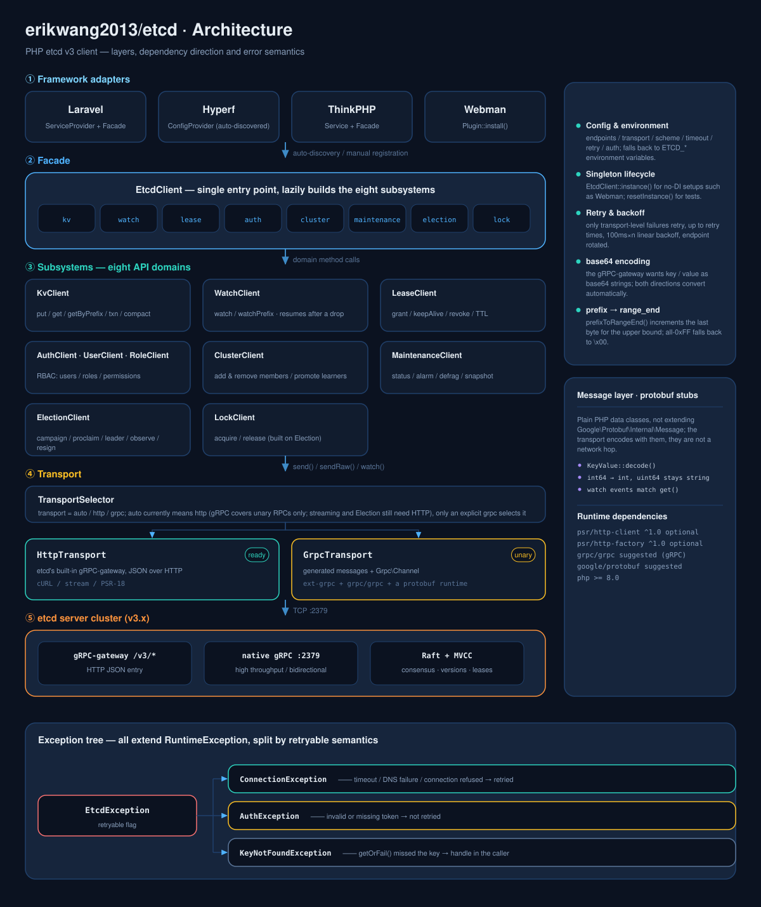
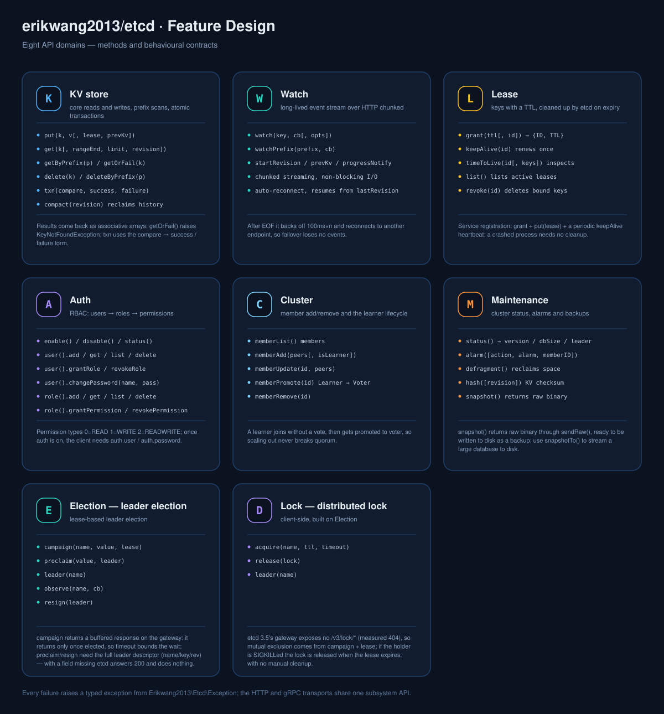
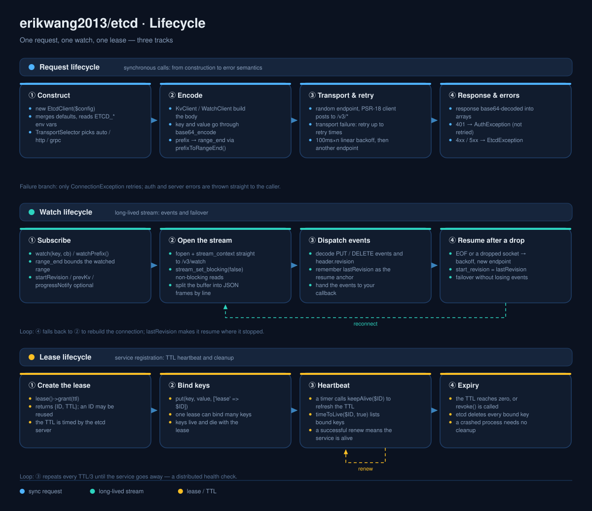

# erikwang2013/etcd

<p align="center">
  <a href="../../README.md">简体中文</a> ·
  <a href="README.en.md">English</a> ·
  <a href="README.ko.md">한국어</a> ·
  <a href="README.ru.md">Русский</a> ·
  <a href="README.de.md">Deutsch</a> ·
  <a href="README.fr.md">Français</a> ·
  <a href="README.es.md">Español</a> ·
  <a href="README.pt.md">Português</a> ·
  <a href="README.hi.md">हिन्दी</a> ·
  <a href="README.ar.md">العربية</a> ·
  <a href="README.bn.md">বাংলা</a> ·
  <a href="README.id.md">Bahasa Indonesia</a> ·
  <a href="README.ja.md">日本語</a>
</p>

<p align="center">
  
</p>

<p align="center">
  <b>Etchy</b> · a little elephant wearing a three-node Raft cluster and carrying <code>k/v</code> and <code>rev</code> on its trunk —<br/>
  it guards your config and your leases: reconnects when dropped, cleans up when expired.
</p>

A PHP etcd v3 client — gRPC + HTTP dual transport, covering the full etcd v3 API (KV / Watch / Lease / Auth / Cluster / Maintenance), with first-class **Laravel / Hyperf / ThinkPHP / Webman** adapters.

## Requirements

- PHP >= 8.1
- etcd v3.x server
- Any one HTTP path: ext-curl, PHP's stream wrapper (allow_url_fopen), or a PSR-18 client of your own — picked automatically, with a clear error when none is available

## Installation

```bash
composer require erikwang2013/etcd
```

### Plain PHP (no framework)

No framework, no PSR-18 implementation and no ext-curl needed — ext-curl is used when loaded, and the client falls back to PHP's own stream wrapper when it is not.

```php
<?php
require __DIR__ . '/vendor/autoload.php';   // your autoload

use Erikwang2013\Etcd\EtcdClient;

$etcd = new EtcdClient(['endpoints' => ['127.0.0.1:2379']]);

$etcd->kv()->put('/app/config', '{"debug":true}');
echo $etcd->kv()->getOrFail('/app/config')['value'], "\n";

// which path is actually in use: curl / stream / none
var_dump(Erikwang2013\Etcd\Transport\HttpTransport::detectDriver());
```

Force one with `'driver' => 'stream'` (default `auto`). When none of the three is available the request raises a catchable `ConnectionException` explaining how to enable one.

## Quick start

```php
use Erikwang2013\Etcd\EtcdClient;

$etcd = new EtcdClient(['endpoints' => ['127.0.0.1:2379']]);

// write
$etcd->kv()->put('/app/config', '{"debug":true}');

// read
$result = $etcd->kv()->get('/app/config');
print_r($result['kvs'][0]);  // ['key' => '/app/config', 'value' => '{"debug":true}', ...]

// throws when the key is missing
$kv = $etcd->kv()->getOrFail('/app/config');

// prefix scan
$all = $etcd->kv()->getByPrefix('/app/');
echo "{$all['count']} keys\n";

// delete
$etcd->kv()->delete('/app/config');
$etcd->kv()->deleteByPrefix('/cache/');

// write with a lease (auto-deleted after 60 seconds)
$lease = $etcd->lease()->grant(60);
$etcd->kv()->put('/session/123', 'active', ['lease' => $lease['ID']]);

// renew
$etcd->lease()->keepAlive($lease['ID']);
```

## Configuration

```php
$etcd = new EtcdClient([
    'endpoints' => ['192.168.1.10:2379', '192.168.1.11:2379'],  // multiple nodes
    'transport' => 'auto',  // auto (default) | http | grpc
    'driver'    => 'auto',  // auto (default) | curl | stream
    'scheme'    => 'http',  // http (default) | https
    'timeout'   => 5.0,     // seconds
    'retry'     => 3,       // connection failure retries
    'auth'      => [        // optional; exchanging credentials for a token needs https
        'user'     => 'root',
        'password' => 'secret',
    ],
]);
```

### Environment variables

When no config is passed, these are read automatically:

| Variable | Default | Description |
|----------|---------|-------------|
| `ETCD_ENDPOINTS` | `127.0.0.1:2379` | comma-separated node addresses |
| `ETCD_TRANSPORT` | `auto` | auto / http / grpc |
| `ETCD_TIMEOUT` | `5.0` | request timeout (seconds) |
| `ETCD_SCHEME` | `http` | http / https |
| `ETCD_RETRY` | `2` | connection retry count |
| `ETCD_DRIVER` | `auto` | HTTP path: auto / curl / stream |
| `ETCD_USER` | — | etcd username |
| `ETCD_PASSWORD` | — | etcd password |

## API reference

### KV — key/value operations

```php
// write
$etcd->kv()->put('key', 'value', [
    'lease'       => 12345,    // bind a lease ID
    'prevKv'      => true,     // return the previous value
    'ignoreValue' => false,
    'ignoreLease' => false,
]);

// read a single key
$etcd->kv()->get('/exact/key');

// throw when missing
$kv = $etcd->kv()->getOrFail('/exact/key');

// prefix scan
$etcd->kv()->getByPrefix('/prefix/');

// range query (full parameter set)
$etcd->kv()->get('/start', [
    'rangeEnd'    => '/startz',      // end of the range
    'limit'       => 100,             // max results
    'revision'    => 42,              // snapshot revision
    'sortOrder'   => 'ascend',        // none | ascend | descend
    'sortTarget'  => 'key',           // key | version | create | mod | value
    'serializable'=> true,            // skip Raft consensus (faster, may be stale)
    'keysOnly'    => true,            // keys without values
    'countOnly'   => false,           // count only
    'minModRevision'    => 100,       // only keys modified at or after this revision
    'maxModRevision'    => 200,
    'minCreateRevision' => 100,       // filter by creation revision
    'maxCreateRevision' => 200,
]);

// delete
$etcd->kv()->delete('/key');
$etcd->kv()->deleteByPrefix('/prefix/');
$etcd->kv()->delete('/key', ['prevKv' => true]);  // also return the deleted value

// transaction (atomic CAS)
$etcd->kv()->txn(
    compare: [
        ['result' => 0, 'target' => 3, 'key' => '/counter', 'value' => '100']
    ],
    success: [
        ['request_put' => ['key' => '/counter', 'value' => '101']]
    ],
    failure: [
        ['request_put' => ['key' => '/counter', 'value' => '1']]
    ]
);

// nested transaction: a branch may contain another transaction
$etcd->kv()->txn(
    compare: [['result' => 0, 'target' => 3, 'key' => '/lock', 'value' => 'free']],
    success: [[
        'request_put' => ['key' => '/lock', 'value' => 'mine'],
        'request_txn' => [                       // inner transaction
            'compare' => [['result' => 0, 'target' => 1, 'key' => '/lock', 'create_revision' => 0]],
            'success' => [['request_put' => ['key' => '/log', 'value' => 'acquired']]],
            'failure' => [],
        ],
    ]],
    failure: []
);

// compact history (reclaim storage)
$etcd->kv()->compact(1000);
```

**Compare targets:** `0`=VERSION, `1`=CREATE, `2`=MOD, `3`=VALUE, `4`=LEASE
**Compare results:** `0`=EQUAL, `1`=GREATER, `2`=LESS, `3`=NOT_EQUAL

### Watch — change notifications

```php
// watch a single key (blocking; run it in a coroutine or a separate process)
$etcd->watch()->watch('/config/key', function (array $events) {
    foreach ($events as $event) {
        // $event: ['type' => 'PUT'|'DELETE', 'kv' => [...], 'prev_kv' => [...]|null]
        echo "{$event['type']} {$event['kv']['key']} = {$event['kv']['value']}\n";
    }
});

// watch every key under a prefix
$etcd->watch()->watchPrefix('/config/', $callback, [
    'startRevision' => 100,       // start from a revision
    'prevKv'        => true,      // DELETE events carry the old value
    'progressNotify'=> true,      // periodic empty events (heartbeat)
]);
```

**Reconnect:** when the watch connection drops it resubscribes from `lastRevision + 1` (`start_revision` is **inclusive**, so resuming at the old value would replay the last event). Failover loses no events and delivers none twice.

**Retry policy:** only failures that prove the connection was never established (connection refused / DNS failure) are retried, and read-only RPCs (range, status, memberlist, …) additionally tolerate 5xx and timeouts. Writes that hit a 5xx or a read timeout are **not** retried — the request may already have taken effect, and replaying it applies a CAS twice, or even produces a confidently wrong answer (the retry sees its own first write and reports the CAS as failed when it actually won).

### Lease — TTL

```php
// create a lease
$lease = $etcd->lease()->grant(300);             // 300 second TTL
$lease = $etcd->lease()->grant(300, 99999);      // with an explicit lease ID

// renew once
$result = $etcd->lease()->keepAlive($lease['ID']);
echo "TTL remaining: {$result['TTL']}s";

// inspect a lease
$info = $etcd->lease()->timeToLive($lease['ID']);
$info = $etcd->lease()->timeToLive($lease['ID'], true);  // include bound keys

// list every active lease
$leases = $etcd->lease()->list();

// revoke (every bound key is deleted immediately)
$etcd->lease()->revoke($lease['ID']);
```

**Typical use:** create a lease and write your key on service registration, then call `keepAlive()` on a timer; when the service stops, the lease expires and everything is cleaned up.

### Auth — authentication and permissions

```php
$auth = $etcd->auth();

// === user management ===
$auth->user()->add('alice', 'password123');          // create a user
$auth->user()->get('alice');                         // inspect a user's roles
$auth->user()->list();                               // list users
$auth->user()->changePassword('alice', 'newpass');    // change a password
$auth->user()->grantRole('alice', 'admin');          // grant a role
$auth->user()->revokeRole('alice', 'admin');         // revoke a role
$auth->user()->delete('alice');                      // delete a user

// === role management ===
$auth->role()->add('reader');                        // create a role
$auth->role()->get('reader');                        // inspect permissions
$auth->role()->list();                               // list roles

// grant a permission (permType: 0=READ, 1=WRITE, 2=READWRITE)
$auth->role()->grantPermission('reader', 0, '/data/', "\0");   // read /data/ prefix
$auth->role()->grantPermission('writer', 2, '/data/', "\0");   // read and write
$auth->role()->revokePermission('reader', '/data/', "\0");     // revoke
$auth->role()->delete('reader');

// === auth switch ===
$auth->enable();           // turn auth on
$auth->disable();          // turn auth off
$status = $auth->status(); // ['enabled' => true, 'authRevision' => 5]
```

**How authentication happens:** etcd v3 does not accept HTTP Basic — it wants credentials exchanged for a token first (`POST /v3/auth/authenticate`), after which the token is sent bare as `Authorization: <token>` (a `Bearer` prefix is rejected too). Once `auth.user` / `auth.password` are configured, the client does this **automatically** and caches the token, re-authenticating once on a 401, with no manual call needed. You can also exchange it yourself:

```php
$token = $etcd->auth()->authenticate('root', 'secret');  // the token is reused by subsequent requests
```

Sending credentials requires `scheme => 'https'`: over plain http the constructor refuses outright (so the password never travels in the clear).

### Cluster — cluster management

```php
// list members
$members = $etcd->cluster()->memberList();

// add a member
$etcd->cluster()->memberAdd(['http://node3:2380']);        // voting member
$etcd->cluster()->memberAdd(['http://node4:2380'], true);  // learner

// change a member's peer URL
$etcd->cluster()->memberUpdate(123456, ['http://newnode:2380']);

// promote a learner to voter
$etcd->cluster()->memberPromote(789012);

// remove a member
$etcd->cluster()->memberRemove(345678);
```

### Maintenance — operations

```php
// node status
$status = $etcd->maintenance()->status();
// ['version' => '3.5.0', 'dbSize' => 24576, 'leader' => 123, 'raftIndex' => 1000, ...]

// alarms
$alarms = $etcd->maintenance()->alarm();                    // inspect alarms
$etcd->maintenance()->alarm(action: 2, alarm: 1);           // clear a NOSPACE alarm

// defragment (reclaim storage)
$etcd->maintenance()->defragment();

// KV hash check
$hash = $etcd->maintenance()->hash();

// snapshot (raw binary, write it to a file)
$snapshot = $etcd->maintenance()->snapshot();
file_put_contents('/backup/etcd-snapshot.db', $snapshot);
```

## Transport modes

| Mode | Status | Requires | Good for |
|------|--------|----------|----------|
| **HTTP** | available | ext-curl / streams / PSR-18 (any one) | zero PHP extension dependencies, works right away |
| **gRPC** | skeleton | ext-grpc + grpc/grpc + google/protobuf | high throughput, native streaming |
| **auto** | default | — | currently the same as `http` (see below) |

`auto` is equivalent to `http`: `GrpcTransport` is still a skeleton (all three of its methods throw), so it does **not** switch to gRPC on its own — actually probing for `ext-grpc` would only leave users who have the extension unable to use it. Only an explicit `'transport' => 'grpc'` selects it. Once gRPC lands, these semantics will change.

### Configuring a PSR-18 HTTP client by hand

```php
use Erikwang2013\Etcd\Transport\HttpTransport;
use GuzzleHttp\Client;
use GuzzleHttp\Psr7\HttpFactory;

$transport = new HttpTransport(['127.0.0.1:2379'], ['timeout' => 3.0]);
$transport->setHttpClient(
    new Client(['timeout' => 3]),
    new HttpFactory(),
    new HttpFactory()
);
```

## Framework integration

### Laravel

Works out of the box — composer.json's `extra.laravel` auto-discovers the ServiceProvider and Facade.

```php
// facade
use Etcd;
Etcd::kv()->put('/foo', 'bar');
$val = Etcd::kv()->get('/foo');

// dependency injection
use Erikwang2013\Etcd\EtcdClient;

class MyService
{
    public function __construct(private EtcdClient $etcd) {}

    public function work(): void
    {
        $this->etcd->kv()->put('/key', 'value');
    }
}
```

Publish the config file:

```bash
php artisan vendor:publish --tag=etcd-config
# → config/etcd.php
```

`.env`:

```env
ETCD_ENDPOINTS=10.0.0.1:2379,10.0.0.2:2379
ETCD_USER=root
ETCD_PASSWORD=secret
```

### Hyperf

Works out of the box — Hyperf auto-discovers the `ConfigProvider`.

```php
use Erikwang2013\Etcd\EtcdClient;
use Hyperf\Di\Annotation\Inject;

class MyService
{
    #[Inject]
    private EtcdClient $etcd;

    public function work(): void
    {
        $this->etcd->kv()->put('/key', 'value');
    }
}

// or resolve it directly
$etcd = make(EtcdClient::class);
```

Publish the config:

```bash
php bin/hyperf.php vendor:publish erikwang2013/etcd
# → config/autoload/etcd.php
```

### ThinkPHP

1. After installing, register the service in `app/service.php`:

```php
return [
    Erikwang2013\Etcd\Adapter\ThinkPHP\Service::class,
];
```

2. Create `config/etcd.php`.

Usage:

```php
// facade
use think\facade\Etcd;
Etcd::kv()->put('/key', 'value');

// container
app('etcd')->kv()->get('/key');
```

### Webman

Works out of the box, no extra configuration.

```php
use Erikwang2013\Etcd\EtcdClient;

$etcd = EtcdClient::instance();
$etcd->kv()->put('/key', 'value');
```

To customise it, edit `plugin/erikwang2013/etcd/config/etcd.php`.

## Error handling

```php
use Erikwang2013\Etcd\Exception\{
    EtcdException,
    ConnectionException,
    AuthException,
    KeyNotFoundException,
};

try {
    $etcd->kv()->put('/key', 'value');
} catch (ConnectionException $e) {
    // the etcd node is unreachable (network failure, node down)
} catch (AuthException $e) {
    // authentication failed (wrong username or password)
} catch (KeyNotFoundException $e) {
    // the key does not exist (from getOrFail())
} catch (EtcdException $e) {
    // any other etcd server error
}
```

## Project structure

```
erikwang2013/etcd/
├── composer.json                    # package definition: PSR-4 autoload + Laravel / Hyperf discovery
├── phpunit.xml.dist                 # PHPUnit config (unit / integration suites)
├── .github/workflows/ci.yml         # pre-merge gate: unit matrix / syntax floor / integration / i18n docs
├── config/etcd.php                  # default config published to each framework (reads ETCD_* env vars)
├── .github/workflows/release.yml    # release automation on tag
├── scripts/i18n/                    #   docs tooling: catalogs, diagram builder, translation checks
├── docs/                            # documentation and diagrams
│   ├── design-cn.md                 #   design document
│   ├── i18n/                        #   READMEs and localised diagrams for 13 languages
│   ├── pet.svg                      #   project mascot Etchy
│   ├── architecture.svg             #   architecture diagram
│   ├── features.svg                 #   feature design diagram
│   └── lifecycle.svg                #   lifecycle diagram
├── src/
│   ├── EtcdClient.php               # top-level facade + singleton: kv / watch / lease / auth / cluster / maintenance
│   ├── Mascot.php                   # accessor for the mascot Etchy (svg / dataUri / path)
│   ├── Install.php                  # Webman plugin hook (WEBMAN_PLUGIN)
│   ├── Transport/                   # transport layer
│   │   ├── TransportInterface.php   #   abstraction: send / sendRaw / watch
│   │   ├── TransportSelector.php    #   auto / http / grpc selection
│   │   ├── HttpTransport.php        #   HTTP JSON transport (fully working)
│   │   └── GrpcTransport.php        #   gRPC transport (skeleton)
│   ├── Kv/KvClient.php              # KV read/write / prefix scan / transactions / compaction
│   ├── Watch/WatchClient.php        # Watch notifications + resume after a drop
│   ├── Lease/LeaseClient.php        # Lease grant / keepAlive / revoke
│   ├── Auth/                        # authentication and authorisation
│   │   ├── AuthClient.php           #   auth switch and status
│   │   ├── UserClient.php           #   user CRUD + role binding
│   │   └── RoleClient.php           #   role CRUD + permissions
│   ├── Cluster/ClusterClient.php    # cluster membership
│   ├── Maintenance/                 # operations: status / alarm / defrag / snapshot
│   ├── Exception/                   # exception hierarchy
│   ├── Support/KeyValue.php         # shared decoding: KV reads and watch events return the same shape
│   └── Adapter/                     # framework adapters
│       ├── Laravel/                 #   ServiceProvider + Facade
│       ├── Hyperf/                  #   ConfigProvider
│       ├── ThinkPHP/                #   Service + Facade
│       └── Webman/                  #   Plugin
└── tests/
    ├── Unit/                        # unit tests (per client / transport / adapter / message class)
    ├── Integration/                 # integration tests (against a real etcd)
    └── Support/                     # FakeTransport, PSR HTTP stubs
```

## Architecture and design diagrams

Three diagrams, organised as structure → capabilities → timing. Click any of them for the full-size file:

| Diagram | Question it answers | File |
|---------|--------------------|------|
| Architecture | which layers exist, which way dependencies point, how errors branch | [`diagrams/en/architecture.svg`](diagrams/en/architecture.svg) |
| Feature design | which methods each subsystem offers, and its behavioural contracts | [`diagrams/en/features.svg`](diagrams/en/features.svg) |
| Lifecycle | how one request / one watch / one lease plays out | [`diagrams/en/lifecycle.svg`](diagrams/en/lifecycle.svg) |

### Architecture



### Feature design



### Lifecycle



### Using Etchy in your code

The artwork ships with the package; `Mascot` is the only accessor, so an admin panel or status page does not need its own copy:

```php
use Erikwang2013\Etcd\Mascot;

echo Mascot::svg();                                          // raw SVG, inline it
echo '';    // data URI, no web root needed
copy(Mascot::path(), __DIR__ . '/public/etcd.svg');          // or copy it where you serve assets
```

On Laravel you can publish it into `public/`:

```bash
php artisan vendor:publish --tag=etcd-assets
# → public/vendor/etcd/pet.svg
```

## Support this project

<p align="center">
  <table>
    <tr>
      <td align="center"><b>WeChat</b></td>
      <td align="center"><b>Alipay</b></td>
    </tr>
    <tr>
      <td align="center"></td>
      <td align="center"></td>
    </tr>
  </table>
</p>

---

## License

MIT — Copyright (c) 2026 [erik](https://erik.xyz) <erik@erik.xyz>
