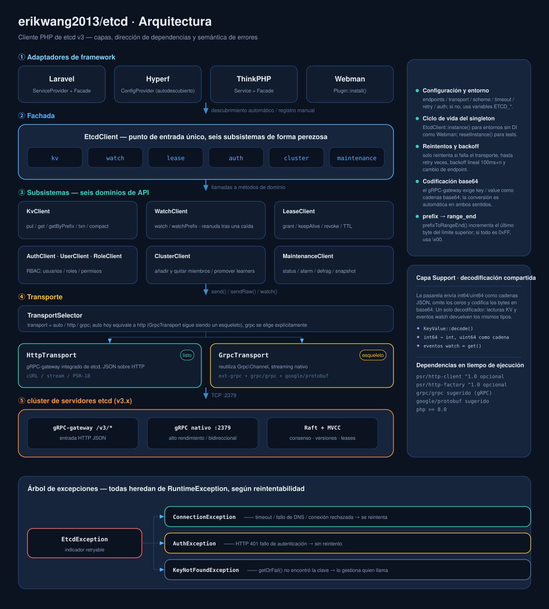
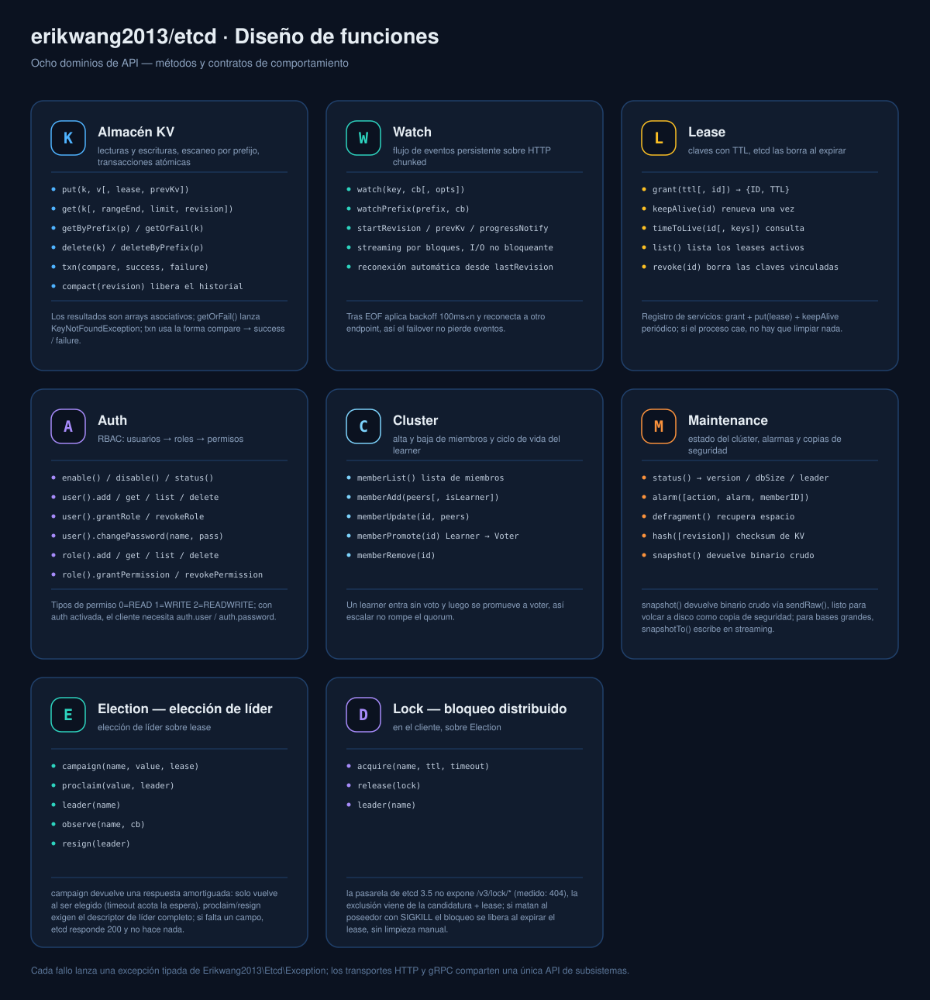
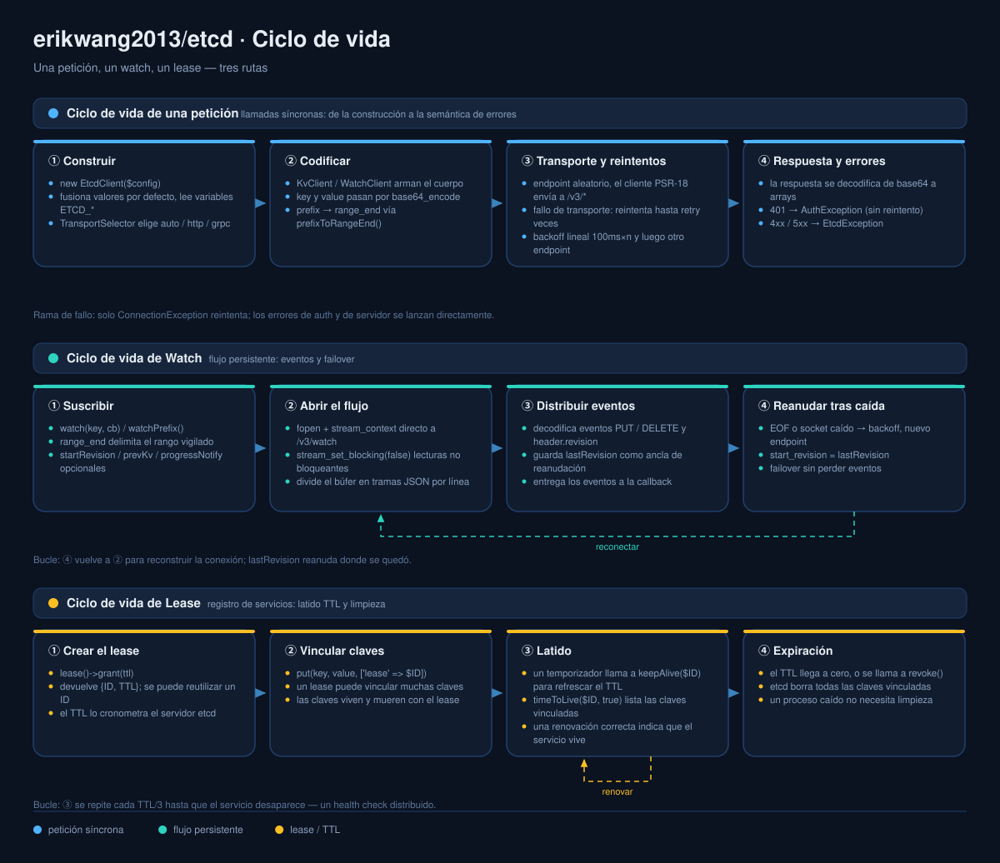

# erikwang2013/etcd

<p align="center">
  <a href="../../README.md">简体中文</a> ·
  <a href="README.en.md">English</a> ·
  <a href="README.ko.md">한국어</a> ·
  <a href="README.ru.md">Русский</a> ·
  <a href="README.de.md">Deutsch</a> ·
  <a href="README.fr.md">Français</a> ·
  <a href="README.es.md">Español</a> ·
  <a href="README.pt.md">Português</a> ·
  <a href="README.hi.md">हिन्दी</a> ·
  <a href="README.ar.md">العربية</a> ·
  <a href="README.bn.md">বাংলা</a> ·
  <a href="README.id.md">Bahasa Indonesia</a> ·
  <a href="README.ja.md">日本語</a>
</p>

<p align="center">
  
</p>

<p align="center">
  <b>Etchy</b> · un elefantito con un clúster Raft de tres nodos en la cabeza y <code>k/v</code> y <code>rev</code> colgando de la trompa ——<br/>
  vigila tu configuración y tus leases: si se cae, se reconecta solo; si caduca, se limpia solo.
</p>

Cliente PHP para etcd v3 —— transporte doble (HTTP completo / gRPC para RPC unarios), cubre toda la API de etcd v3 (KV / Watch / Lease / Auth / Cluster / Maintenance / Election / Lock) y funciona sin configuración en **Laravel / Hyperf / ThinkPHP / Webman**.

## Requisitos

- PHP >= 8.1
- Servidor etcd v3.x
- Basta con una vía HTTP: ext-curl, el envoltorio de flujos de PHP (allow_url_fopen) o tu propio cliente PSR-18 — se elige automáticamente y avisa con claridad si no hay ninguna

## Instalación

```bash
composer require erikwang2013/etcd
```

### PHP puro (sin framework)

No hace falta framework, ni implementación PSR-18, ni ext-curl: si ext-curl está cargado se usa, y si no el cliente recurre al envoltorio de flujos de PHP.

```php
<?php
require __DIR__ . '/vendor/autoload.php';   // tu autoload

use Erikwang2013\Etcd\EtcdClient;

$etcd = new EtcdClient(['endpoints' => ['127.0.0.1:2379']]);

$etcd->kv()->put('/app/config', '{"debug":true}');
echo $etcd->kv()->getOrFail('/app/config')['value'], "\n";

// qué ruta se está usando: curl / stream / none
var_dump(Erikwang2013\Etcd\Transport\HttpTransport::detectDriver());
```

Fuerza una ruta con `'driver' => 'stream'` (por defecto `auto`). Si no hay ninguna de las tres, la petición lanza una `ConnectionException` capturable que explica qué activar.

## Inicio rápido

```php
use Erikwang2013\Etcd\EtcdClient;

$etcd = new EtcdClient(['endpoints' => ['127.0.0.1:2379']]);

// escritura
$etcd->kv()->put('/app/config', '{"debug":true}');

// lectura
$result = $etcd->kv()->get('/app/config');
print_r($result['kvs'][0]);  // ['key' => '/app/config', 'value' => '{"debug":true}', ...]

// lanza excepción si no se encuentra
$kv = $etcd->kv()->getOrFail('/app/config');

// escaneo por prefijo
$all = $etcd->kv()->getByPrefix('/app/');
echo "total {$all['count']} claves\n";

// borrado
$etcd->kv()->delete('/app/config');
$etcd->kv()->deleteByPrefix('/cache/');

// escritura con lease (se elimina a los 60 s)
$lease = $etcd->lease()->grant(60);
$etcd->kv()->put('/session/123', 'active', ['lease' => $lease['ID']]);

// renovación
$etcd->lease()->keepAlive($lease['ID']);
```

## Configuración

```php
$etcd = new EtcdClient([
    'endpoints' => ['192.168.1.10:2379', '192.168.1.11:2379'],  // varios nodos
    'transport' => 'auto',  // auto (por defecto) | http | grpc
    'driver'    => 'auto',  // auto (por defecto) | curl | stream
    'scheme'    => 'http',  // http (por defecto) | https
    'timeout'   => 5.0,     // segundos
    'retry'     => 3,       // reintentos si falla la conexión
    'auth'      => [        // opcional; cambiar las credenciales por un token exige https
        'user'     => 'root',
        'password' => 'secret',
    ],
]);
```

### Variables de entorno

Si no se pasa configuración, se leen automáticamente las variables de entorno:

| Variable | Valor por defecto | Descripción |
|------|--------|------|
| `ETCD_ENDPOINTS` | `127.0.0.1:2379` | Direcciones de varios nodos separadas por comas |
| `ETCD_TRANSPORT` | `auto` | auto / http / grpc |
| `ETCD_TIMEOUT` | `5.0` | Timeout de petición (segundos) |
| `ETCD_SCHEME` | `http` | http / https |
| `ETCD_RETRY` | `2` | Número de reintentos de conexión |
| `ETCD_DRIVER` | `auto` | vía HTTP: auto / curl / stream |
| `ETCD_USER` | — | Usuario de etcd |
| `ETCD_PASSWORD` | — | Contraseña de etcd |

## Referencia de la API

### KV — operaciones clave-valor

```php
// escritura
$etcd->kv()->put('key', 'value', [
    'lease'       => 12345,    // ID del lease vinculado
    'prevKv'      => true,     // devuelve el valor anterior
    'ignoreValue' => false,
    'ignoreLease' => false,
]);

// leer una sola clave
$etcd->kv()->get('/exact/key');

// lanza excepción si no se encuentra
$kv = $etcd->kv()->getOrFail('/exact/key');

// escaneo por prefijo
$etcd->kv()->getByPrefix('/prefix/');

// consulta por rango (parámetros completos)
$etcd->kv()->get('/start', [
    'rangeEnd'    => '/startz',      // clave final del rango
    'limit'       => 100,             // máximo de resultados
    'revision'    => 42,              // revisión de la instantánea
    'sortOrder'   => 'ascend',        // none | ascend | descend
    'sortTarget'  => 'key',           // key | version | create | mod | value
    'serializable'=> true,            // omite el consenso Raft (más rápido, puede quedar obsoleto)
    'keysOnly'    => true,            // solo devuelve key, sin value
    'countOnly'   => false,           // solo devuelve el recuento
    'minModRevision'    => 100,       // solo las keys modificadas a partir de esta revisión
    'maxModRevision'    => 200,
    'minCreateRevision' => 100,       // filtrar por revisión de creación
    'maxCreateRevision' => 200,
]);

// borrado
$etcd->kv()->delete('/key');
$etcd->kv()->deleteByPrefix('/prefix/');
$etcd->kv()->delete('/key', ['prevKv' => true]);  // devuelve también el valor borrado

// transacción (CAS atómico)
$etcd->kv()->txn(
    compare: [
        ['result' => 0, 'target' => 3, 'key' => '/counter', 'value' => '100']
    ],
    success: [
        ['request_put' => ['key' => '/counter', 'value' => '101']]
    ],
    failure: [
        ['request_put' => ['key' => '/counter', 'value' => '1']]
    ]
);

// transacción anidada: una rama puede contener otra transacción
$etcd->kv()->txn(
    compare: [['result' => 0, 'target' => 3, 'key' => '/lock', 'value' => 'free']],
    success: [[
        'request_put' => ['key' => '/lock', 'value' => 'mine'],
        'request_txn' => [                       // transacción interna
            'compare' => [['result' => 0, 'target' => 1, 'key' => '/lock', 'create_revision' => 0]],
            'success' => [['request_put' => ['key' => '/log', 'value' => 'acquired']]],
            'failure' => [],
        ],
    ]],
    failure: []
);

// compacta el historial (libera espacio)
$etcd->kv()->compact(1000);
```

**Constantes de destino de comparación (target):** `0`=VERSION, `1`=CREATE, `2`=MOD, `3`=VALUE, `4`=LEASE  
**Constantes de resultado de comparación (result):** `0`=EQUAL, `1`=GREATER, `2`=LESS, `3`=NOT_EQUAL

### Watch — escucha de cambios

```php
// vigila una sola clave (bloqueante; mejor en una corrutina o proceso aparte)
$etcd->watch()->watch('/config/key', function (array $events) {
    foreach ($events as $event) {
        // $event: ['type' => 'PUT'|'DELETE', 'kv' => [...], 'prev_kv' => [...]|null]
        echo "{$event['type']} {$event['kv']['key']} = {$event['kv']['value']}\n";
    }
});

// vigila los cambios de todas las claves bajo un prefijo
$etcd->watch()->watchPrefix('/config/', $callback, [
    'startRevision' => 100,       // empieza en la revisión indicada
    'prevKv'        => true,      // los eventos DELETE devuelven el valor anterior
    'progressNotify'=> true,      // envía eventos vacíos periódicos (latido)
]);
```

**Detener un watch:** `watch()` bloquea indefinidamente; pásale un `WatchHandle` y podrás detenerlo desde fuera (la necesidad habitual de un proceso de larga vida que termina con SIGTERM):

```php
use Erikwang2013\Etcd\Support\WatchHandle;

$handle = new WatchHandle();
pcntl_async_signals(true);
pcntl_signal(SIGTERM, fn() => $handle->cancel());

$etcd->watch()->watchPrefix('/config/', $onEvent, ['handle' => $handle]);
```

Tras `cancel()`, `watch()` **vuelve con normalidad** (no lanza excepción, no hay nada que capturar). Incluso en una key inactiva sale en torno a un segundo — el driver curl lo detecta con el callback periódico de cURL, el driver stream con un ciclo de inactividad de 200 ms de timeout de lectura.

**Reconexión:** si la conexión de Watch se corta, se reabre desde `lastRevision + 1` (`start_revision` es **inclusivo**, reanudar con el valor anterior reproduciría el último evento). La conmutación por error no pierde eventos ni los entrega dos veces.

**Política de reintentos:** solo se reintentan los fallos que demuestran que la conexión nunca llegó a establecerse (conexión rechazada / fallo de DNS), y los RPC de solo lectura (range, status, memberlist, etc.) toleran además 5xx y timeouts. Las escrituras que reciben un 5xx o un timeout de lectura **no** se reintentan — la petición puede haberse aplicado ya, y reintentarla aplica un CAS dos veces o incluso da una «respuesta falsamente segura» (el reintento ve su propia primera escritura y reporta un CAS fallido cuando en realidad ganó).

### Lease — gestión de leases

```php
// crear el lease
$lease = $etcd->lease()->grant(300);             // TTL de 300 s
$lease = $etcd->lease()->grant(300, 99999);      // ID de lease explícito

// renovación (una sola vez)
$result = $etcd->lease()->keepAlive($lease['ID']);
echo "TTL restante: {$result['TTL']} s";

// consultar el estado del lease
$info = $etcd->lease()->timeToLive($lease['ID']);
$info = $etcd->lease()->timeToLive($lease['ID'], true);  // incluye la lista de claves vinculadas

// listar todos los leases activos
$leases = $etcd->lease()->list();

// revocar el lease (borra al instante las claves vinculadas)
$etcd->lease()->revoke($lease['ID']);
```

**Escenario típico:** al registrar un servicio se crea un lease y se escribe la clave, y un temporizador llama a `keepAlive()` para renovar el latido; cuando el servicio se detiene, el lease caduca y se limpia solo.

### Auth — autenticación y permisos

```php
$auth = $etcd->auth();

// === gestión de usuarios ===
$auth->user()->add('alice', 'password123');          // crear usuario
$auth->user()->get('alice');                         // ver el usuario y sus roles
$auth->user()->list();                               // listar todos los usuarios
$auth->user()->changePassword('alice', 'newpass');    // cambiar la contraseña
$auth->user()->grantRole('alice', 'admin');          // asignar rol
$auth->user()->revokeRole('alice', 'admin');         // revocar rol
$auth->user()->delete('alice');                      // borrar usuario

// === gestión de roles ===
$auth->role()->add('reader');                        // crear rol
$auth->role()->get('reader');                        // ver los permisos del rol
$auth->role()->list();                               // listar todos los roles

// conceder permiso (permType: 0=READ, 1=WRITE, 2=READWRITE)
$auth->role()->grantPermission('reader', 0, '/data/', "\0");   // permiso de lectura sobre el prefijo /data/
$auth->role()->grantPermission('writer', 2, '/data/', "\0");   // permiso de lectura y escritura
$auth->role()->revokePermission('reader', '/data/', "\0");     // revocar permiso
$auth->role()->delete('reader');

// === interruptor de autenticación ===
$auth->enable();           // activar la autenticación
$auth->disable();          // desactivar la autenticación
$status = $auth->status(); // ['enabled' => true, 'authRevision' => 5]
```

**Cómo ocurre la autenticación:** etcd v3 no acepta HTTP Basic — exige primero cambiar las credenciales por un token (`POST /v3/auth/authenticate`) y luego enviar el token tal cual en `Authorization: <token>` (un prefijo `Bearer` también se rechaza). Con `auth.user` / `auth.password` configurados, el cliente lo hace **automáticamente** y guarda el token en caché, reautenticándose una vez ante un 401, sin llamadas manuales. También puedes cambiarlo tú mismo:

```php
$token = $etcd->auth()->authenticate('root', 'secret');  // el token obtenido se reutiliza en las peticiones siguientes
```

Enviar credenciales exige `scheme => 'https'`: con http en claro el constructor rechaza de entrada (para que la contraseña no viaje nunca sin cifrar).

### Cluster — gestión del clúster

```php
// ver los miembros del clúster
$members = $etcd->cluster()->memberList();

// añadir un miembro
$etcd->cluster()->memberAdd(['http://node3:2380']);        // añadir un miembro Voting
$etcd->cluster()->memberAdd(['http://node4:2380'], true);  // añadir un miembro Learner

// modificar la peer URL de un miembro
$etcd->cluster()->memberUpdate(123456, ['http://newnode:2380']);

// promover un Learner a Voter
$etcd->cluster()->memberPromote(789012);

// eliminar un miembro
$etcd->cluster()->memberRemove(345678);
```

### Election — elección de líder

```php
// candidatura: toma un lease primero y preséntate; solo devuelve al ganar, los perdedores esperan (acotado por $timeout)
$lease  = $etcd->lease()->grant(30);
$leader = $etcd->election()->campaign('/my-election', 'node-a', $lease['ID'], 5.0);
// → ['name' => ..., 'key' => ..., 'rev' => ..., 'lease' => ...]

// líder actual (null si nadie ha ganado)
$current = $etcd->election()->leader('/my-election');

// ceder el puesto
$etcd->election()->resign($leader);
```

En la pasarela HTTP, `campaign()` es una **respuesta amortiguada**: no vuelve hasta que ganas, así que usa `$timeout` para acotar la espera. Para seguir los cambios de líder a lo largo del tiempo, usa `observe()`.

**Atención (trampa silenciosa medida):** `proclaim()` / `resign()` necesitan un **array descriptor de líder completo** (name, key y rev, los tres). Si falta alguno, etcd responde **HTTP 200 sin hacer nada**: parece una liberación correcta, pero el líder sigue ahí. Por eso ambos métodos validan el descriptor antes de enviar y lanzan excepción si está incompleto; usa siempre los valores que devuelven `campaign()` / `leader()`, no los armes a mano.

**Otros comportamientos medidos:** una candidatura que falla a mitad de la petición es **retirada** por el servidor (así un timeout de `acquire()` puede informar del fallo con seguridad, sin convertirse en un «poseedor oculto»); si no hay nadie elegido, `leader()` devuelve `null` (el servidor responde 500 `election: no leader`, un estado normal y no un error).

### Lock — bloqueo distribuido

```php
$lock = $etcd->lock()->acquire('/my-lock', ttl: 30, timeout: 5.0);
// ... sección crítica ...
$etcd->lock()->release($lock);
```

**Esto es una implementación en el cliente sobre Election, no un lock del servidor.** La pasarela HTTP de etcd 3.5 **no expone** `/v3/lock/*` (medido: 404), así que la exclusión mutua la aporta «candidatura Election + lease» — el mismo enfoque que el paquete Go `concurrency` del propio etcd. Si matan al poseedor con `SIGKILL`, el lock se libera solo al expirar el lease, sin limpieza manual.

### Maintenance — operación y mantenimiento

```php
// ver el estado del nodo
$status = $etcd->maintenance()->status();
// ['version' => '3.5.0', 'dbSize' => 24576, 'leader' => 123, 'raftIndex' => 1000, ...]

// gestión de alarmas
$alarms = $etcd->maintenance()->alarm();                    // consultar las alarmas
$etcd->maintenance()->alarm(action: 2, alarm: 1);           // limpiar la alarma NOSPACE

// desfragmentar (recuperar espacio)
$etcd->maintenance()->defragment();

// verificación hash de KV
$hash = $etcd->maintenance()->hash();

// obtener una instantánea (binario; basta volcarlo a un archivo)
$snapshot = $etcd->maintenance()->snapshot();
file_put_contents('/backup/etcd-snapshot.db', $snapshot);

// para bases grandes, volcar en streaming a disco: no leer toda la base en memoria
$bytes = $etcd->maintenance()->snapshotTo('/backup/etcd-snapshot.db');
// escribe primero un archivo temporal y solo renombra cuando el digest sha256
// de los últimos 32 bytes cuadra, así que una escritura interrumpida nunca deja un archivo que parezca una copia; devuelve los bytes escritos.
```

## Modos de transporte

| Modo | Estado | Dependencias | Cuándo usarlo |
|------|------|------|---------|
| **HTTP** | Disponible | ext-curl / flujos / PSR-18 (cualquiera) | Cero dependencias de extensiones, funciona al momento |
| **gRPC** | RPC unarios | ext-grpc + grpc/grpc + mensajes protobuf generados | Alto rendimiento; streaming y Election siguen necesitando HTTP |
| **auto** | Por defecto | — | hoy es idéntico a `http` (ver abajo) |

`auto` equivale a `http`: hoy gRPC solo cubre RPC unarios — las llamadas en streaming como watch / snapshot, y también Election, siguen teniendo que ir por HTTP, así que cambiar automáticamente les quitaría en silencio la mitad de las funciones a quienes tienen la extensión instalada. Solo un `'transport' => 'grpc'` explícito lo selecciona.

**Estado actual del transporte gRPC (atención):**
- **Implementado**: RPC unarios (`send()`) — clases de mensaje generadas con `protoc` desde el `rpc.proto` de etcd v3.5; el cuerpo de la petición se arma con mensajes tipados y los nombres y tipos de campo los garantiza el proto.
- **No implementado**: llamadas en streaming como watch y snapshot, y `/v3/election/*` (ese es otro proto, `v3electionpb`) — esas rutas se **rechazan por nombre** con el motivo, nunca fallan en silencio.
- **Sin verificación de extremo a extremo**: el entorno de desarrollo de este proyecto no tiene `ext-grpc`, así que la apertura del canal, los metadata de credenciales, `_simpleRequest`, los tiempos de espera y el mapeo de códigos de estado están **escritos a mano siguiendo el patrón de salida de grpc_php_plugin y nunca se han ejercitado con una llamada real**. La generación de mensajes y el armado de peticiones están probados; el viaje de ida y vuelta por la red, no. Si vas a usar gRPC, verifícalo tú mismo antes de llevarlo a producción.

### Configurar a mano el cliente HTTP PSR-18

```php
use Erikwang2013\Etcd\Transport\HttpTransport;
use GuzzleHttp\Client;
use GuzzleHttp\Psr7\HttpFactory;

$transport = new HttpTransport(['127.0.0.1:2379'], ['timeout' => 3.0]);
$transport->setHttpClient(
    new Client(['timeout' => 3]),
    new HttpFactory(),
    new HttpFactory()
);
```

## Integración con frameworks

### Laravel

Listo tras instalar. La clave `extra.laravel` de composer.json descubre automáticamente el ServiceProvider y la Facade.

```php
// con la Facade
use Etcd;
Etcd::kv()->put('/foo', 'bar');
$val = Etcd::kv()->get('/foo');

// con inyección de dependencias
use Erikwang2013\Etcd\EtcdClient;

class MyService
{
    public function __construct(private EtcdClient $etcd) {}

    public function work(): void
    {
        $this->etcd->kv()->put('/key', 'value');
    }
}
```

Publicar el archivo de configuración:

```bash
php artisan vendor:publish --tag=etcd-config
# → config/etcd.php
```

Configuración en `.env`:

```env
ETCD_ENDPOINTS=10.0.0.1:2379,10.0.0.2:2379
ETCD_USER=root
ETCD_PASSWORD=secret
```

### Hyperf

Listo tras instalar. Hyperf descubre `ConfigProvider` automáticamente.

```php
use Erikwang2013\Etcd\EtcdClient;
use Hyperf\Di\Annotation\Inject;

class MyService
{
    #[Inject]
    private EtcdClient $etcd;

    public function work(): void
    {
        $this->etcd->kv()->put('/key', 'value');
    }
}

// o directamente con make
$etcd = make(EtcdClient::class);
```

Publicar la configuración:

```bash
php bin/hyperf.php vendor:publish erikwang2013/etcd
# → config/autoload/etcd.php
```

### ThinkPHP

1. Tras instalar, registrar en `app/service.php`:

```php
return [
    Erikwang2013\Etcd\Adapter\ThinkPHP\Service::class,
];
```

2. Crear el archivo de configuración `config/etcd.php`.

Uso:

```php
// con la Facade
use think\facade\Etcd;
Etcd::kv()->put('/key', 'value');

// con el contenedor
app('etcd')->kv()->get('/key');
```

### Webman

Listo tras instalar, sin configuración adicional.

```php
use Erikwang2013\Etcd\EtcdClient;

$etcd = EtcdClient::instance();
$etcd->kv()->put('/key', 'value');
```

Para personalizar la configuración, editar `plugin/erikwang2013/etcd/config/etcd.php`.

## Manejo de excepciones

```php
use Erikwang2013\Etcd\Exception\{
    EtcdException,
    ConnectionException,
    AuthException,
    KeyNotFoundException,
};

try {
    $etcd->kv()->put('/key', 'value');
} catch (ConnectionException $e) {
    // no se puede conectar al nodo etcd (fallo de red, caída)
} catch (AuthException $e) {
    // fallo de autenticación (usuario o contraseña incorrectos)
} catch (KeyNotFoundException $e) {
    // la clave no existe en getOrFail()
} catch (EtcdException $e) {
    // otros errores del servidor etcd
}
```

## Estructura del proyecto

```
erikwang2013/etcd/
├── composer.json # definición del paquete: autoload PSR-4 + autodescubrimiento en Laravel / Hyperf
├── phpunit.xml.dist # configuración de PHPUnit (suites unit / integration)
├── protos/          # proto de origen de etcd v3.5 + script de generación + salida generada (para gRPC)
├── .github/workflows/ci.yml # barrera previa al merge: matriz unit / base de sintaxis / integración / docs i18n
├── config/etcd.php # configuración por defecto que publican los frameworks (lee variables ETCD_*)
├── .github/workflows/release.yml # publica automáticamente al crear un tag
├── scripts/i18n/                 #   herramientas de docs: catálogos, generador de diagramas, validación
├── docs/ # documentación y diagramas
│   ├── design-cn.md # documento de diseño
│   ├── i18n/        #   README y diagramas localizados en 13 idiomas
│   ├── pet.svg # mascota del proyecto Etchy
│   ├── architecture.svg # diagrama de arquitectura
│   ├── features.svg # diagrama de diseño de funciones
│   └── lifecycle.svg # diagrama de ciclo de vida
├── src/
│   ├── EtcdClient.php # fachada de nivel superior + singleton: accesores de los ocho subsistemas
│   ├── Mascot.php # punto de acceso a la mascota Etchy (svg / dataUri / path)
│   ├── Install.php # hook del plugin de Webman (WEBMAN_PLUGIN)
│   ├── Transport/ # capa de transporte
│   │   ├── TransportInterface.php # abstracción de transporte: send / sendRaw / watch
│   │   ├── TransportSelector.php # selección automática auto / http / grpc
│   │   ├── HttpTransport.php # transporte HTTP JSON (completo y funcional)
│   │   ├── GrpcTransport.php # transporte gRPC (RPC unarios; streaming rechazado con motivo)
│   │   └── GrpcStub.php      # subclase de Grpc\BaseStub (archivo aparte, no se carga si falta la extensión)
│   ├── Kv/KvClient.php # KV: lectura/escritura / escaneo por prefijo / transacciones / compactación
│   ├── Watch/WatchClient.php # Watch: escucha de cambios + reanudación tras corte
│   ├── Lease/LeaseClient.php        # Lease: grant / keepAlive / revoke
│   ├── Auth/ # Auth: autenticación y autorización
│   │   ├── AuthClient.php # interruptor y estado de la autenticación
│   │   ├── UserClient.php # CRUD de usuarios + vínculo de roles
│   │   └── RoleClient.php # CRUD de roles + permisos
│   ├── Cluster/ClusterClient.php # Cluster: gestión de miembros del clúster
│   ├── Election/                    # Election — elección (campaign / leader / observe / resign)
│   ├── Lock/LockClient.php          # Lock — bloqueo distribuido (sobre Election; la pasarela no tiene /v3/lock/*)
│   ├── Maintenance/                 # Maintenance: status / alarm / defrag / snapshot
│   ├── Exception/ # jerarquía de excepciones
│   ├── Support/             # decodificación compartida: KeyValue / Int64, WatchHandle de cancelación
│   └── Adapter/ # adaptadores de framework
│       ├── Laravel/                 #   ServiceProvider + Facade
│       ├── Hyperf/                  #   ConfigProvider
│       ├── ThinkPHP/                #   Service + Facade
│       └── Webman/                  #   Plugin
└── tests/
    ├── Unit/ # tests unitarios (por cliente / transporte / adaptador / clase de mensaje)
    ├── Integration/ # tests de integración (contra un etcd real)
    └── Support/ # FakeTransport, stubs HTTP PSR
```

## Pruebas

```bash
composer install
vendor/bin/phpunit --no-coverage tests/Unit     # pruebas unitarias (stubs en memoria)

# integración: la suite trae su propia pasarela falsa que imita la real (framing chunked + sobre {"result":…} + int64 como cadenas)
php -d zend.assertions=1 -d assert.exception=1 tests/transport_test.php
```

**Verificación contra un clúster real (recomendada):** dale a la misma suite una dirección de etcd real — ejecuta los mismos casos y comprueba que la pasarela falsa y la real coinciden (framing, sobre, codificación int64):

```bash
docker run -d --name etcd -p 2379:2379 quay.io/coreos/etcd:v3.5.17 \
  /usr/local/bin/etcd --name n1 --data-dir /d \
  --listen-client-urls http://0.0.0.0:2379 --advertise-client-urls http://127.0.0.1:2379 \
  --listen-peer-urls http://0.0.0.0:2380 --initial-advertise-peer-urls http://127.0.0.1:2380 \
  --initial-cluster n1=http://127.0.0.1:2380

ETCD_REAL=127.0.0.1:2379 php -d zend.assertions=1 -d assert.exception=1 tests/transport_test.php
```

> Por qué merece la pena: este proyecto llegó a tener una tanda de defectos (watch totalmente muerto, nueve métodos
> sin argumentos devolviendo 400, keepAlive lanzando siempre) con más de 40 pruebas en verde — el fixture y la
> pasarela real diferían **tanto en el framing como en el sobre**. Ya están corregidos, y este modo diferencial evita que la misma clase de fallo vuelva a colarse.

La documentación y los diagramas también los mantienen coherentes unos scripts:

```bash
python3 scripts/i18n/check_translations.py      # 13 traducciones: conmutador, enlaces, catálogo, estructura de bloques
python3 scripts/i18n/build_diagrams.py --check --all   # diagramas en 13 idiomas: cada cadena medida
python3 scripts/i18n/sync_zh_readme.py --check  # copia zh sincronizada con el README raíz
```

La CI (`.github/workflows/ci.yml`) ejecuta todo lo anterior: pruebas unitarias en PHP 8.2/8.3, un suelo de sintaxis en PHP 8.0/8.1, la suite de integración (incluida la pasada diferencial contra un etcd real en un contenedor de servicio) y esas tres comprobaciones de documentación.

## Arquitectura y diagramas

Los tres diagramas se organizan como «estructura → capacidades → secuencia» y pueden abrirse por separado:

| Diagrama | Pregunta que responde | Archivo |
|----|-----------|------|
| Arquitectura | En qué capas se divide, hacia dónde van las dependencias, cómo se separan los errores | [`docs/architecture.svg`](diagrams/es/architecture.svg) |
| Diseño de funciones | Qué métodos ofrece cada subsistema y qué contratos de comportamiento tiene | [`docs/features.svg`](diagrams/es/features.svg) |
| Ciclo de vida | Cómo recorre cada uno una petición / un watch / un lease | [`docs/lifecycle.svg`](diagrams/es/lifecycle.svg) |

### Arquitectura



### Diseño de funciones



### Ciclo de vida



### Usar Etchy en el código

Los gráficos se publican con el paquete y `Mascot` es el único punto de acceso, así no hay que copiarlos para un panel de administración o una página de estado:

```php
use Erikwang2013\Etcd\Mascot;

echo Mascot::svg();                                          // código SVG, para incrustar directamente
echo '';    // data URI, sin depender del directorio web
copy(Mascot::path(), __DIR__ . '/public/etcd.svg');          // o copiarlo a un directorio estático
```

En Laravel pueden publicarse directamente en `public/`:

```bash
php artisan vendor:publish --tag=etcd-assets
# → public/vendor/etcd/pet.svg
```

## Mantener el open source no es fácil, tu apoyo es bienvenido / Support This Project

<p align="center">
  <table>
    <tr>
      <td align="center"><b>微信 / WeChat</b></td>
      <td align="center"><b>支付宝 / Alipay</b></td>
    </tr>
    <tr>
      <td align="center"></td>
      <td align="center"></td>
    </tr>
  </table>
</p>

---

## License

MIT — Copyright (c) 2026 [erik](https://erik.xyz) <erik@erik.xyz>
