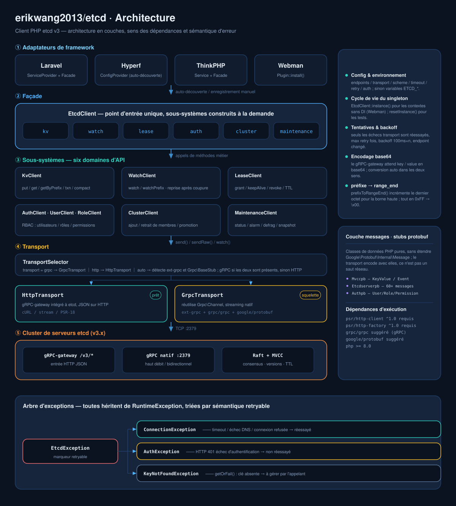
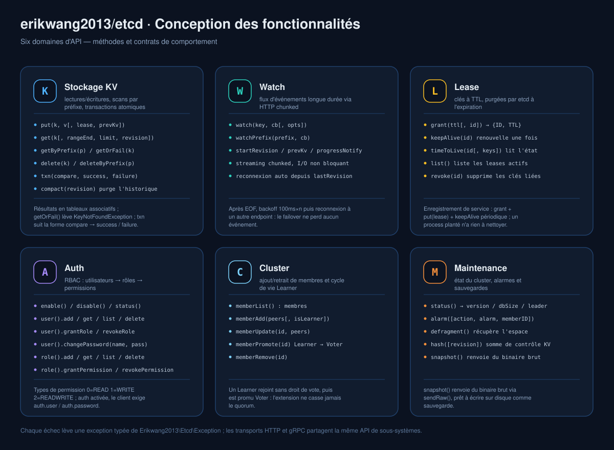
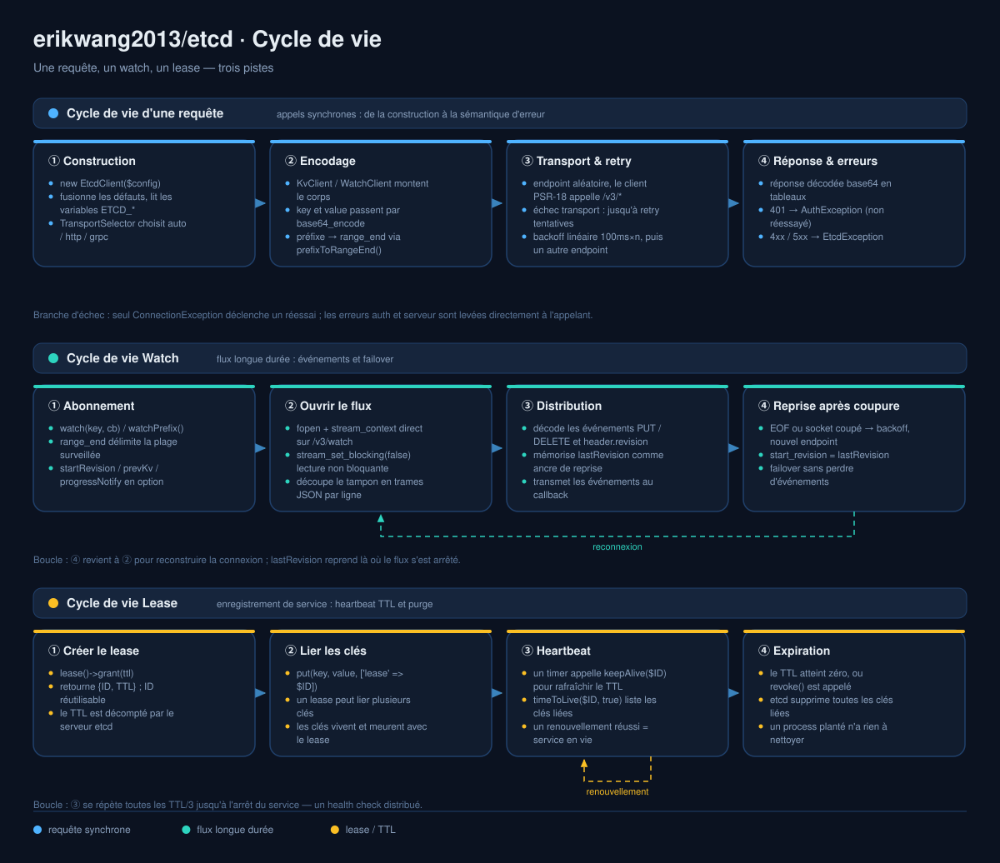

# erikwang2013/etcd

<p align="center">
  <a href="../../README.md">简体中文</a> ·
  <a href="README.en.md">English</a> ·
  <a href="README.ko.md">한국어</a> ·
  <a href="README.ru.md">Русский</a> ·
  <a href="README.de.md">Deutsch</a> ·
  <a href="README.fr.md">Français</a> ·
  <a href="README.es.md">Español</a> ·
  <a href="README.pt.md">Português</a> ·
  <a href="README.hi.md">हिन्दी</a> ·
  <a href="README.ar.md">العربية</a> ·
  <a href="README.bn.md">বাংলা</a> ·
  <a href="README.id.md">Bahasa Indonesia</a> ·
  <a href="README.ja.md">日本語</a>
</p>

<p align="center">
  
</p>

<p align="center">
  <b>Etchy</b> · un petit éléphant avec un cluster Raft à trois nœuds sur la tête et <code>k/v</code> et <code>rev</code> au bout de la trompe —<br/>
  il garde vos configurations et vos leases : coupé, il se reconnecte ; expiré, il nettoie tout seul.
</p>

Client PHP pour etcd v3 — transport double gRPC + HTTP, couvre toute l'API etcd v3 (KV / Watch / Lease / Auth / Cluster / Maintenance), prêt à l'emploi avec **Laravel / Hyperf / ThinkPHP / Webman**.

## Prérequis

- PHP >= 8.1
- serveur etcd v3.x
- client HTTP PSR-18 + PSR-17 (requis pour le transport HTTP, généralement fourni par le framework)

## Installation

```bash
composer require erikwang2013/etcd
```

## Démarrage rapide

```php
use Erikwang2013\Etcd\EtcdClient;

$etcd = new EtcdClient(['endpoints' => ['127.0.0.1:2379']]);

// écriture
$etcd->kv()->put('/app/config', '{"debug":true}');

// lecture
$result = $etcd->kv()->get('/app/config');
print_r($result['kvs'][0]);  // ['key' => '/app/config', 'value' => '{"debug":true}', ...]

// lève une exception si absent
$kv = $etcd->kv()->getOrFail('/app/config');

// balayage par préfixe
$all = $etcd->kv()->getByPrefix('/app/');
echo "total {$all['count']} entrées\n";

// suppression
$etcd->kv()->delete('/app/config');
$etcd->kv()->deleteByPrefix('/cache/');

// écriture avec bail (supprimé automatiquement après 60 s)
$lease = $etcd->lease()->grant(60);
$etcd->kv()->put('/session/123', 'active', ['lease' => $lease['ID']]);

// renouvellement
$etcd->lease()->keepAlive($lease['ID']);
```

## Configuration

```php
$etcd = new EtcdClient([
    'endpoints' => ['192.168.1.10:2379', '192.168.1.11:2379'],  // plusieurs nœuds
    'transport' => 'auto',  // auto (défaut) | http | grpc
    'scheme'    => 'http',  // http (défaut) | https
    'timeout'   => 5.0,     // secondes (à configurer dans le client PSR-18)
    'retry'     => 3,       // nombre de réessais en cas d'échec de connexion
    'auth'      => [        // facultatif, Basic Auth
        'user'     => 'root',
        'password' => 'secret',
    ],
]);
```

### Variables d'environnement

Sans configuration explicite, les variables d'environnement sont lues automatiquement :

| Variable | Défaut | Description |
|------|--------|------|
| `ETCD_ENDPOINTS` | `127.0.0.1:2379` | adresses multi-nœuds séparées par des virgules |
| `ETCD_TRANSPORT` | `auto` | auto / http / grpc |
| `ETCD_TIMEOUT` | `5.0` | délai d'expiration de la requête (secondes) |
| `ETCD_SCHEME` | `http` | http / https |
| `ETCD_RETRY` | `2` | nombre de réessais de connexion |
| `ETCD_USER` | — | nom d'utilisateur etcd |
| `ETCD_PASSWORD` | — | mot de passe etcd |

## Référence API

### KV — opérations clé/valeur

```php
// écriture
$etcd->kv()->put('key', 'value', [
    'lease'       => 12345,    // ID de bail lié
    'prevKv'      => true,     // renvoie l'ancienne valeur avant écriture
    'ignoreValue' => false,
    'ignoreLease' => false,
]);

// lecture d'une clé unique
$etcd->kv()->get('/exact/key');

// lève une exception si absent
$kv = $etcd->kv()->getOrFail('/exact/key');

// balayage par préfixe
$etcd->kv()->getByPrefix('/prefix/');

// requête par plage (paramètres complets)
$etcd->kv()->get('/start', [
    'rangeEnd'    => '/startz',      // clé de fin de plage
    'limit'       => 100,             // nombre maximal d'entrées renvoyées
    'revision'    => 42,              // numéro de version du snapshot
    'sortOrder'   => 'ascend',        // none | ascend | descend
    'sortTarget'  => 'key',           // key | version | create | mod | value
    'serializable'=> true,            // ignore le consensus Raft (plus rapide, peut être périmé)
    'keysOnly'    => true,            // renvoie seulement les clés, pas les valeurs
    'countOnly'   => false,           // renvoie seulement le nombre
]);

// suppression
$etcd->kv()->delete('/key');
$etcd->kv()->deleteByPrefix('/prefix/');
$etcd->kv()->delete('/key', ['prevKv' => true]);  // renvoie aussi la valeur supprimée

// transaction (CAS atomique)
$etcd->kv()->txn(
    compare: [
        ['result' => 0, 'target' => 3, 'key' => '/counter', 'value' => '100']
    ],
    success: [
        ['request_put' => ['key' => '/counter', 'value' => '101']]
    ],
    failure: [
        ['request_put' => ['key' => '/counter', 'value' => '1']]
    ]
);

// compacte les versions historiques (libère de l'espace)
$etcd->kv()->compact(1000);
```

**Constantes de cible de comparaison (target) :** `0`=VERSION, `1`=CREATE, `2`=MOD, `3`=VALUE, `4`=LEASE  
**Constantes de résultat de comparaison (result) :** `0`=EQUAL, `1`=GREATER, `2`=LESS, `3`=NOT_EQUAL

### Watch — écoute des changements

```php
// écoute d'une clé unique (mode bloquant, à lancer dans une coroutine / un process dédié)
$etcd->watch()->watch('/config/key', function (array $events) {
    foreach ($events as $event) {
        // $event: ['type' => 'PUT'|'DELETE', 'kv' => [...], 'prev_kv' => [...]|null]
        echo "{$event['type']} {$event['kv']['key']} = {$event['kv']['value']}\n";
    }
});

// écoute des changements de toutes les clés sous un préfixe
$etcd->watch()->watchPrefix('/config/', $callback, [
    'startRevision' => 100,       // à partir de la version indiquée
    'prevKv'        => true,      // les événements DELETE renvoient l'ancienne valeur
    'progressNotify'=> true,      // envoie périodiquement un événement vide (heartbeat)
]);
```

**Reconnexion :** en cas de coupure, le Watch se réabonne automatiquement à partir de la dernière revision reçue, sans perdre d'événement.

### Lease — leases

```php
// création du bail
$lease = $etcd->lease()->grant(300);             // TTL de 300 secondes
$lease = $etcd->lease()->grant(300, 99999);      // ID de bail explicite

// renouvellement (une fois)
$result = $etcd->lease()->keepAlive($lease['ID']);
echo "TTL restant: {$result['TTL']} secondes";

// consulter l'état du bail
$info = $etcd->lease()->timeToLive($lease['ID']);
$info = $etcd->lease()->timeToLive($lease['ID'], true);  // avec la liste des clés liées

// lister tous les baux actifs
$leases = $etcd->lease()->list();

// révoquer le bail (toutes les clés liées sont supprimées immédiatement)
$etcd->lease()->revoke($lease['ID']);
```

**Cas typique :** à l'enregistrement d'un service, créer un lease + écrire la clé, puis appeler `keepAlive()` périodiquement comme heartbeat ; à l'arrêt du service, le lease expire et tout est nettoyé automatiquement.

### Auth — authentification et permissions

```php
$auth = $etcd->auth();

// === gestion des utilisateurs ===
$auth->user()->add('alice', 'password123');          // créer l'utilisateur
$auth->user()->get('alice');                         // voir l'utilisateur et ses rôles
$auth->user()->list();                               // lister tous les utilisateurs
$auth->user()->changePassword('alice', 'newpass');    // changer le mot de passe
$auth->user()->grantRole('alice', 'admin');          // accorder le rôle
$auth->user()->revokeRole('alice', 'admin');         // révoquer le rôle
$auth->user()->delete('alice');                      // supprimer l'utilisateur

// === gestion des rôles ===
$auth->role()->add('reader');                        // créer le rôle
$auth->role()->get('reader');                        // voir les permissions du rôle
$auth->role()->list();                               // lister tous les rôles

// accorder une permission (permType: 0=READ, 1=WRITE, 2=READWRITE)
$auth->role()->grantPermission('reader', 0, '/data/', "\0");   // permission de lecture sur le préfixe /data/
$auth->role()->grantPermission('writer', 2, '/data/', "\0");   // permission de lecture-écriture
$auth->role()->revokePermission('reader', '/data/', "\0");     // révoquer la permission
$auth->role()->delete('reader');

// === activation de l'authentification ===
$auth->enable();           // activer l'authentification
$auth->disable();          // désactiver l'authentification
$status = $auth->status(); // ['enabled' => true, 'authRevision' => 5]
```

**Attention :** une fois l'authentification activée, le client doit configurer `auth.user` et `auth.password` pour continuer à fonctionner.

### Cluster — gestion du cluster

```php
// voir les membres du cluster
$members = $etcd->cluster()->memberList();

// ajouter un membre
$etcd->cluster()->memberAdd(['http://node3:2380']);        // ajouter un membre Voting
$etcd->cluster()->memberAdd(['http://node4:2380'], true);  // ajouter un membre Learner

// modifier l'URL peer d'un membre
$etcd->cluster()->memberUpdate(123456, ['http://newnode:2380']);

// promouvoir un Learner en Voter
$etcd->cluster()->memberPromote(789012);

// retirer un membre
$etcd->cluster()->memberRemove(345678);
```

### Maintenance — exploitation

```php
// voir l'état du nœud
$status = $etcd->maintenance()->status();
// ['version' => '3.5.0', 'dbSize' => 24576, 'leader' => 123, 'raftIndex' => 1000, ...]

// gestion des alarmes
$alarms = $etcd->maintenance()->alarm();                    // voir les alarmes
$etcd->maintenance()->alarm(action: 2, alarm: 1);           // effacer l'alarme NOSPACE

// défragmentation (récupère l'espace de stockage)
$etcd->maintenance()->defragment();

// vérification du hash KV
$hash = $etcd->maintenance()->hash();

// récupérer un snapshot (données binaires, à écrire dans un fichier)
$snapshot = $etcd->maintenance()->snapshot();
file_put_contents('/backup/etcd-snapshot.db', $snapshot);
```

## Modes de transport

| Mode | État | Dépendances | Cas d'usage |
|------|------|------|---------|
| **HTTP** | disponible | PSR-18 + PSR-17 | aucune extension requise, opérationnel immédiatement |
| **gRPC** | squelette | ext-grpc + grpc/grpc + google/protobuf | hautes performances, streaming natif |
| **auto** | par défaut | détection automatique | gRPC si disponible, sinon HTTP |

Logique de détection du mode `auto` :
1. `extension_loaded('grpc')` — l'extension C est chargée ?
2. `class_exists('Grpc\BaseStub')` — le paquet composer `grpc/grpc` est installé ?

Il faut les deux pour utiliser gRPC, sinon repli sur HTTP.

### Configurer manuellement le client HTTP PSR-18

```php
use Erikwang2013\Etcd\Transport\HttpTransport;
use GuzzleHttp\Client;
use GuzzleHttp\Psr7\HttpFactory;

$transport = new HttpTransport(['127.0.0.1:2379'], ['timeout' => 3.0]);
$transport->setHttpClient(
    new Client(['timeout' => 3]),
    new HttpFactory(),
    new HttpFactory()
);
```

## Intégration aux frameworks

### Laravel

Prêt à l'emploi après installation. La clé `extra.laravel` de composer.json déclenche la découverte automatique du ServiceProvider et de la Facade.

```php
// via la Facade
use Etcd;
Etcd::kv()->put('/foo', 'bar');
$val = Etcd::kv()->get('/foo');

// via l'injection de dépendances
use Erikwang2013\Etcd\EtcdClient;

class MyService
{
    public function __construct(private EtcdClient $etcd) {}

    public function work(): void
    {
        $this->etcd->kv()->put('/key', 'value');
    }
}
```

Publier le fichier de configuration :

```bash
php artisan vendor:publish --tag=etcd-config
# → config/etcd.php
```

Configuration `.env` :

```env
ETCD_ENDPOINTS=10.0.0.1:2379,10.0.0.2:2379
ETCD_USER=root
ETCD_PASSWORD=secret
```

### Hyperf

Prêt à l'emploi après installation. Hyperf découvre automatiquement le `ConfigProvider`.

```php
use Erikwang2013\Etcd\EtcdClient;
use Hyperf\Di\Annotation\Inject;

class MyService
{
    #[Inject]
    private EtcdClient $etcd;

    public function work(): void
    {
        $this->etcd->kv()->put('/key', 'value');
    }
}

// ou directement make
$etcd = make(EtcdClient::class);
```

Publier la configuration :

```bash
php bin/hyperf.php vendor:publish erikwang2013/etcd
# → config/autoload/etcd.php
```

### ThinkPHP

1. Après installation, enregistrez-la dans `app/service.php` :

```php
return [
    Erikwang2013\Etcd\Adapter\ThinkPHP\Service::class,
];
```

2. Créez le fichier de configuration `config/etcd.php`.

Utilisation :

```php
// via la Facade
use think\facade\Etcd;
Etcd::kv()->put('/key', 'value');

// via le conteneur
app('etcd')->kv()->get('/key');
```

### Webman

Prêt à l'emploi après installation, aucune configuration supplémentaire.

```php
use Erikwang2013\Etcd\EtcdClient;

$etcd = EtcdClient::instance();
$etcd->kv()->put('/key', 'value');
```

Pour personnaliser la configuration, éditez `plugin/erikwang2013/etcd/config/etcd.php`.

## Gestion des exceptions

```php
use Erikwang2013\Etcd\Exception\{
    EtcdException,
    ConnectionException,
    AuthException,
    KeyNotFoundException,
};

try {
    $etcd->kv()->put('/key', 'value');
} catch (ConnectionException $e) {
    // nœud etcd injoignable (panne réseau, arrêt)
} catch (AuthException $e) {
    // échec d'authentification (utilisateur ou mot de passe incorrect)
} catch (KeyNotFoundException $e) {
    // clé inexistante lors d'un getOrFail()
} catch (EtcdException $e) {
    // autre erreur côté serveur etcd
}
```

## Structure du projet

```
erikwang2013/etcd/
├── composer.json                    # définition du paquet : autoload PSR-4 + auto-découverte Laravel / Hyperf
├── phpunit.xml                      # configuration PHPUnit (deux suites : unit / integration)
├── config/etcd.php                  # configuration par défaut, publiée par chaque framework (lit les variables ETCD_*)
├── .github/workflows/release.yml    # publication automatique au tag
├── docs/                            # documentation et diagrammes
│   ├── design-cn.md                 #   document de conception
│   ├── pet.svg                      #   la mascotte du projet, Etchy
│   ├── architecture.svg             #   diagramme d'architecture
│   ├── features.svg                 #   diagramme de conception fonctionnelle
│   └── lifecycle.svg                #   diagramme de cycle de vie
├── src/
│   ├── EtcdClient.php               # façade de plus haut niveau + singleton : kv / watch / lease / auth / cluster / maintenance
│   ├── Mascot.php                   # point d'entrée vers la mascotte Etchy (svg / dataUri / path)
│   ├── Install.php                  # hook du plugin Webman (WEBMAN_PLUGIN)
│   ├── Transport/                   # couche transport
│   │   ├── TransportInterface.php   #   abstraction de transport : send / sendRaw / watch
│   │   ├── TransportSelector.php    #   sélection automatique auto / http / grpc
│   │   ├── HttpTransport.php        #   transport HTTP JSON (complet et opérationnel)
│   │   └── GrpcTransport.php        #   transport gRPC (squelette)
│   ├── Kv/KvClient.php              # lecture-écriture KV / balayage par préfixe / transactions / compaction
│   ├── Watch/WatchClient.php        # écoute des changements Watch + réabonnement après coupure
│   ├── Lease/LeaseClient.php        # baux Lease grant / keepAlive / revoke
│   ├── Auth/                        # authentification et autorisation Auth
│   │   ├── AuthClient.php           #   activation et état de l'authentification
│   │   ├── UserClient.php           #   CRUD des utilisateurs + liaison des rôles
│   │   └── RoleClient.php           #   CRUD des rôles + permissions
│   ├── Cluster/ClusterClient.php    # gestion des membres du cluster Cluster
│   ├── Maintenance/                 # exploitation Maintenance : status / alarm / defrag / snapshot
│   ├── Exception/                   # hiérarchie des exceptions
│   ├── Protobuf/                    # stubs de messages (classes de données PHP pures, sans hériter de Message)
│   │   ├── Mvccpb/                  #   KeyValue, Event
│   │   ├── Etcdserverpb/            #   60+ messages de requête / réponse
│   │   └── Authpb/                  #   User, Role, Permission
│   └── Adapter/                     # adaptateurs de framework
│       ├── Laravel/                 #   ServiceProvider + Facade
│       ├── Hyperf/                  #   ConfigProvider
│       ├── ThinkPHP/                #   Service + Facade
│       └── Webman/                  #   Plugin
└── tests/
    ├── Unit/                        # tests unitaires (par client / transport / adaptateur / classe de message)
    ├── Integration/                 # tests d'intégration (contre un vrai etcd)
    └── Support/                     # FakeTransport, stubs HTTP PSR
```

## Architecture et diagrammes

Les trois diagrammes suivent l'ordre « structure → capacités → séquence » et sont consultables séparément :

| Diagramme | Question traitée | Fichier |
|----|-----------|------|
| Architecture | en combien de couches, dans quel sens vont les dépendances, comment les erreurs sont triées | [`diagrams/fr/architecture.svg`](diagrams/fr/architecture.svg) |
| Conception fonctionnelle | quelles méthodes offre chaque sous-système, quels contrats de comportement | [`diagrams/fr/features.svg`](diagrams/fr/features.svg) |
| Cycle de vie | comment se déroulent une requête / un watch / un lease | [`diagrams/fr/lifecycle.svg`](diagrams/fr/lifecycle.svg) |

### Architecture



### Conception fonctionnelle



### Cycle de vie



### Utiliser Etchy dans votre code

Les visuels sont livrés avec le paquet ; `Mascot` est l'unique point d'entrée pour les récupérer, inutile d'en recopier une version pour un panneau d'admin / une page de statut :

```php
use Erikwang2013\Etcd\Mascot;

echo Mascot::svg();                                          // code SVG, à inliner directement
echo '';    // data URI, indépendant du répertoire web
copy(Mascot::path(), __DIR__ . '/public/etcd.svg');          // ou à copier soi-même dans un répertoire statique
```

Sous Laravel, publication directe vers `public/` :

```bash
php artisan vendor:publish --tag=etcd-assets
# → public/vendor/etcd/pet.svg
```

## Le libre, c'est difficile — merci de soutenir / Support This Project

<p align="center">
  <table>
    <tr>
      <td align="center"><b>微信 / WeChat</b></td>
      <td align="center"><b>支付宝 / Alipay</b></td>
    </tr>
    <tr>
      <td align="center"></td>
      <td align="center"></td>
    </tr>
  </table>
</p>

---

## License

MIT — Copyright (c) 2026 [erik](https://erik.xyz) <erik@erik.xyz>
