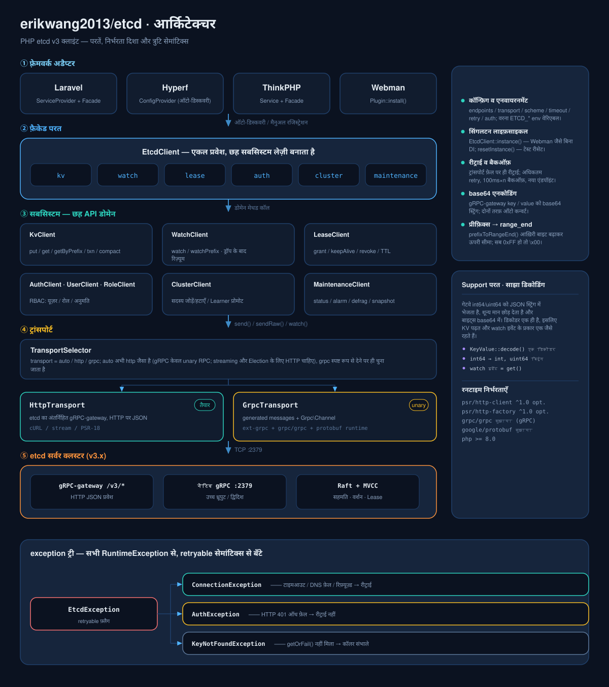
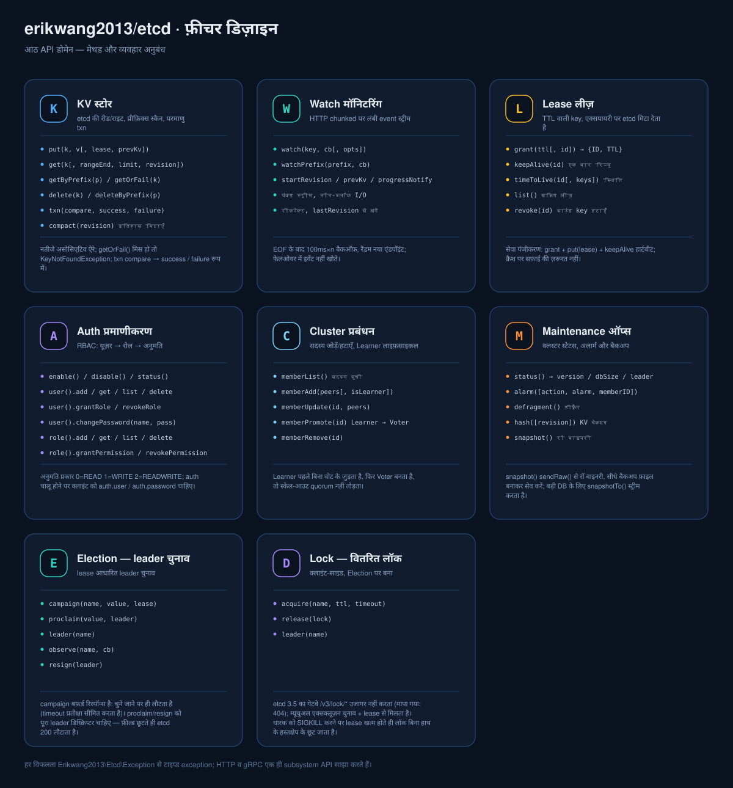
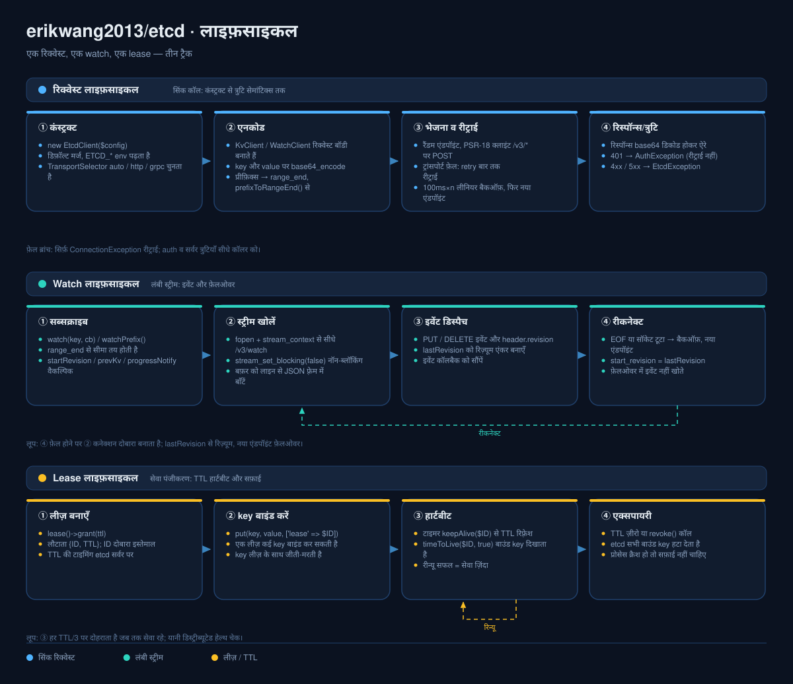

# erikwang2013/etcd

<p align="center">
  <a href="../../README.md">简体中文</a> ·
  <a href="README.en.md">English</a> ·
  <a href="README.ko.md">한국어</a> ·
  <a href="README.ru.md">Русский</a> ·
  <a href="README.de.md">Deutsch</a> ·
  <a href="README.fr.md">Français</a> ·
  <a href="README.es.md">Español</a> ·
  <a href="README.pt.md">Português</a> ·
  <a href="README.hi.md">हिन्दी</a> ·
  <a href="README.ar.md">العربية</a> ·
  <a href="README.bn.md">বাংলা</a> ·
  <a href="README.id.md">Bahasa Indonesia</a> ·
  <a href="README.ja.md">日本語</a>
</p>

<p align="center">
  
</p>

<p align="center">
  <b>Etchy</b> · सिर पर तीन-नोड Raft क्लस्टर, सूंड की नोक पर <code>k/v</code> और <code>rev</code> लटकाए छोटा हाथी ——<br/>
  आपके कॉन्फ़िग और लीज़ का रखवाला: कनेक्शन टूटे तो खुद जुड़ता है, एक्सपायर हो तो खुद साफ़ करता है।
</p>

PHP etcd v3 क्लाइंट —— gRPC + HTTP दोहरा ट्रांसपोर्ट, etcd v3 के सभी API (KV / Watch / Lease / Auth / Cluster / Maintenance) कवर करता है, और **Laravel / Hyperf / ThinkPHP / Webman** के लिए बिना किसी सेटअप के तैयार है।

## आवश्यकताएँ

- PHP >= 8.1
- etcd v3.x सर्वर
- PSR-18 + PSR-17 HTTP क्लाइंट (HTTP ट्रांसपोर्ट के लिए ज़रूरी; आमतौर पर फ़्रेमवर्क के साथ आता है)

## इंस्टॉलेशन

```bash
composer require erikwang2013/etcd
```

## त्वरित शुरुआत

```php
use Erikwang2013\Etcd\EtcdClient;

$etcd = new EtcdClient(['endpoints' => ['127.0.0.1:2379']]);

// लिखें
$etcd->kv()->put('/app/config', '{"debug":true}');

// पढ़ें
$result = $etcd->kv()->get('/app/config');
print_r($result['kvs'][0]);  // ['key' => '/app/config', 'value' => '{"debug":true}', ...]

// न मिले तो exception
$kv = $etcd->kv()->getOrFail('/app/config');

// prefix स्कैन
$all = $etcd->kv()->getByPrefix('/app/');
echo "कुल {$all['count']} रिकॉर्ड\n";

// हटाएँ
$etcd->kv()->delete('/app/config');
$etcd->kv()->deleteByPrefix('/cache/');

// lease के साथ लिखें (60 सेकंड बाद अपने-आप हट जाता है)
$lease = $etcd->lease()->grant(60);
$etcd->kv()->put('/session/123', 'active', ['lease' => $lease['ID']]);

// रिन्यू
$etcd->lease()->keepAlive($lease['ID']);
```

## कॉन्फ़िगरेशन

```php
$etcd = new EtcdClient([
    'endpoints' => ['192.168.1.10:2379', '192.168.1.11:2379'],  // कई नोड
    'transport' => 'auto',  // auto (डिफ़ॉल्ट) | http | grpc
    'scheme'    => 'http',  // http (डिफ़ॉल्ट) | https
    'timeout'   => 5.0,     // सेकंड (PSR-18 क्लाइंट में सेट करें)
    'retry'     => 3,       // कनेक्शन फ़ेल पर रीट्राई की संख्या
    'auth'      => [        // वैकल्पिक, Basic Auth
        'user'     => 'root',
        'password' => 'secret',
    ],
]);
```

### एनवायरनमेंट वेरिएबल

कॉन्फ़िग न देने पर एनवायरनमेंट वेरिएबल अपने आप पढ़े जाते हैं:

| वेरिएबल | डिफ़ॉल्ट | विवरण |
|------|--------|------|
| `ETCD_ENDPOINTS` | `127.0.0.1:2379` | कॉमा से अलग किए कई नोड पते |
| `ETCD_TRANSPORT` | `auto` | auto / http / grpc |
| `ETCD_TIMEOUT` | `5.0` | रिक्वेस्ट टाइमआउट (सेकंड) |
| `ETCD_SCHEME` | `http` | http / https |
| `ETCD_RETRY` | `2` | कनेक्शन रीट्राई की संख्या |
| `ETCD_USER` | — | etcd यूज़रनेम |
| `ETCD_PASSWORD` | — | etcd पासवर्ड |

## API संदर्भ

### KV — की-वैल्यू ऑपरेशन

```php
// लिखें
$etcd->kv()->put('key', 'value', [
    'lease'       => 12345,    // lease ID बाइंड करें
    'prevKv'      => true,     // लिखने से पहले की पुरानी value
    'ignoreValue' => false,
    'ignoreLease' => false,
]);

// अकेली key पढ़ें
$etcd->kv()->get('/exact/key');

// न मिले तो exception
$kv = $etcd->kv()->getOrFail('/exact/key');

// prefix स्कैन
$etcd->kv()->getByPrefix('/prefix/');

// range क्वेरी (पूरे पैरामीटर)
$etcd->kv()->get('/start', [
    'rangeEnd'    => '/startz',      // range का अंतिम key
    'limit'       => 100,             // ज़्यादा से ज़्यादा कितने रिकॉर्ड
    'revision'    => 42,              // स्नैपशॉट revision
    'sortOrder'   => 'ascend',        // none | ascend | descend
    'sortTarget'  => 'key',           // key | version | create | mod | value
    'serializable'=> true,            // Raft सहमति छोड़ें (तेज़, पर डेटा पुराना हो सकता है)
    'keysOnly'    => true,            // सिर्फ़ key लौटाएँ, value नहीं
    'countOnly'   => false,           // सिर्फ़ गिनती लौटाएँ
]);

// हटाएँ
$etcd->kv()->delete('/key');
$etcd->kv()->deleteByPrefix('/prefix/');
$etcd->kv()->delete('/key', ['prevKv' => true]);  // साथ में हटाई गई value भी

// txn (परमाणु CAS)
$etcd->kv()->txn(
    compare: [
        ['result' => 0, 'target' => 3, 'key' => '/counter', 'value' => '100']
    ],
    success: [
        ['request_put' => ['key' => '/counter', 'value' => '101']]
    ],
    failure: [
        ['request_put' => ['key' => '/counter', 'value' => '1']]
    ]
);

// पुराने वर्शन कॉम्पैक्ट करें (स्टोरेज खाली करें)
$etcd->kv()->compact(1000);
```

**तुलना target कॉन्स्टेंट:** `0`=VERSION, `1`=CREATE, `2`=MOD, `3`=VALUE, `4`=LEASE  
**तुलना result कॉन्स्टेंट:** `0`=EQUAL, `1`=GREATER, `2`=LESS, `3`=NOT_EQUAL

### Watch — बदलाव की निगरानी

```php
// अकेली key सुनें (blocking मोड; कोरूटीन या अलग प्रोसेस में चलाएँ)
$etcd->watch()->watch('/config/key', function (array $events) {
    foreach ($events as $event) {
        // $event: ['type' => 'PUT'|'DELETE', 'kv' => [...], 'prev_kv' => [...]|null]
        echo "{$event['type']} {$event['kv']['key']} = {$event['kv']['value']}\n";
    }
});

// prefix की सभी key के बदलाव सुनें
$etcd->watch()->watchPrefix('/config/', $callback, [
    'startRevision' => 100,       // दिए revision से शुरू
    'prevKv'        => true,      // DELETE इवेंट में पुरानी value
    'progressNotify'=> true,      // समय-समय पर खाली इवेंट (हार्टबीट)
]);
```

**रीकनेक्ट:** Watch कनेक्शन टूटने पर पिछली मिली revision से अपने आप रिज़्यूम होता है, इवेंट नहीं खोते।

### Lease — लीज़

```php
// lease बनाएँ
$lease = $etcd->lease()->grant(300);             // 300 सेकंड TTL
$lease = $etcd->lease()->grant(300, 99999);      // lease ID तय करें

// रिन्यू (एक बार)
$result = $etcd->lease()->keepAlive($lease['ID']);
echo "TTL शेष: {$result['TTL']} सेकंड";

// lease की स्थिति देखें
$info = $etcd->lease()->timeToLive($lease['ID']);
$info = $etcd->lease()->timeToLive($lease['ID'], true);  // बाउंड key की सूची भी

// सभी सक्रिय lease की सूची
$leases = $etcd->lease()->list();

// lease रद्द करें (बाउंड सभी key तुरंत हट जाती हैं)
$etcd->lease()->revoke($lease['ID']);
```

**आम उपयोग:** सेवा रजिस्टर करते समय लीज़ बनाएँ + key लिखें, और समय-समय पर `keepAlive()` हार्टबीट भेजें; सेवा बंद होने पर लीज़ एक्सपायर होकर अपने आप साफ़ हो जाती है।

### Auth — प्रमाणीकरण और अनुमतियाँ

```php
$auth = $etcd->auth();

// === यूज़र प्रबंधन ===
$auth->user()->add('alice', 'password123');          // यूज़र बनाएँ
$auth->user()->get('alice');                         // यूज़र और उसके रोल
$auth->user()->list();                               // सभी यूज़र की सूची
$auth->user()->changePassword('alice', 'newpass');    // पासवर्ड बदलें
$auth->user()->grantRole('alice', 'admin');          // रोल दें
$auth->user()->revokeRole('alice', 'admin');         // रोल वापस लें
$auth->user()->delete('alice');                      // यूज़र हटाएँ

// === रोल प्रबंधन ===
$auth->role()->add('reader');                        // रोल बनाएँ
$auth->role()->get('reader');                        // रोल की अनुमतियाँ
$auth->role()->list();                               // सभी रोल की सूची

// अनुमति दें (permType: 0=READ, 1=WRITE, 2=READWRITE)
$auth->role()->grantPermission('reader', 0, '/data/', "\0");   // /data/ prefix पर पढ़ने की अनुमति
$auth->role()->grantPermission('writer', 2, '/data/', "\0");   // पढ़ने-लिखने की अनुमति
$auth->role()->revokePermission('reader', '/data/', "\0");     // अनुमति वापस लें
$auth->role()->delete('reader');

// === auth स्विच ===
$auth->enable();           // auth चालू करें
$auth->disable();          // auth बंद करें
$status = $auth->status(); // ['enabled' => true, 'authRevision' => 5]
```

**ध्यान दें:** auth चालू करने के बाद क्लाइंट के लिए `auth.user` और `auth.password` कॉन्फ़िग करना ज़रूरी है, तभी आगे के ऑपरेशन चलेंगे।

### Cluster — क्लस्टर प्रबंधन

```php
// क्लस्टर के सदस्य देखें
$members = $etcd->cluster()->memberList();

// सदस्य जोड़ें
$etcd->cluster()->memberAdd(['http://node3:2380']);        // Voting सदस्य जोड़ें
$etcd->cluster()->memberAdd(['http://node4:2380'], true);  // Learner सदस्य जोड़ें

// सदस्य का peer URL बदलें
$etcd->cluster()->memberUpdate(123456, ['http://newnode:2380']);

// Learner को Voter बनाएँ
$etcd->cluster()->memberPromote(789012);

// सदस्य हटाएँ
$etcd->cluster()->memberRemove(345678);
```

### Maintenance — ऑप्स

```php
// नोड की स्थिति देखें
$status = $etcd->maintenance()->status();
// ['version' => '3.5.0', 'dbSize' => 24576, 'leader' => 123, 'raftIndex' => 1000, ...]

// अलार्म प्रबंधन
$alarms = $etcd->maintenance()->alarm();                    // अलार्म देखें
$etcd->maintenance()->alarm(action: 2, alarm: 1);           // NOSPACE अलार्म हटाएँ

// डीफ़्रैग (स्टोरेज वापस पाएँ)
$etcd->maintenance()->defragment();

// KV चेकसम जाँच
$hash = $etcd->maintenance()->hash();

// स्नैपशॉट लें (बाइनरी डेटा; फ़ाइल में लिख दें)
$snapshot = $etcd->maintenance()->snapshot();
file_put_contents('/backup/etcd-snapshot.db', $snapshot);
```

## ट्रांसपोर्ट मोड

| मोड | स्थिति | निर्भरता | कब ठीक है |
|------|------|------|---------|
| **HTTP** | तैयार | PSR-18 + PSR-17 | कोई PHP एक्सटेंशन नहीं चाहिए, तुरंत काम करता है |
| **gRPC** | ढांचा | ext-grpc + grpc/grpc + google/protobuf | उच्च प्रदर्शन, नेटिव स्ट्रीमिंग |
| **auto** | डिफ़ॉल्ट | अपने आप डिटेक्ट | gRPC हो तो gRPC, वरना HTTP |

`auto` मोड का डिटेक्शन लॉजिक:
1. `extension_loaded('grpc')` — C एक्सटेंशन लोड है?
2. `class_exists('Grpc\BaseStub')` — `grpc/grpc` composer पैकेज इंस्टॉल है?

दोनों शर्तें पूरी हों तभी gRPC, वरना HTTP पर वापस।

### PSR-18 HTTP क्लाइंट मैनुअल कॉन्फ़िगर करें

```php
use Erikwang2013\Etcd\Transport\HttpTransport;
use GuzzleHttp\Client;
use GuzzleHttp\Psr7\HttpFactory;

$transport = new HttpTransport(['127.0.0.1:2379'], ['timeout' => 3.0]);
$transport->setHttpClient(
    new Client(['timeout' => 3]),
    new HttpFactory(),
    new HttpFactory()
);
```

## फ़्रेमवर्क इंटीग्रेशन

### Laravel

इंस्टॉल करते ही काम करता है। composer.json की `extra.laravel` सेटिंग ServiceProvider और Facade अपने आप खोज लेती है।

```php
// Facade तरीक़ा
use Etcd;
Etcd::kv()->put('/foo', 'bar');
$val = Etcd::kv()->get('/foo');

// डिपेंडेंसी इंजेक्शन तरीक़ा
use Erikwang2013\Etcd\EtcdClient;

class MyService
{
    public function __construct(private EtcdClient $etcd) {}

    public function work(): void
    {
        $this->etcd->kv()->put('/key', 'value');
    }
}
```

कॉन्फ़िग फ़ाइल पब्लिश करें:

```bash
php artisan vendor:publish --tag=etcd-config
# → config/etcd.php
```

`.env` कॉन्फ़िगरेशन:

```env
ETCD_ENDPOINTS=10.0.0.1:2379,10.0.0.2:2379
ETCD_USER=root
ETCD_PASSWORD=secret
```

### Hyperf

इंस्टॉल करते ही काम करता है। Hyperf `ConfigProvider` अपने आप खोज लेता है।

```php
use Erikwang2013\Etcd\EtcdClient;
use Hyperf\Di\Annotation\Inject;

class MyService
{
    #[Inject]
    private EtcdClient $etcd;

    public function work(): void
    {
        $this->etcd->kv()->put('/key', 'value');
    }
}

// या सीधे make
$etcd = make(EtcdClient::class);
```

कॉन्फ़िग पब्लिश करें:

```bash
php bin/hyperf.php vendor:publish erikwang2013/etcd
# → config/autoload/etcd.php
```

### ThinkPHP

1. इंस्टॉल के बाद `app/service.php` में रजिस्टर करें:

```php
return [
    Erikwang2013\Etcd\Adapter\ThinkPHP\Service::class,
];
```

2. `config/etcd.php` कॉन्फ़िग फ़ाइल बनाएँ।

इस्तेमाल:

```php
// Facade तरीक़ा
use think\facade\Etcd;
Etcd::kv()->put('/key', 'value');

// कंटेनर तरीक़ा
app('etcd')->kv()->get('/key');
```

### Webman

इंस्टॉल करते ही काम करता है, किसी अतिरिक्त कॉन्फ़िग की ज़रूरत नहीं।

```php
use Erikwang2013\Etcd\EtcdClient;

$etcd = EtcdClient::instance();
$etcd->kv()->put('/key', 'value');
```

कस्टम कॉन्फ़िग चाहिए तो `plugin/erikwang2013/etcd/config/etcd.php` एडिट करें।

## त्रुटि हैंडलिंग

```php
use Erikwang2013\Etcd\Exception\{
    EtcdException,
    ConnectionException,
    AuthException,
    KeyNotFoundException,
};

try {
    $etcd->kv()->put('/key', 'value');
} catch (ConnectionException $e) {
    // etcd नोड से कनेक्शन नहीं (नेटवर्क गड़बड़ी, सर्वर डाउन)
} catch (AuthException $e) {
    // auth फ़ेल (यूज़रनेम या पासवर्ड ग़लत)
} catch (KeyNotFoundException $e) {
    // getOrFail() पर key मौजूद नहीं
} catch (EtcdException $e) {
    // etcd सर्वर की अन्य त्रुटि
}
```

## प्रोजेक्ट स्ट्रक्चर

```
erikwang2013/etcd/
├── composer.json                    # पैकेज परिभाषा: PSR-4 ऑटोलोड + Laravel / Hyperf ऑटो-डिस्कवरी
├── phpunit.xml                      # PHPUnit कॉन्फ़िग (unit / integration दो सूट)
├── config/etcd.php                  # डिफ़ॉल्ट कॉन्फ़िग, फ़्रेमवर्क पब्लिश करने के लिए (ETCD_* env पढ़ता है)
├── .github/workflows/release.yml    # tag लगाने पर अपने-आप रिलीज़
├── docs/                            # डॉक्स और डिज़ाइन आरेख
│   ├── design-cn.md                 #   डिज़ाइन डॉक्यूमेंट
│   ├── pet.svg                      #   प्रोजेक्ट पेट Etchy
│   ├── architecture.svg             #   आर्किटेक्चर आरेख
│   ├── features.svg                 #   फ़ीचर डिज़ाइन आरेख
│   └── lifecycle.svg                #   लाइफ़साइकल आरेख
├── src/
│   ├── EtcdClient.php               # टॉप-लेवल फ़ैकेड + सिंगलटन: kv / watch / lease / auth / cluster / maintenance
│   ├── Mascot.php                   # प्रोजेक्ट पेट Etchy लेने का रास्ता (svg / dataUri / path)
│   ├── Install.php                  # Webman प्लगिन हुक (WEBMAN_PLUGIN)
│   ├── Transport/                   # ट्रांसपोर्ट परत
│   │   ├── TransportInterface.php   #   ट्रांसपोर्ट एब्स्ट्रैक्शन: send / sendRaw / watch
│   │   ├── TransportSelector.php    #   auto / http / grpc ऑटो-चयन
│   │   ├── HttpTransport.php        #   HTTP JSON ट्रांसपोर्ट (पूरी तरह तैयार)
│   │   └── GrpcTransport.php        #   gRPC ट्रांसपोर्ट (ढांचा)
│   ├── Kv/KvClient.php              # KV रीड-राइट / prefix स्कैन / txn / कॉम्पैक्शन
│   ├── Watch/WatchClient.php        # Watch बदलाव की निगरानी + रीकनेक्ट
│   ├── Lease/LeaseClient.php        # Lease: grant / keepAlive / revoke
│   ├── Auth/                        # Auth प्रमाणीकरण और अनुमतियाँ
│   │   ├── AuthClient.php           #   auth स्विच और स्थिति
│   │   ├── UserClient.php           #   यूज़र CRUD + रोल बाइंडिंग
│   │   └── RoleClient.php           #   रोल CRUD + अनुमतियाँ
│   ├── Cluster/ClusterClient.php    # Cluster सदस्य प्रबंधन
│   ├── Maintenance/                 # Maintenance ऑप्स: status / alarm / defrag / snapshot
│   ├── Exception/                   # exception पदानुक्रम
│   ├── Protobuf/                    # मैसेज स्टब्स (सादे PHP डेटा क्लास, Message से इनहेरिट नहीं)
│   │   ├── Mvccpb/                  #   KeyValue, Event
│   │   ├── Etcdserverpb/            #   60+ रिक्वेस्ट / रिस्पॉन्स मैसेज
│   │   └── Authpb/                  #   User, Role, Permission
│   └── Adapter/                     # फ़्रेमवर्क अडैप्टर
│       ├── Laravel/                 #   ServiceProvider + Facade
│       ├── Hyperf/                  #   ConfigProvider
│       ├── ThinkPHP/                #   Service + Facade
│       └── Webman/                  #   Plugin
└── tests/
    ├── Unit/                        # यूनिट टेस्ट (हर क्लाइंट / ट्रांसपोर्ट / अडैप्टर / मैसेज क्लास)
    ├── Integration/                 # इंटीग्रेशन टेस्ट (असली etcd से)
    └── Support/                     # FakeTransport, PSR HTTP स्टब्स
```

## आर्किटेक्चर और डिज़ाइन आरेख

तीनों आरेख «संरचना → क्षमता → क्रम» के क्रम में लगे हैं, हर एक अलग से देख सकते हैं:

| आरेख | किस सवाल का जवाब | फ़ाइल |
|----|-----------|------|
| आर्किटेक्चर डिज़ाइन | कितनी परतें हैं, निर्भरता किस दिशा में जाती है, त्रुटि कैसे बँटती है | [`docs/architecture.svg`](diagrams/hi/architecture.svg) |
| फ़ीचर डिज़ाइन | हर सबसिस्टम कौन-से मेथड देता है और कौन-से व्यवहार अनुबंध हैं | [`docs/features.svg`](diagrams/hi/features.svg) |
| लाइफ़साइकल | एक रिक्वेस्ट / एक watch / एक लीज़ अलग-अलग कैसे पूरे होते हैं | [`docs/lifecycle.svg`](diagrams/hi/lifecycle.svg) |

### आर्किटेक्चर डिज़ाइन



### फ़ीचर डिज़ाइन



### लाइफ़साइकल



### कोड में Etchy का इस्तेमाल

आरेख पैकेज के साथ ही आते हैं, और `Mascot` ही इन्हें लेने का इकलौता ज़रिया है — एडमिन पैनल / स्टेटस पेज बनाते समय अलग कॉपी रखने की ज़रूरत नहीं:

```php
use Erikwang2013\Etcd\Mascot;

echo Mascot::svg();                                          // SVG सोर्स, सीधे इनलाइन
echo '';    // data URI, web डायरेक्टरी की ज़रूरत नहीं
copy(Mascot::path(), __DIR__ . '/public/etcd.svg');          // या खुद स्टैटिक डायरेक्टरी में रखें
```

Laravel में सीधे `public/` में पब्लिश कर सकते हैं:

```bash
php artisan vendor:publish --tag=etcd-assets
# → public/vendor/etcd/pet.svg
```

## ओपन सोर्स आसान नहीं है, सपोर्ट करें / Support This Project

<p align="center">
  <table>
    <tr>
      <td align="center"><b>微信 / WeChat</b></td>
      <td align="center"><b>支付宝 / Alipay</b></td>
    </tr>
    <tr>
      <td align="center"></td>
      <td align="center"></td>
    </tr>
  </table>
</p>

---

## License

MIT — Copyright (c) 2026 [erik](https://erik.xyz) <erik@erik.xyz>
