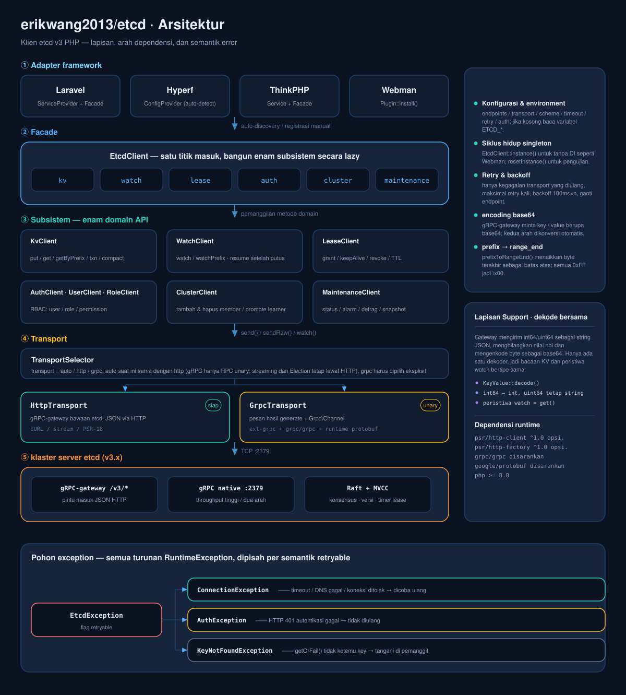
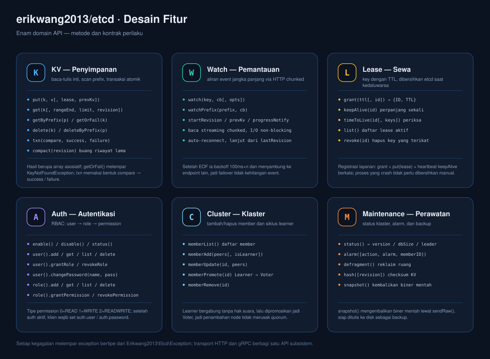
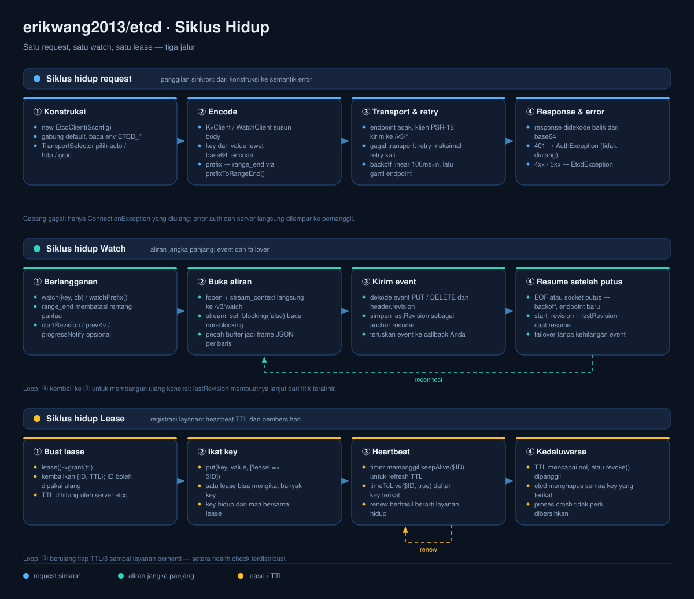

# erikwang2013/etcd

<p align="center">
  <a href="../../README.md">简体中文</a> ·
  <a href="README.en.md">English</a> ·
  <a href="README.ko.md">한국어</a> ·
  <a href="README.ru.md">Русский</a> ·
  <a href="README.de.md">Deutsch</a> ·
  <a href="README.fr.md">Français</a> ·
  <a href="README.es.md">Español</a> ·
  <a href="README.pt.md">Português</a> ·
  <a href="README.hi.md">हिन्दी</a> ·
  <a href="README.ar.md">العربية</a> ·
  <a href="README.bn.md">বাংলা</a> ·
  <a href="README.id.md">Bahasa Indonesia</a> ·
  <a href="README.ja.md">日本語</a>
</p>

<p align="center">
  
</p>

<p align="center">
  <b>Etchy</b> · gajah kecil bertopi klaster Raft tiga node dan membawa <code>k/v</code> serta <code>rev</code> di ujung belalainya ——<br/>
  penjaga konfigurasi dan lease Anda: putus, ia menyambung sendiri; kedaluwarsa, ia membersihkan sendiri.
</p>

Klien etcd v3 untuk PHP —— transport ganda gRPC + HTTP, mencakup seluruh API etcd v3 (KV / Watch / Lease / Auth / Cluster / Maintenance), siap pakai dengan **Laravel / Hyperf / ThinkPHP / Webman**.

## Persyaratan

- PHP >= 8.1
- Server etcd v3.x
- Klien HTTP PSR-18 + PSR-17 (wajib untuk transport HTTP, biasanya sudah tersedia di framework)

## Instalasi

```bash
composer require erikwang2013/etcd
```

## Mulai Cepat

```php
use Erikwang2013\Etcd\EtcdClient;

$etcd = new EtcdClient(['endpoints' => ['127.0.0.1:2379']]);

// 写入
$etcd->kv()->put('/app/config', '{"debug":true}');

// 读取
$result = $etcd->kv()->get('/app/config');
print_r($result['kvs'][0]);  // ['key' => '/app/config', 'value' => '{"debug":true}', ...]

// 找不到时抛异常
$kv = $etcd->kv()->getOrFail('/app/config');

// 前缀扫描
$all = $etcd->kv()->getByPrefix('/app/');
echo "total {$all['count']} key\n";

// 删除
$etcd->kv()->delete('/app/config');
$etcd->kv()->deleteByPrefix('/cache/');

// 带租约写入（60 秒后自动删除）
$lease = $etcd->lease()->grant(60);
$etcd->kv()->put('/session/123', 'active', ['lease' => $lease['ID']]);

// 续约
$etcd->lease()->keepAlive($lease['ID']);
```

## Konfigurasi

```php
$etcd = new EtcdClient([
    'endpoints' => ['192.168.1.10:2379', '192.168.1.11:2379'],  // 多节点
    'transport' => 'auto',  // auto（默认）| http | grpc
    'scheme'    => 'http',  // http（默认）| https
    'timeout'   => 5.0,     // 秒（需在 PSR-18 客户端配置）
    'retry'     => 3,       // 连接失败重试次数
    'auth'      => [        // 可选，Basic Auth
        'user'     => 'root',
        'password' => 'secret',
    ],
]);
```

### Variabel Environment

Tanpa konfigurasi eksplisit, variabel berikut dibaca otomatis:

| Variabel | Default | Keterangan |
|------|--------|------|
| `ETCD_ENDPOINTS` | `127.0.0.1:2379` | alamat node, dipisah koma |
| `ETCD_TRANSPORT` | `auto` | auto / http / grpc |
| `ETCD_TIMEOUT` | `5.0` | timeout request (detik) |
| `ETCD_SCHEME` | `http` | http / https |
| `ETCD_RETRY` | `2` | jumlah percobaan ulang koneksi |
| `ETCD_USER` | — | nama pengguna etcd |
| `ETCD_PASSWORD` | — | kata sandi etcd |

## Referensi API

### KV — Operasi Key/Value

```php
// 写入
$etcd->kv()->put('key', 'value', [
    'lease'       => 12345,    // 绑定租约 ID
    'prevKv'      => true,     // 返回写入前的旧值
    'ignoreValue' => false,
    'ignoreLease' => false,
]);

// 读取单键
$etcd->kv()->get('/exact/key');

// 找不到即抛异常
$kv = $etcd->kv()->getOrFail('/exact/key');

// 前缀扫描
$etcd->kv()->getByPrefix('/prefix/');

// 范围查询（完整参数）
$etcd->kv()->get('/start', [
    'rangeEnd'    => '/startz',      // 范围结束 key
    'limit'       => 100,             // 最大返回条数
    'revision'    => 42,              // 快照版本号
    'sortOrder'   => 'ascend',        // none | ascend | descend
    'sortTarget'  => 'key',           // key | version | create | mod | value
    'serializable'=> true,            // 跳过 Raft 共识（更快，可能过期）
    'keysOnly'    => true,            // 只返回 key，不返回 value
    'countOnly'   => false,           // 只返回计数
]);

// 删除
$etcd->kv()->delete('/key');
$etcd->kv()->deleteByPrefix('/prefix/');
$etcd->kv()->delete('/key', ['prevKv' => true]);  // 同时返回被删的值

// 事务（原子 CAS）
$etcd->kv()->txn(
    compare: [
        ['result' => 0, 'target' => 3, 'key' => '/counter', 'value' => '100']
    ],
    success: [
        ['request_put' => ['key' => '/counter', 'value' => '101']]
    ],
    failure: [
        ['request_put' => ['key' => '/counter', 'value' => '1']]
    ]
);

// 压缩历史版本（释放存储空间）
$etcd->kv()->compact(1000);
```

**Konstanta target perbandingan:** `0`=VERSION, `1`=CREATE, `2`=MOD, `3`=VALUE, `4`=LEASE  
**Konstanta hasil perbandingan:** `0`=EQUAL, `1`=GREATER, `2`=LESS, `3`=NOT_EQUAL

### Watch — Pemantauan Perubahan

```php
// 监听单个 key（阻塞模式，建议在协程/独立进程中运行）
$etcd->watch()->watch('/config/key', function (array $events) {
    foreach ($events as $event) {
        // $event: ['type' => 'PUT'|'DELETE', 'kv' => [...], 'prev_kv' => [...]|null]
        echo "{$event['type']} {$event['kv']['key']} = {$event['kv']['value']}\n";
    }
});

// 监听前缀下所有 key 的变更
$etcd->watch()->watchPrefix('/config/', $callback, [
    'startRevision' => 100,       // 从指定版本开始
    'prevKv'        => true,      // DELETE 事件返回原值
    'progressNotify'=> true,      // 定期发送空事件（心跳）
]);
```

**Reconnect:** saat koneksi Watch terputus, klien otomatis berlangganan ulang dari revision terakhir yang diterima, jadi tidak ada event yang hilang.

### Lease — Sewa

```php
// 创建租约
$lease = $etcd->lease()->grant(300);             // 300 秒 TTL
$lease = $etcd->lease()->grant(300, 99999);      // 指定租约 ID

// 续约（单次）
$result = $etcd->lease()->keepAlive($lease['ID']);
echo "TTL tersisa: {$result['TTL']} detik";

// 查看租约状态
$info = $etcd->lease()->timeToLive($lease['ID']);
$info = $etcd->lease()->timeToLive($lease['ID'], true);  // 含绑定的 key 列表

// 列出所有活跃租约
$leases = $etcd->lease()->list();

// 撤销租约（绑定的所有 key 立即删除）
$etcd->lease()->revoke($lease['ID']);
```

**Skenario umum:** saat registrasi layanan, buat lease lalu tulis key; panggil `keepAlive()` berkala sebagai heartbeat. Setelah layanan berhenti, lease kedaluwarsa dan semuanya dibersihkan otomatis.

### Auth — Autentikasi dan Izin

```php
$auth = $etcd->auth();

// === 用户管理 ===
$auth->user()->add('alice', 'password123');          // 创建用户
$auth->user()->get('alice');                         // 查看用户及其角色
$auth->user()->list();                               // 列出所有用户
$auth->user()->changePassword('alice', 'newpass');    // 修改密码
$auth->user()->grantRole('alice', 'admin');          // 授权角色
$auth->user()->revokeRole('alice', 'admin');         // 撤销角色
$auth->user()->delete('alice');                      // 删除用户

// === 角色管理 ===
$auth->role()->add('reader');                        // 创建角色
$auth->role()->get('reader');                        // 查看角色权限
$auth->role()->list();                               // 列出所有角色

// 授予权限（permType: 0=READ, 1=WRITE, 2=READWRITE）
$auth->role()->grantPermission('reader', 0, '/data/', "\0");   // 对 /data/ 前缀的读权限
$auth->role()->grantPermission('writer', 2, '/data/', "\0");   // 读写权限
$auth->role()->revokePermission('reader', '/data/', "\0");     // 撤销权限
$auth->role()->delete('reader');

// === 认证开关 ===
$auth->enable();           // 开启认证
$auth->disable();          // 关闭认证
$status = $auth->status(); // ['enabled' => true, 'authRevision' => 5]
```

**Catatan:** setelah auth diaktifkan, klien wajib dikonfigurasi dengan `auth.user` dan `auth.password` agar bisa terus beroperasi.

### Cluster — Manajemen Klaster

```php
// 查看集群成员
$members = $etcd->cluster()->memberList();

// 添加成员
$etcd->cluster()->memberAdd(['http://node3:2380']);        // 添加 Voting 成员
$etcd->cluster()->memberAdd(['http://node4:2380'], true);  // 添加 Learner 成员

// 修改成员 peer URL
$etcd->cluster()->memberUpdate(123456, ['http://newnode:2380']);

// Learner 提升为 Voter
$etcd->cluster()->memberPromote(789012);

// 移除成员
$etcd->cluster()->memberRemove(345678);
```

### Maintenance — Operasional

```php
// 查看节点状态
$status = $etcd->maintenance()->status();
// ['version' => '3.5.0', 'dbSize' => 24576, 'leader' => 123, 'raftIndex' => 1000, ...]

// 告警管理
$alarms = $etcd->maintenance()->alarm();                    // 查看告警
$etcd->maintenance()->alarm(action: 2, alarm: 1);           // 清除 NOSPACE 告警

// 碎片整理（回收存储空间）
$etcd->maintenance()->defragment();

// KV 哈希校验
$hash = $etcd->maintenance()->hash();

// 获取快照（返回二进制数据，写入文件即可）
$snapshot = $etcd->maintenance()->snapshot();
file_put_contents('/backup/etcd-snapshot.db', $snapshot);
```

## Mode Transport

| Mode | Status | Dependensi | Cocok untuk |
|------|------|------|---------|
| **HTTP** | Tersedia | PSR-18 + PSR-17 | tanpa dependensi ekstensi, langsung jalan |
| **gRPC** | Kerangka | ext-grpc + grpc/grpc + google/protobuf | throughput tinggi, streaming native |
| **auto** | Default | deteksi otomatis | pakai gRPC bila tersedia, jika tidak HTTP |

Logika deteksi mode `auto`:
1. `extension_loaded('grpc')` — apakah ekstensi C sudah dimuat?
2. `class_exists('Grpc\BaseStub')` — apakah paket composer `grpc/grpc` sudah terpasang?

Klien baru memakai gRPC bila keduanya terpenuhi; jika tidak, ia kembali ke HTTP.

### Konfigurasi Manual Klien HTTP PSR-18

```php
use Erikwang2013\Etcd\Transport\HttpTransport;
use GuzzleHttp\Client;
use GuzzleHttp\Psr7\HttpFactory;

$transport = new HttpTransport(['127.0.0.1:2379'], ['timeout' => 3.0]);
$transport->setHttpClient(
    new Client(['timeout' => 3]),
    new HttpFactory(),
    new HttpFactory()
);
```

## Integrasi Framework

### Laravel

Langsung pakai setelah instalasi. `extra.laravel` pada composer.json menemukan ServiceProvider dan Facade secara otomatis.

```php
// Facade 方式
use Etcd;
Etcd::kv()->put('/foo', 'bar');
$val = Etcd::kv()->get('/foo');

// 依赖注入方式
use Erikwang2013\Etcd\EtcdClient;

class MyService
{
    public function __construct(private EtcdClient $etcd) {}

    public function work(): void
    {
        $this->etcd->kv()->put('/key', 'value');
    }
}
```

Terbitkan berkas konfigurasi:

```bash
php artisan vendor:publish --tag=etcd-config
# → config/etcd.php
```

Konfigurasi `.env`:

```env
ETCD_ENDPOINTS=10.0.0.1:2379,10.0.0.2:2379
ETCD_USER=root
ETCD_PASSWORD=secret
```

### Hyperf

Langsung pakai setelah instalasi. Hyperf menemukan `ConfigProvider` secara otomatis.

```php
use Erikwang2013\Etcd\EtcdClient;
use Hyperf\Di\Annotation\Inject;

class MyService
{
    #[Inject]
    private EtcdClient $etcd;

    public function work(): void
    {
        $this->etcd->kv()->put('/key', 'value');
    }
}

// 或者直接 make
$etcd = make(EtcdClient::class);
```

Terbitkan konfigurasi:

```bash
php bin/hyperf.php vendor:publish erikwang2013/etcd
# → config/autoload/etcd.php
```

### ThinkPHP

1. Setelah instalasi, daftarkan service di `app/service.php`:

```php
return [
    Erikwang2013\Etcd\Adapter\ThinkPHP\Service::class,
];
```

2. Buat berkas konfigurasi `config/etcd.php`.

Pemakaian:

```php
// Facade 方式
use think\facade\Etcd;
Etcd::kv()->put('/key', 'value');

// 容器方式
app('etcd')->kv()->get('/key');
```

### Webman

Langsung pakai setelah instalasi, tanpa konfigurasi tambahan.

```php
use Erikwang2013\Etcd\EtcdClient;

$etcd = EtcdClient::instance();
$etcd->kv()->put('/key', 'value');
```

Untuk konfigurasi khusus, sunting `plugin/erikwang2013/etcd/config/etcd.php`.

## Penanganan Exception

```php
use Erikwang2013\Etcd\Exception\{
    EtcdException,
    ConnectionException,
    AuthException,
    KeyNotFoundException,
};

try {
    $etcd->kv()->put('/key', 'value');
} catch (ConnectionException $e) {
    // etcd 节点无法连接（网络故障、宕机）
} catch (AuthException $e) {
    // 认证失败（用户名密码错误）
} catch (KeyNotFoundException $e) {
    // getOrFail() 时 key 不存在
} catch (EtcdException $e) {
    // 其他 etcd 服务端错误
}
```

## Struktur Proyek

```
erikwang2013/etcd/
├── composer.json                    # 包定义：PSR-4 自动加载 + Laravel / Hyperf 自动发现
├── phpunit.xml                      # PHPUnit 配置（unit / integration 两套套件）
├── config/etcd.php                  # 默认配置，供各框架发布（读取 ETCD_* 环境变量）
├── .github/workflows/release.yml    # 打 tag 时自动发布
├── scripts/i18n/                    #   perkakas doks: katalog, pembuat diagram, pemeriksaan terjemahan
├── docs/                            # 文档与设计图
│   ├── design-cn.md                 #   设计文档
│   ├── i18n/                        #   README dan diagram terlokalisasi dalam 13 bahasa
│   ├── pet.svg                      #   项目宠物 Etchy
│   ├── architecture.svg             #   架构设计图
│   ├── features.svg                 #   功能设计图
│   └── lifecycle.svg                #   生命周期图
├── src/
│   ├── EtcdClient.php               # 顶层门面 + 单例：kv / watch / lease / auth / cluster / maintenance
│   ├── Mascot.php                   # 项目宠物 Etchy 的取值入口（svg / dataUri / path）
│   ├── Install.php                  # Webman 插件钩子（WEBMAN_PLUGIN）
│   ├── Transport/                   # 传输层
│   │   ├── TransportInterface.php   #   传输抽象：send / sendRaw / watch
│   │   ├── TransportSelector.php    #   auto / http / grpc 自动选择
│   │   ├── HttpTransport.php        #   HTTP JSON 传输（完整可用）
│   │   └── GrpcTransport.php        #   gRPC 传输（骨架）
│   ├── Kv/KvClient.php              # KV 读写 / 前缀扫描 / 事务 / 压缩
│   ├── Watch/WatchClient.php        # Watch 变更监听 + 断线续订
│   ├── Lease/LeaseClient.php        # Lease 租约 grant / keepAlive / revoke
│   ├── Auth/                        # Auth 认证授权
│   │   ├── AuthClient.php           #   认证开关与状态
│   │   ├── UserClient.php           #   用户 CRUD + 角色绑定
│   │   └── RoleClient.php           #   角色 CRUD + 权限
│   ├── Cluster/ClusterClient.php    # Cluster 集群成员管理
│   ├── Maintenance/                 # Maintenance 运维：status / alarm / defrag / snapshot
│   ├── Exception/                   # 异常层次
│   ├── Protobuf/                    # 消息桩（纯 PHP 数据类，不继承 Message）
│   │   ├── Mvccpb/                  #   KeyValue、Event
│   │   ├── Etcdserverpb/            #   60+ 请求 / 响应消息
│   │   └── Authpb/                  #   User、Role、Permission
│   └── Adapter/                     # 框架适配器
│       ├── Laravel/                 #   ServiceProvider + Facade
│       ├── Hyperf/                  #   ConfigProvider
│       ├── ThinkPHP/                #   Service + Facade
│       └── Webman/                  #   Plugin
└── tests/
    ├── Unit/                        # 单元测试（逐客户端 / 传输 / 适配器 / 消息类）
    ├── Integration/                 # 集成测试（对接真实 etcd）
    └── Support/                     # FakeTransport、PSR HTTP 桩
```

## Arsitektur dan Diagram Desain

Tiga diagram disusun sebagai struktur → kemampuan → urutan waktu; klik untuk membuka masing-masing:

| Diagram | Pertanyaan yang dijawab | Berkas |
|----|-----------|------|
| Arsitektur | terbagi jadi lapisan apa saja, ke arah mana dependensi mengalir, bagaimana error bercabang | [`diagrams/id/architecture.svg`](diagrams/id/architecture.svg) |
| Desain fitur | metode apa saja yang disediakan tiap subsistem dan kontrak perilakunya | [`diagrams/id/features.svg`](diagrams/id/features.svg) |
| Siklus hidup | bagaimana satu request / satu watch / satu lease berjalan sampai tuntas | [`diagrams/id/lifecycle.svg`](diagrams/id/lifecycle.svg) |

### Arsitektur



### Desain Fitur



### Siklus Hidup



### Memakai Etchy di Kode

Grafik ikut dipublikasikan bersama paket dan `Mascot` adalah satu-satunya pintu akses, jadi panel admin atau halaman status tidak perlu menyalinnya lagi:

```php
use Erikwang2013\Etcd\Mascot;

echo Mascot::svg();                                          // SVG 源码，直接内联
echo '';    // data URI，不依赖 web 目录
copy(Mascot::path(), __DIR__ . '/public/etcd.svg');          // 或自行落到静态目录
```

Di Laravel, aset bisa langsung diterbitkan ke `public/`:

```bash
php artisan vendor:publish --tag=etcd-assets
# → public/vendor/etcd/pet.svg
```

## Dukung Proyek Ini / Support This Project

<p align="center">
  <table>
    <tr>
      <td align="center"><b>WeChat</b></td>
      <td align="center"><b>Alipay</b></td>
    </tr>
    <tr>
      <td align="center"></td>
      <td align="center"></td>
    </tr>
  </table>
</p>

---

## License

MIT — Copyright (c) 2026 [erik](https://erik.xyz) <erik@erik.xyz>
