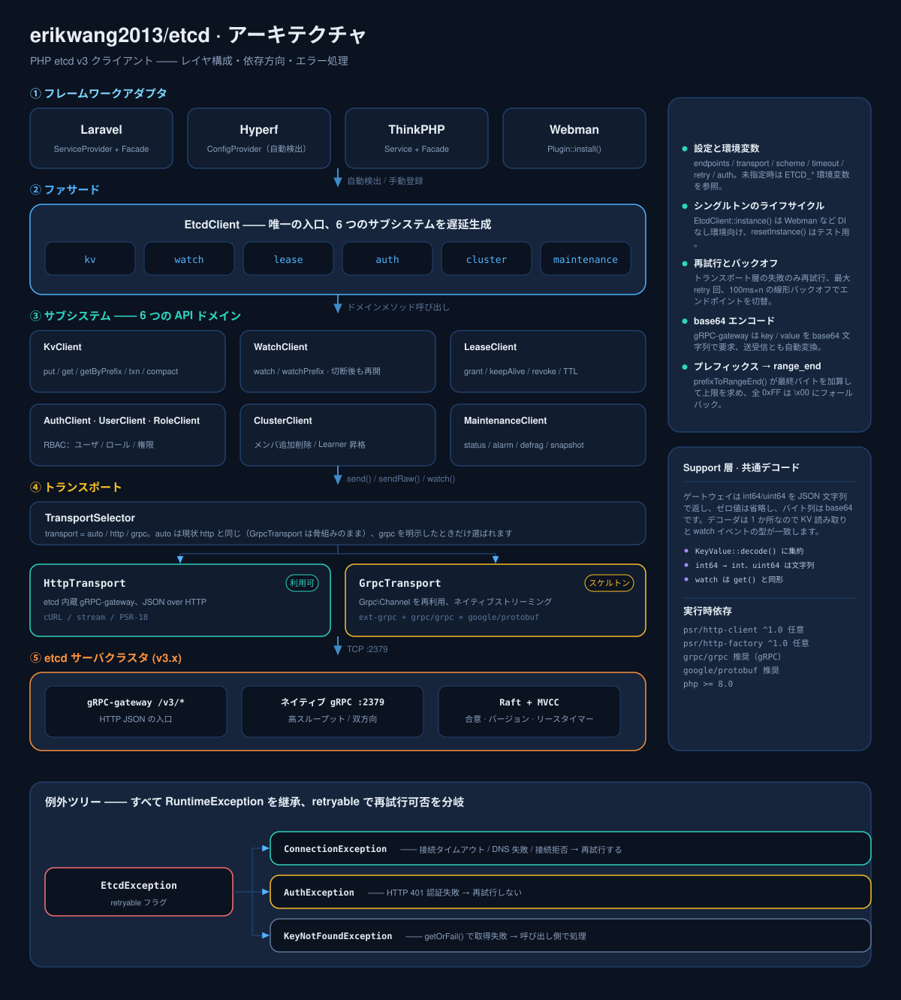
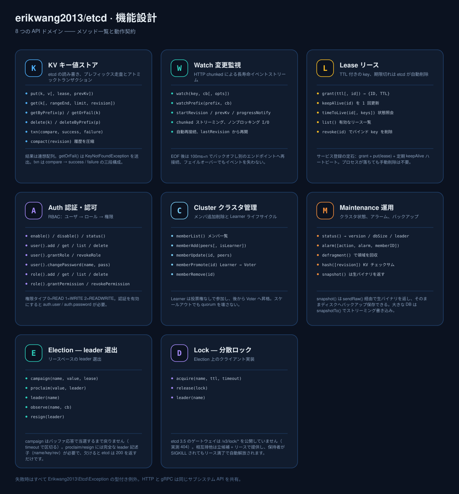
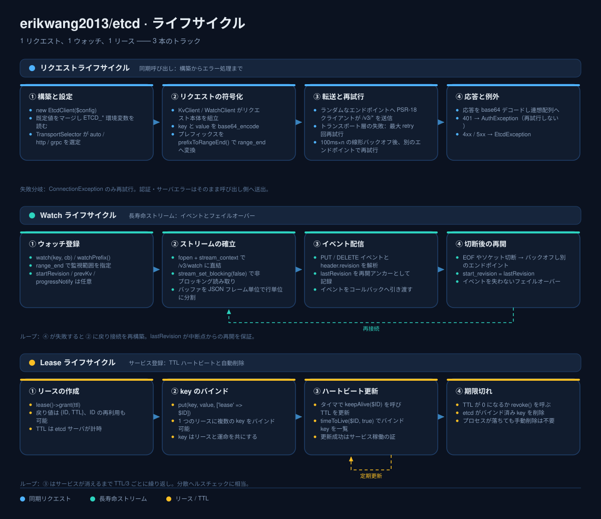

# erikwang2013/etcd

<p align="center">
  <a href="../../README.md">简体中文</a> ·
  <a href="README.en.md">English</a> ·
  <a href="README.ko.md">한국어</a> ·
  <a href="README.ru.md">Русский</a> ·
  <a href="README.de.md">Deutsch</a> ·
  <a href="README.fr.md">Français</a> ·
  <a href="README.es.md">Español</a> ·
  <a href="README.pt.md">Português</a> ·
  <a href="README.hi.md">हिन्दी</a> ·
  <a href="README.ar.md">العربية</a> ·
  <a href="README.bn.md">বাংলা</a> ·
  <a href="README.id.md">Bahasa Indonesia</a> ·
  <a href="README.ja.md">日本語</a>
</p>

<p align="center">
  
</p>

<p align="center">
  <b>Etchy</b> · 頭に 3 ノードの Raft クラスタ、鼻先に <code>k/v</code> と <code>rev</code> をぶら下げた子象 ——<br/>
  あなたの設定とリースを見守ります：切断すれば自分で再接続し、期限が切れれば自分で掃除します。
</p>

PHP etcd v3 クライアント —— gRPC + HTTP のデュアルトランスポートで、etcd v3 の全 API（KV / Watch / Lease / Auth / Cluster / Maintenance）をカバー。**Laravel / Hyperf / ThinkPHP / Webman** にすぐ対応します。

## 要件

- PHP >= 8.1
- etcd v3.x サーバ
- PSR-18 + PSR-17 HTTP クライアント（HTTP トランスポートで必須。多くのフレームワークは同梱済み）

## インストール

```bash
composer require erikwang2013/etcd
```

## クイックスタート

```php
use Erikwang2013\Etcd\EtcdClient;

$etcd = new EtcdClient(['endpoints' => ['127.0.0.1:2379']]);

// 書き込み
$etcd->kv()->put('/app/config', '{"debug":true}');

// 読み取り
$result = $etcd->kv()->get('/app/config');
print_r($result['kvs'][0]);  // ['key' => '/app/config', 'value' => '{"debug":true}', ...]

// 見つからない場合は例外を送出
$kv = $etcd->kv()->getOrFail('/app/config');

// プレフィックススキャン
$all = $etcd->kv()->getByPrefix('/app/');
echo "合計 {$all['count']} 件\n";

// 削除
$etcd->kv()->delete('/app/config');
$etcd->kv()->deleteByPrefix('/cache/');

// リース付きで書き込み（60 秒後に自動削除）
$lease = $etcd->lease()->grant(60);
$etcd->kv()->put('/session/123', 'active', ['lease' => $lease['ID']]);

// 更新
$etcd->lease()->keepAlive($lease['ID']);
```

## 設定

```php
$etcd = new EtcdClient([
    'endpoints' => ['192.168.1.10:2379', '192.168.1.11:2379'],  // 複数ノード
    'transport' => 'auto',  // auto（既定）| http | grpc
    'scheme'    => 'http',  // http（既定）| https
    'timeout'   => 5.0,     // 秒（PSR-18 クライアントで設定）
    'retry'     => 3,       // 接続失敗時のリトライ回数
    'auth'      => [        // 任意、Basic Auth
        'user'     => 'root',
        'password' => 'secret',
    ],
]);
```

### 環境変数

設定を渡さない場合は環境変数を自動的に読み取ります：

| 変数 | 既定値 | 説明 |
|------|--------|------|
| `ETCD_ENDPOINTS` | `127.0.0.1:2379` | カンマ区切りのマルチノードアドレス |
| `ETCD_TRANSPORT` | `auto` | auto / http / grpc |
| `ETCD_TIMEOUT` | `5.0` | リクエストタイムアウト（秒） |
| `ETCD_SCHEME` | `http` | http / https |
| `ETCD_RETRY` | `2` | 接続リトライ回数 |
| `ETCD_USER` | — | etcd ユーザ名 |
| `ETCD_PASSWORD` | — | etcd パスワード |

## API リファレンス

### KV — キー値操作

```php
// 書き込み
$etcd->kv()->put('key', 'value', [
    'lease'       => 12345,    // リース ID をバインド
    'prevKv'      => true,     // 書き込み前の旧値を返す
    'ignoreValue' => false,
    'ignoreLease' => false,
]);

// 単一 key の読み取り
$etcd->kv()->get('/exact/key');

// 見つからなければ例外を送出
$kv = $etcd->kv()->getOrFail('/exact/key');

// プレフィックススキャン
$etcd->kv()->getByPrefix('/prefix/');

// 範囲クエリ（全パラメータ）
$etcd->kv()->get('/start', [
    'rangeEnd'    => '/startz',      // 範囲終了 key
    'limit'       => 100,             // 最大取得件数
    'revision'    => 42,              // スナップショットのリビジョン
    'sortOrder'   => 'ascend',        // none | ascend | descend
    'sortTarget'  => 'key',           // key | version | create | mod | value
    'serializable'=> true,            // Raft 合意をスキップ（高速、古い可能性あり）
    'keysOnly'    => true,            // key のみ返し value は返さない
    'countOnly'   => false,           // 件数のみ返す
]);

// 削除
$etcd->kv()->delete('/key');
$etcd->kv()->deleteByPrefix('/prefix/');
$etcd->kv()->delete('/key', ['prevKv' => true]);  // 削除された値も返す

// トランザクション（アトミック CAS）
$etcd->kv()->txn(
    compare: [
        ['result' => 0, 'target' => 3, 'key' => '/counter', 'value' => '100']
    ],
    success: [
        ['request_put' => ['key' => '/counter', 'value' => '101']]
    ],
    failure: [
        ['request_put' => ['key' => '/counter', 'value' => '1']]
    ]
);

// 履歴バージョンを圧縮（領域を解放）
$etcd->kv()->compact(1000);
```

**比較ターゲット（target）定数：** `0`=VERSION, `1`=CREATE, `2`=MOD, `3`=VALUE, `4`=LEASE  
**比較結果（result）定数：** `0`=EQUAL, `1`=GREATER, `2`=LESS, `3`=NOT_EQUAL

### Watch — 変更監視

```php
// 単一 key を監視（ブロッキングモード。コルーチン/別プロセスでの実行を推奨）
$etcd->watch()->watch('/config/key', function (array $events) {
    foreach ($events as $event) {
        // $event: ['type' => 'PUT'|'DELETE', 'kv' => [...], 'prev_kv' => [...]|null]
        echo "{$event['type']} {$event['kv']['key']} = {$event['kv']['value']}\n";
    }
});

// プレフィックス配下の全 key の変更を監視
$etcd->watch()->watchPrefix('/config/', $callback, [
    'startRevision' => 100,       // 指定リビジョンから開始
    'prevKv'        => true,      // DELETE イベントで元の値を返す
    'progressNotify'=> true,      // 定期的に空イベントを送信（ハートビート）
]);
```

**切断時の再接続：** Watch 接続が切れると、最後に受信した revision から自動的に再開するため、イベントを取りこぼしません。

### Lease — リース

```php
// リースを作成
$lease = $etcd->lease()->grant(300);             // 300 秒 TTL
$lease = $etcd->lease()->grant(300, 99999);      // リース ID を指定

// 更新（1 回）
$result = $etcd->lease()->keepAlive($lease['ID']);
echo "TTL 残り: {$result['TTL']} 秒";

// リースの状態を確認
$info = $etcd->lease()->timeToLive($lease['ID']);
$info = $etcd->lease()->timeToLive($lease['ID'], true);  // バインドされた key 一覧を含む

// 有効なリースを一覧
$leases = $etcd->lease()->list();

// リースを失効（バインドされた全 key を即削除）
$etcd->lease()->revoke($lease['ID']);
```

**典型的な用途：** サービス登録時にリースを作成して key を書き込み、定期的に `keepAlive()` でハートビート更新。サービス停止後はリースの期限切れで自動的にクリーンアップされます。

### Auth — 認証と権限

```php
$auth = $etcd->auth();

// === ユーザ管理 ===
$auth->user()->add('alice', 'password123');          // ユーザを作成
$auth->user()->get('alice');                         // ユーザとロールを確認
$auth->user()->list();                               // 全ユーザを一覧
$auth->user()->changePassword('alice', 'newpass');    // パスワードを変更
$auth->user()->grantRole('alice', 'admin');          // ロールを付与
$auth->user()->revokeRole('alice', 'admin');         // ロールを剥奪
$auth->user()->delete('alice');                      // ユーザを削除

// === ロール管理 ===
$auth->role()->add('reader');                        // ロールを作成
$auth->role()->get('reader');                        // ロールの権限を確認
$auth->role()->list();                               // 全ロールを一覧

// 権限を付与（permType: 0=READ, 1=WRITE, 2=READWRITE）
$auth->role()->grantPermission('reader', 0, '/data/', "\0");   // /data/ プレフィックスの読み取り権限
$auth->role()->grantPermission('writer', 2, '/data/', "\0");   // 読み書き権限
$auth->role()->revokePermission('reader', '/data/', "\0");     // 権限を剥奪
$auth->role()->delete('reader');

// === 認証の有効/無効 ===
$auth->enable();           // 認証を有効化
$auth->disable();          // 認証を無効化
$status = $auth->status(); // ['enabled' => true, 'authRevision' => 5]
```

**注意：** 認証を有効にすると、クライアントに `auth.user` と `auth.password` を設定しない限り操作を続けられません。

### Cluster — クラスタ管理

```php
// クラスタメンバを確認
$members = $etcd->cluster()->memberList();

// メンバを追加
$etcd->cluster()->memberAdd(['http://node3:2380']);        // Voting メンバを追加
$etcd->cluster()->memberAdd(['http://node4:2380'], true);  // Learner メンバを追加

// メンバの peer URL を変更
$etcd->cluster()->memberUpdate(123456, ['http://newnode:2380']);

// Learner を Voter へ昇格
$etcd->cluster()->memberPromote(789012);

// メンバを削除
$etcd->cluster()->memberRemove(345678);
```

### Maintenance — 運用

```php
// ノード状態を確認
$status = $etcd->maintenance()->status();
// ['version' => '3.5.0', 'dbSize' => 24576, 'leader' => 123, 'raftIndex' => 1000, ...]

// アラーム管理
$alarms = $etcd->maintenance()->alarm();                    // アラームを確認
$etcd->maintenance()->alarm(action: 2, alarm: 1);           // NOSPACE アラームを解除

// デフラグ（領域を回収）
$etcd->maintenance()->defragment();

// KV ハッシュ検証
$hash = $etcd->maintenance()->hash();

// スナップショットを取得（バイナリを返すのでファイルに書き込むだけ）
$snapshot = $etcd->maintenance()->snapshot();
file_put_contents('/backup/etcd-snapshot.db', $snapshot);
```

## トランスポートモード

| モード | 状態 | 依存 | 用途 |
|------|------|------|---------|
| **HTTP** | 利用可 | PSR-18 + PSR-17 | 拡張機能への依存ゼロ、すぐ使える |
| **gRPC** | スケルトン | ext-grpc + grpc/grpc + google/protobuf | 高スループット、ネイティブストリーミング |
| **auto** | 既定 | 自動検出 | gRPC があれば gRPC、なければ HTTP |

`auto` モードの判定ロジック：
1. `extension_loaded('grpc')` — C 拡張がロード済みか？
2. `class_exists('Grpc\BaseStub')` — `grpc/grpc` composer パッケージがインストール済みか？

両方を満たす場合のみ gRPC を使い、そうでなければ HTTP にフォールバックします。

### PSR-18 HTTP クライアントを手動設定

```php
use Erikwang2013\Etcd\Transport\HttpTransport;
use GuzzleHttp\Client;
use GuzzleHttp\Psr7\HttpFactory;

$transport = new HttpTransport(['127.0.0.1:2379'], ['timeout' => 3.0]);
$transport->setHttpClient(
    new Client(['timeout' => 3]),
    new HttpFactory(),
    new HttpFactory()
);
```

## フレームワーク統合

### Laravel

インストールするだけで使えます。composer.json の `extra.laravel` が ServiceProvider と Facade を自動検出します。

```php
// Facade 経由
use Etcd;
Etcd::kv()->put('/foo', 'bar');
$val = Etcd::kv()->get('/foo');

// 依存注入経由
use Erikwang2013\Etcd\EtcdClient;

class MyService
{
    public function __construct(private EtcdClient $etcd) {}

    public function work(): void
    {
        $this->etcd->kv()->put('/key', 'value');
    }
}
```

設定ファイルを publish する：

```bash
php artisan vendor:publish --tag=etcd-config
# → config/etcd.php
```

`.env` の設定：

```env
ETCD_ENDPOINTS=10.0.0.1:2379,10.0.0.2:2379
ETCD_USER=root
ETCD_PASSWORD=secret
```

### Hyperf

インストールするだけで使えます。Hyperf が `ConfigProvider` を自動検出します。

```php
use Erikwang2013\Etcd\EtcdClient;
use Hyperf\Di\Annotation\Inject;

class MyService
{
    #[Inject]
    private EtcdClient $etcd;

    public function work(): void
    {
        $this->etcd->kv()->put('/key', 'value');
    }
}

// あるいは直接 make
$etcd = make(EtcdClient::class);
```

設定を publish する：

```bash
php bin/hyperf.php vendor:publish erikwang2013/etcd
# → config/autoload/etcd.php
```

### ThinkPHP

1. インストール後、`app/service.php` に登録します：

```php
return [
    Erikwang2013\Etcd\Adapter\ThinkPHP\Service::class,
];
```

2. `config/etcd.php` 設定ファイルを作成します。

使い方：

```php
// Facade 経由
use think\facade\Etcd;
Etcd::kv()->put('/key', 'value');

// コンテナ経由
app('etcd')->kv()->get('/key');
```

### Webman

インストールするだけで使え、追加設定は不要です。

```php
use Erikwang2013\Etcd\EtcdClient;

$etcd = EtcdClient::instance();
$etcd->kv()->put('/key', 'value');
```

設定をカスタマイズする場合は `plugin/erikwang2013/etcd/config/etcd.php` を編集します。

## 例外処理

```php
use Erikwang2013\Etcd\Exception\{
    EtcdException,
    ConnectionException,
    AuthException,
    KeyNotFoundException,
};

try {
    $etcd->kv()->put('/key', 'value');
} catch (ConnectionException $e) {
    // etcd ノードに接続できない（ネットワーク障害、ダウン）
} catch (AuthException $e) {
    // 認証失敗（ユーザ名・パスワード誤り）
} catch (KeyNotFoundException $e) {
    // getOrFail() で key が存在しない
} catch (EtcdException $e) {
    // その他の etcd サーバエラー
}
```

## プロジェクト構成

```
erikwang2013/etcd/
├── composer.json                    # パッケージ定義：PSR-4 自動読込 + Laravel / Hyperf 自動検出
├── phpunit.xml                      # PHPUnit 設定（unit / integration の 2 スイート）
├── config/etcd.php                  # 既定設定。各フレームワークへ publish（ETCD_* 環境変数を読む）
├── .github/workflows/release.yml    # タグ付けで自動リリース
├── docs/                            # ドキュメントと設計図
│   ├── design-cn.md                 #   設計ドキュメント
│   ├── pet.svg                      #   マスコット Etchy
│   ├── architecture.svg             #   アーキテクチャ設計図
│   ├── features.svg                 #   機能設計図
│   └── lifecycle.svg                #   ライフサイクル図
├── src/
│   ├── EtcdClient.php               # 最上位ファサード + シングルトン：kv / watch / lease / auth / cluster / maintenance
│   ├── Mascot.php                   # マスコット Etchy の取得入口（svg / dataUri / path）
│   ├── Install.php                  # Webman プラグインフック（WEBMAN_PLUGIN）
│   ├── Transport/                   # トランスポート層
│   │   ├── TransportInterface.php   #   転送の抽象：send / sendRaw / watch
│   │   ├── TransportSelector.php    #   auto / http / grpc を自動選択
│   │   ├── HttpTransport.php        #   HTTP JSON 転送（利用可）
│   │   └── GrpcTransport.php        #   gRPC 転送（スケルトン）
│   ├── Kv/KvClient.php              # KV 読み書き / プレフィックス走査 / トランザクション / 圧縮
│   ├── Watch/WatchClient.php        # Watch 変更監視 + 切断時の再開
│   ├── Lease/LeaseClient.php        # Lease リース grant / keepAlive / revoke
│   ├── Auth/                        # Auth 認証・認可
│   │   ├── AuthClient.php           #   認証の有効/無効と状態
│   │   ├── UserClient.php           #   ユーザ CRUD + ロール紐付け
│   │   └── RoleClient.php           #   ロール CRUD + 権限
│   ├── Cluster/ClusterClient.php    # Cluster クラスタメンバ管理
│   ├── Maintenance/                 # Maintenance 運用：status / alarm / defrag / snapshot
│   ├── Exception/                   # 例外階層
│   ├── Protobuf/                    # メッセージスタブ（素の PHP データクラス、Message を継承しない）
│   │   ├── Mvccpb/                  #   KeyValue、Event
│   │   ├── Etcdserverpb/            #   60+ リクエスト / 応答メッセージ
│   │   └── Authpb/                  #   User、Role、Permission
│   └── Adapter/                     # フレームワークアダプタ
│       ├── Laravel/                 #   ServiceProvider + Facade
│       ├── Hyperf/                  #   ConfigProvider
│       ├── ThinkPHP/                #   Service + Facade
│       └── Webman/                  #   Plugin
└── tests/
    ├── Unit/                        # 単体テスト（クライアント / 転送 / アダプタ / メッセージクラス別）
    ├── Integration/                 # 結合テスト（実 etcd に接続）
    └── Support/                     # FakeTransport、PSR HTTP スタブ
```

## アーキテクチャと設計図

3 つの図は「構造 → 能力 → 時系列」の順に構成されており、個別にクリックして閲覧できます：

| 図 | 答える問い | ファイル |
|----|-----------|------|
| アーキテクチャ設計 | どの層に分かれ、依存がどちらへ向き、エラーをどう振り分けるか | [`docs/architecture.svg`](diagrams/ja/architecture.svg) |
| 機能設計 | 各サブシステムがどのメソッドを提供し、どんな動作契約を持つか | [`docs/features.svg`](diagrams/ja/features.svg) |
| ライフサイクル | 1 リクエスト / 1 ウォッチ / 1 リース がそれぞれどう進むか | [`docs/lifecycle.svg`](diagrams/ja/lifecycle.svg) |

### アーキテクチャ設計



### 機能設計



### ライフサイクル



### コードから Etchy を使う

図はパッケージに同梱されており、`Mascot` が唯一の取得入口です。管理画面やステータスページを作るときに、わざわざコピーを置く必要はありません：

```php
use Erikwang2013\Etcd\Mascot;

echo Mascot::svg();                                          // SVG ソースをそのままインライン展開
echo '';    // data URI。web ディレクトリ不要
copy(Mascot::path(), __DIR__ . '/public/etcd.svg');          // あるいは静的ディレクトリへ自分で配置
```

Laravel では `public/` へそのまま publish できます：

```bash
php artisan vendor:publish --tag=etcd-assets
# → public/vendor/etcd/pet.svg
```

## オープンソースの継続は容易ではありません。ぜひご支援を / Support This Project

<p align="center">
  <table>
    <tr>
      <td align="center"><b>微信 / WeChat</b></td>
      <td align="center"><b>支付宝 / Alipay</b></td>
    </tr>
    <tr>
      <td align="center"></td>
      <td align="center"></td>
    </tr>
  </table>
</p>

---

## License

MIT — Copyright (c) 2026 [erik](https://erik.xyz) <erik@erik.xyz>
