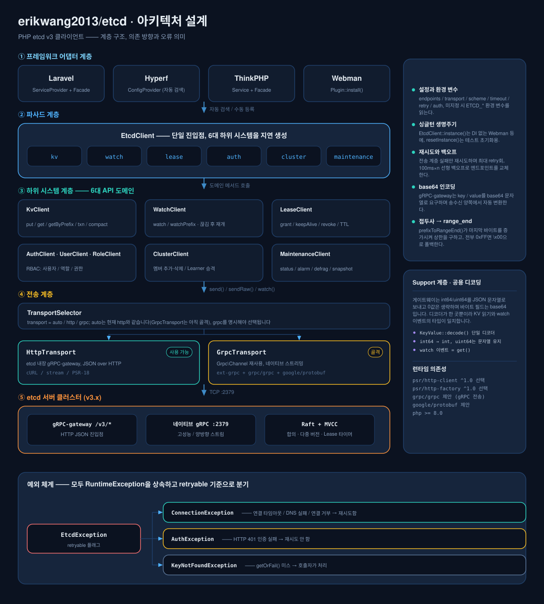
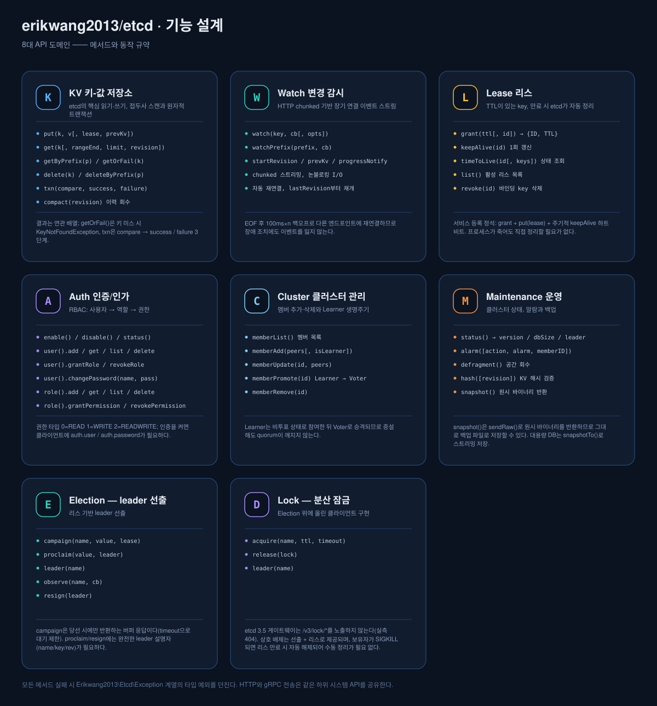
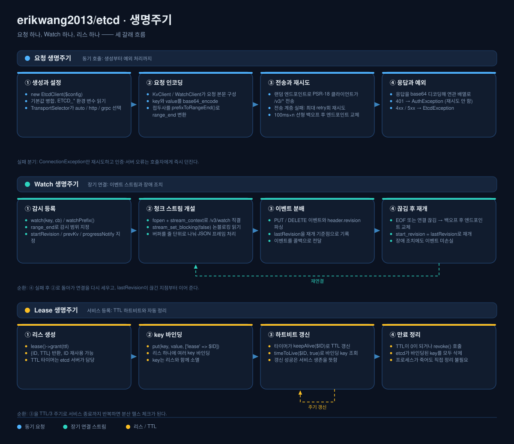

# erikwang2013/etcd

<p align="center">
  <a href="../../README.md">简体中文</a> ·
  <a href="README.en.md">English</a> ·
  <a href="README.ko.md">한국어</a> ·
  <a href="README.ru.md">Русский</a> ·
  <a href="README.de.md">Deutsch</a> ·
  <a href="README.fr.md">Français</a> ·
  <a href="README.es.md">Español</a> ·
  <a href="README.pt.md">Português</a> ·
  <a href="README.hi.md">हिन्दी</a> ·
  <a href="README.ar.md">العربية</a> ·
  <a href="README.bn.md">বাংলা</a> ·
  <a href="README.id.md">Bahasa Indonesia</a> ·
  <a href="README.ja.md">日本語</a>
</p>

<p align="center">
  
</p>

<p align="center">
  <b>Etchy</b> · 머리에 3노드 Raft 클러스터를 이고 코끝에 <code>k/v</code>와 <code>rev</code>를 달고 다니는 아기 코끼리 ——<br/>
  당신의 설정과 리스를 지킵니다: 끊기면 스스로 재연결하고, 만료되면 스스로 정리합니다.
</p>

PHP etcd v3 클라이언트 —— gRPC + HTTP 이중 전송으로 etcd v3의 모든 API(KV / Watch / Lease / Auth / Cluster / Maintenance)를 지원하며, **Laravel / Hyperf / ThinkPHP / Webman**에 바로 붙습니다.

## 요구 사항

- PHP >= 8.1
- etcd v3.x 서버
- HTTP 경로 중 하나면 충분합니다: ext-curl, PHP 스트림 래퍼(allow_url_fopen), 또는 직접 준비한 PSR-18 클라이언트 — 자동 선택되며 모두 불가능하면 명확한 오류를 줍니다

## 설치

```bash
composer require erikwang2013/etcd
```

### 순수 PHP (프레임워크 없음)

프레임워크도, PSR-18 구현도, ext-curl도 필요 없습니다. ext-curl이 로드되어 있으면 사용하고, 없으면 PHP 자체 스트림 래퍼로 자동 전환합니다.

```php
<?php
require __DIR__ . '/vendor/autoload.php';   // 사용자의 autoload

use Erikwang2013\Etcd\EtcdClient;

$etcd = new EtcdClient(['endpoints' => ['127.0.0.1:2379']]);

$etcd->kv()->put('/app/config', '{"debug":true}');
echo $etcd->kv()->getOrFail('/app/config')['value'], "\n";

// 실제 사용 중인 경로: curl / stream / none
var_dump(Erikwang2013\Etcd\Transport\HttpTransport::detectDriver());
```

`'driver' => 'stream'`(기본값 `auto`)으로 경로를 강제할 수 있습니다. 세 가지 모두 불가능하면 활성화 방법을 설명하는 `ConnectionException`이 발생합니다.

## 빠른 시작

```php
use Erikwang2013\Etcd\EtcdClient;

$etcd = new EtcdClient(['endpoints' => ['127.0.0.1:2379']]);

// 쓰기
$etcd->kv()->put('/app/config', '{"debug":true}');

// 읽기
$result = $etcd->kv()->get('/app/config');
print_r($result['kvs'][0]);  // ['key' => '/app/config', 'value' => '{"debug":true}', ...]

// 없으면 예외 발생
$kv = $etcd->kv()->getOrFail('/app/config');

// 접두사 스캔
$all = $etcd->kv()->getByPrefix('/app/');
echo "총 {$all['count']}건\n";

// 삭제
$etcd->kv()->delete('/app/config');
$etcd->kv()->deleteByPrefix('/cache/');

// 리스와 함께 쓰기 (60초 후 자동 삭제)
$lease = $etcd->lease()->grant(60);
$etcd->kv()->put('/session/123', 'active', ['lease' => $lease['ID']]);

// 갱신
$etcd->lease()->keepAlive($lease['ID']);
```

## 설정

```php
$etcd = new EtcdClient([
    'endpoints' => ['192.168.1.10:2379', '192.168.1.11:2379'],  // 다중 노드
    'transport' => 'auto',  // auto(기본) | http | grpc
    'driver'    => 'auto',  // auto(기본) | curl | stream
    'scheme'    => 'http',  // http(기본) | https
    'timeout'   => 5.0,     // 초
    'retry'     => 3,       // 연결 실패 재시도 횟수
    'auth'      => [        // 선택; 자격 증명을 token으로 교환하려면 https 필요
        'user'     => 'root',
        'password' => 'secret',
    ],
]);
```

### 환경 변수

설정을 넘기지 않으면 환경 변수를 자동으로 읽습니다:

| 변수 | 기본값 | 설명 |
|------|--------|------|
| `ETCD_ENDPOINTS` | `127.0.0.1:2379` | 쉼표로 구분한 다중 노드 주소 |
| `ETCD_TRANSPORT` | `auto` | auto / http / grpc |
| `ETCD_TIMEOUT` | `5.0` | 요청 타임아웃(초) |
| `ETCD_SCHEME` | `http` | http / https |
| `ETCD_RETRY` | `2` | 연결 재시도 횟수 |
| `ETCD_DRIVER` | `auto` | HTTP 경로: auto / curl / stream |
| `ETCD_USER` | — | etcd 사용자 이름 |
| `ETCD_PASSWORD` | — | etcd 비밀번호 |

## API 레퍼런스

### KV — 키-값 연산

```php
// 쓰기
$etcd->kv()->put('key', 'value', [
    'lease'       => 12345,    // 리스 ID 바인딩
    'prevKv'      => true,     // 쓰기 전 이전 값 반환
    'ignoreValue' => false,
    'ignoreLease' => false,
]);

// 단일 키 읽기
$etcd->kv()->get('/exact/key');

// 없으면 예외 발생
$kv = $etcd->kv()->getOrFail('/exact/key');

// 접두사 스캔
$etcd->kv()->getByPrefix('/prefix/');

// 범위 조회 (전체 파라미터)
$etcd->kv()->get('/start', [
    'rangeEnd'    => '/startz',      // 범위 종료 key
    'limit'       => 100,             // 최대 반환 건수
    'revision'    => 42,              // 스냅샷 버전
    'sortOrder'   => 'ascend',        // none | ascend | descend
    'sortTarget'  => 'key',           // key | version | create | mod | value
    'serializable'=> true,            // Raft 합의 생략 (더 빠르지만 오래된 값일 수 있음)
    'keysOnly'    => true,            // key만 반환, value 제외
    'countOnly'   => false,           // 개수만 반환
    'minModRevision'    => 100,       // 이 리비전 이후에 수정된 key만
    'maxModRevision'    => 200,
    'minCreateRevision' => 100,       // 생성 리비전으로 필터
    'maxCreateRevision' => 200,
]);

// 삭제
$etcd->kv()->delete('/key');
$etcd->kv()->deleteByPrefix('/prefix/');
$etcd->kv()->delete('/key', ['prevKv' => true]);  // 삭제된 값도 함께 반환

// 트랜잭션 (원자적 CAS)
$etcd->kv()->txn(
    compare: [
        ['result' => 0, 'target' => 3, 'key' => '/counter', 'value' => '100']
    ],
    success: [
        ['request_put' => ['key' => '/counter', 'value' => '101']]
    ],
    failure: [
        ['request_put' => ['key' => '/counter', 'value' => '1']]
    ]
);

// 중첩 트랜잭션: 브랜치 안에 트랜잭션을 또 넣을 수 있음
$etcd->kv()->txn(
    compare: [['result' => 0, 'target' => 3, 'key' => '/lock', 'value' => 'free']],
    success: [[
        'request_put' => ['key' => '/lock', 'value' => 'mine'],
        'request_txn' => [                       // 내부 트랜잭션
            'compare' => [['result' => 0, 'target' => 1, 'key' => '/lock', 'create_revision' => 0]],
            'success' => [['request_put' => ['key' => '/log', 'value' => 'acquired']]],
            'failure' => [],
        ],
    ]],
    failure: []
);

// 이력 압축 (저장 공간 회수)
$etcd->kv()->compact(1000);
```

**비교 대상(target) 상수:** `0`=VERSION, `1`=CREATE, `2`=MOD, `3`=VALUE, `4`=LEASE
**비교 결과(result) 상수:** `0`=EQUAL, `1`=GREATER, `2`=LESS, `3`=NOT_EQUAL

### Watch — 변경 감시

```php
// 단일 key 감시 (블로킹 모드, 코루틴이나 별도 프로세스에서 실행 권장)
$etcd->watch()->watch('/config/key', function (array $events) {
    foreach ($events as $event) {
        // $event: ['type' => 'PUT'|'DELETE', 'kv' => [...], 'prev_kv' => [...]|null]
        echo "{$event['type']} {$event['kv']['key']} = {$event['kv']['value']}\n";
    }
});

// 접두사 아래 모든 key의 변경 감시
$etcd->watch()->watchPrefix('/config/', $callback, [
    'startRevision' => 100,       // 지정한 버전부터 시작
    'prevKv'        => true,      // DELETE 이벤트에 원래 값 포함
    'progressNotify'=> true,      // 주기적으로 빈 이벤트 전송 (하트비트)
]);
```

**끊김 후 재연결:** Watch 연결이 끊기면 `lastRevision + 1`부터 다시 구독합니다(`start_revision`은 **폐구간**이라 같은 값을 쓰면 마지막 이벤트가 재생됩니다). 장애 조치에서 이벤트를 잃지도, 중복 전달하지도 않습니다.

**재시도 정책:** **연결이 아예 맺어지지 않은** 경우(연결 거부 / DNS 실패)에만 재시도하며, 읽기 전용 RPC(range, status, memberlist 등)는 5xx와 타임아웃까지 추가로 허용합니다. 쓰기 작업이 5xx나 읽기 타임아웃을 만나면 **재시도하지 않습니다** — 이미 반영되었을 수 있고, 재생하면 CAS 같은 요청이 두 번 적용되거나 "자신 있게 틀린 답"(재시도가 자신의 첫 쓰기 결과를 보고 실제로는 이겼는데 CAS 실패로 보고)을 받게 됩니다.

### Lease — 리스

```php
// 리스 생성
$lease = $etcd->lease()->grant(300);             // TTL 300초
$lease = $etcd->lease()->grant(300, 99999);      // 리스 ID 지정

// 갱신 (1회)
$result = $etcd->lease()->keepAlive($lease['ID']);
echo "남은 TTL: {$result['TTL']}초";

// 리스 상태 조회
$info = $etcd->lease()->timeToLive($lease['ID']);
$info = $etcd->lease()->timeToLive($lease['ID'], true);  // 바인딩된 key 목록 포함

// 활성 리스 전체 조회
$leases = $etcd->lease()->list();

// 리스 취소 (바인딩된 모든 key가 즉시 삭제됨)
$etcd->lease()->revoke($lease['ID']);
```

**대표 시나리오:** 서비스 등록 시 리스를 만들고 key를 쓴 뒤, 주기적으로 `keepAlive()`를 호출해 갱신합니다. 서비스가 멈추면 리스가 만료되어 자동으로 정리됩니다.

### Auth — 인증과 권한

```php
$auth = $etcd->auth();

// === 사용자 관리 ===
$auth->user()->add('alice', 'password123');          // 사용자 생성
$auth->user()->get('alice');                         // 사용자와 역할 조회
$auth->user()->list();                               // 사용자 목록
$auth->user()->changePassword('alice', 'newpass');    // 비밀번호 변경
$auth->user()->grantRole('alice', 'admin');          // 역할 부여
$auth->user()->revokeRole('alice', 'admin');         // 역할 회수
$auth->user()->delete('alice');                      // 사용자 삭제

// === 역할 관리 ===
$auth->role()->add('reader');                        // 역할 생성
$auth->role()->get('reader');                        // 역할 권한 조회
$auth->role()->list();                               // 역할 목록

// 권한 부여 (permType: 0=READ, 1=WRITE, 2=READWRITE)
$auth->role()->grantPermission('reader', 0, '/data/', "\0");   // /data/ 접두사 읽기 권한
$auth->role()->grantPermission('writer', 2, '/data/', "\0");   // 읽기/쓰기 권한
$auth->role()->revokePermission('reader', '/data/', "\0");     // 권한 회수
$auth->role()->delete('reader');

// === 인증 스위치 ===
$auth->enable();           // 인증 켜기
$auth->disable();          // 인증 끄기
$status = $auth->status(); // ['enabled' => true, 'authRevision' => 5]
```

**인증은 어떻게 이루어지나:** etcd v3는 HTTP Basic을 받지 않습니다 — 먼저 자격 증명을 token으로 교환해야 하고(`POST /v3/auth/authenticate`), 그다음 token을 `Authorization: <token>` 형태로 그대로 보냅니다(`Bearer` 접두사를 붙여도 거부됩니다). `auth.user` / `auth.password`를 설정하면 클라이언트가 **자동으로** 이 과정을 수행하고 token을 캐시하며, 401이면 한 번 다시 인증합니다. 직접 호출할 필요가 없습니다. 직접 교환할 수도 있습니다:

```php
$token = $etcd->auth()->authenticate('root', 'secret');  // 발급받은 token은 이후 요청에서 재사용됨
```

자격 증명을 보내려면 `scheme => 'https'`가 필요합니다: 평문 http에서는 생성자가 바로 거부합니다(비밀번호가 평문으로 노출되지 않도록).

### Cluster — 클러스터 관리

```php
// 클러스터 멤버 조회
$members = $etcd->cluster()->memberList();

// 멤버 추가
$etcd->cluster()->memberAdd(['http://node3:2380']);        // Voting 멤버 추가
$etcd->cluster()->memberAdd(['http://node4:2380'], true);  // Learner 멤버 추가

// 멤버 peer URL 수정
$etcd->cluster()->memberUpdate(123456, ['http://newnode:2380']);

// Learner를 Voter로 승격
$etcd->cluster()->memberPromote(789012);

// 멤버 제거
$etcd->cluster()->memberRemove(345678);
```

### Maintenance — 운영

```php
// 노드 상태 조회
$status = $etcd->maintenance()->status();
// ['version' => '3.5.0', 'dbSize' => 24576, 'leader' => 123, 'raftIndex' => 1000, ...]

// 알람 관리
$alarms = $etcd->maintenance()->alarm();                    // 알람 조회
$etcd->maintenance()->alarm(action: 2, alarm: 1);           // NOSPACE 알람 해제

// 조각 모음 (저장 공간 회수)
$etcd->maintenance()->defragment();

// KV 해시 검증
$hash = $etcd->maintenance()->hash();

// 스냅샷 획득 (바이너리 반환, 파일로 쓰면 됨)
$snapshot = $etcd->maintenance()->snapshot();
file_put_contents('/backup/etcd-snapshot.db', $snapshot);
```

## 전송 모드

| 모드 | 상태 | 의존성 | 적합한 경우 |
|------|------|--------|-------------|
| **HTTP** | 사용 가능 | ext-curl / stream / PSR-18 중 하나 | 확장 의존성 없이 바로 사용 |
| **gRPC** | 골격 | ext-grpc + grpc/grpc + google/protobuf | 고성능, 네이티브 스트리밍 |
| **auto** | 기본 | — | 현재 `http`와 동일 (아래 참조) |

`auto`는 `http`와 같습니다: `GrpcTransport`는 아직 골격이라(세 메서드 모두 예외를 던짐) **자동으로** gRPC로 전환하지 **않습니다** — 실제로 `ext-grpc`를 탐지하면 확장을 설치한 사용자만 오히려 쓸 수 없게 됩니다. `'transport' => 'grpc'`를 명시적으로 넘겨야 선택됩니다. gRPC가 구현되면 이 의미도 바뀝니다.

### PSR-18 HTTP 클라이언트 수동 설정

```php
use Erikwang2013\Etcd\Transport\HttpTransport;
use GuzzleHttp\Client;
use GuzzleHttp\Psr7\HttpFactory;

$transport = new HttpTransport(['127.0.0.1:2379'], ['timeout' => 3.0]);
$transport->setHttpClient(
    new Client(['timeout' => 3]),
    new HttpFactory(),
    new HttpFactory()
);
```

## 프레임워크 통합

### Laravel

설치만 하면 됩니다. composer.json의 `extra.laravel`이 ServiceProvider와 Facade를 자동으로 검색합니다.

```php
// Facade 방식
use Etcd;
Etcd::kv()->put('/foo', 'bar');
$val = Etcd::kv()->get('/foo');

// 의존성 주입 방식
use Erikwang2013\Etcd\EtcdClient;

class MyService
{
    public function __construct(private EtcdClient $etcd) {}

    public function work(): void
    {
        $this->etcd->kv()->put('/key', 'value');
    }
}
```

설정 파일 게시:

```bash
php artisan vendor:publish --tag=etcd-config
# → config/etcd.php
```

`.env` 설정:

```env
ETCD_ENDPOINTS=10.0.0.1:2379,10.0.0.2:2379
ETCD_USER=root
ETCD_PASSWORD=secret
```

### Hyperf

설치만 하면 됩니다. Hyperf가 `ConfigProvider`를 자동으로 검색합니다.

```php
use Erikwang2013\Etcd\EtcdClient;
use Hyperf\Di\Annotation\Inject;

class MyService
{
    #[Inject]
    private EtcdClient $etcd;

    public function work(): void
    {
        $this->etcd->kv()->put('/key', 'value');
    }
}

// 또는 직접 make
$etcd = make(EtcdClient::class);
```

설정 게시:

```bash
php bin/hyperf.php vendor:publish erikwang2013/etcd
# → config/autoload/etcd.php
```

### ThinkPHP

1. 설치 후 `app/service.php`에 등록합니다:

```php
return [
    Erikwang2013\Etcd\Adapter\ThinkPHP\Service::class,
];
```

2. `config/etcd.php` 설정 파일을 만듭니다.

사용:

```php
// Facade 방식
use think\facade\Etcd;
Etcd::kv()->put('/key', 'value');

// 컨테이너 방식
app('etcd')->kv()->get('/key');
```

### Webman

설치만 하면 되고 추가 설정이 없습니다.

```php
use Erikwang2013\Etcd\EtcdClient;

$etcd = EtcdClient::instance();
$etcd->kv()->put('/key', 'value');
```

설정을 바꾸려면 `plugin/erikwang2013/etcd/config/etcd.php`를 편집합니다.

## 예외 처리

```php
use Erikwang2013\Etcd\Exception\{
    EtcdException,
    ConnectionException,
    AuthException,
    KeyNotFoundException,
};

try {
    $etcd->kv()->put('/key', 'value');
} catch (ConnectionException $e) {
    // etcd 노드에 연결할 수 없음 (네트워크 장애, 다운)
} catch (AuthException $e) {
    // 인증 실패 (사용자 이름 또는 비밀번호 오류)
} catch (KeyNotFoundException $e) {
    // getOrFail() 시 key가 존재하지 않음
} catch (EtcdException $e) {
    // 그 밖의 etcd 서버 오류
}
```

## 프로젝트 구조

```
erikwang2013/etcd/
├── composer.json                    # 패키지 정의: PSR-4 오토로드 + Laravel / Hyperf 자동 검색
├── phpunit.xml.dist                 # PHPUnit 설정 (unit / integration 두 스위트)
├── .github/workflows/ci.yml         # 병합 전 게이트: 단위 테스트 매트릭스 / 문법 기준선 / 통합 / i18n 문서
├── config/etcd.php                  # 기본 설정, 각 프레임워크 게시용 (ETCD_* 환경 변수 읽기)
├── .github/workflows/release.yml    # 태그 푸시 시 자동 릴리스
├── scripts/i18n/                    #   문서 도구: 카탈로그, 다이어그램 빌더, 번역 검사
├── docs/                            # 문서와 설계도
│   ├── design-cn.md                 #   설계 문서
│   ├── i18n/                        #   13개 언어 README와 현지화 다이어그램
│   ├── pet.svg                      #   프로젝트 펫 Etchy
│   ├── architecture.svg             #   아키텍처 설계도
│   ├── features.svg                 #   기능 설계도
│   └── lifecycle.svg                #   생명주기 그림
├── src/
│   ├── EtcdClient.php               # 최상위 파사드 + 싱글턴: kv / watch / lease / auth / cluster / maintenance
│   ├── Mascot.php                   # 프로젝트 펫 Etchy 접근 지점 (svg / dataUri / path)
│   ├── Install.php                  # Webman 플러그인 훅 (WEBMAN_PLUGIN)
│   ├── Transport/                   # 전송 계층
│   │   ├── TransportInterface.php   #   전송 추상화: send / sendRaw / watch
│   │   ├── TransportSelector.php    #   auto / http / grpc 자동 선택
│   │   ├── HttpTransport.php        #   HTTP JSON 전송 (완전 사용 가능)
│   │   └── GrpcTransport.php        #   gRPC 전송 (골격)
│   ├── Kv/KvClient.php              # KV 읽기/쓰기 / 접두사 스캔 / 트랜잭션 / 압축
│   ├── Watch/WatchClient.php        # Watch 변경 감시 + 끊김 후 재개
│   ├── Lease/LeaseClient.php        # Lease grant / keepAlive / revoke
│   ├── Auth/                        # Auth 인증과 권한
│   │   ├── AuthClient.php           #   인증 스위치와 상태
│   │   ├── UserClient.php           #   사용자 CRUD + 역할 바인딩
│   │   └── RoleClient.php           #   역할 CRUD + 권한
│   ├── Cluster/ClusterClient.php    # Cluster 클러스터 멤버 관리
│   ├── Maintenance/                 # Maintenance 운영: status / alarm / defrag / snapshot
│   ├── Exception/                   # 예외 계층
│   ├── Support/KeyValue.php         # 공용 디코딩: KV 조회와 watch 이벤트가 같은 모양을 반환
│   └── Adapter/                     # 프레임워크 어댑터
│       ├── Laravel/                 #   ServiceProvider + Facade
│       ├── Hyperf/                  #   ConfigProvider
│       ├── ThinkPHP/                #   Service + Facade
│       └── Webman/                  #   Plugin
└── tests/
    ├── Unit/                        # 단위 테스트 (클라이언트 / 전송 / 어댑터 / 메시지 클래스별)
    ├── Integration/                 # 통합 테스트 (실제 etcd 연동)
    └── Support/                     # FakeTransport, PSR HTTP 스텁
```

## 아키텍처와 설계도

세 장의 그림은 「구조 → 능력 → 타이밍」 순으로 구성되어 있으며, 클릭하면 개별로 볼 수 있습니다:

| 그림 | 답하는 질문 | 파일 |
|------|-------------|------|
| 아키텍처 설계 | 어떤 계층으로 나뉘고, 의존은 어느 방향이며, 오류는 어떻게 분기되는가 | [`diagrams/ko/architecture.svg`](diagrams/ko/architecture.svg) |
| 기능 설계 | 각 하위 시스템이 어떤 메서드를 제공하고 어떤 동작 규약을 갖는가 | [`diagrams/ko/features.svg`](diagrams/ko/features.svg) |
| 생명주기 | 요청 하나 / 감시 하나 / 리스 하나가 각각 어떻게 끝까지 흘러가는가 | [`diagrams/ko/lifecycle.svg`](diagrams/ko/lifecycle.svg) |

### 아키텍처 설계



### 기능 설계



### 생명주기



### 코드에서 Etchy 사용하기

그래픽은 패키지에 함께 배포되며 `Mascot`이 유일한 접근 지점이므로, 관리 패널이나 상태 페이지에서 따로 복사해 둘 필요가 없습니다:

```php
use Erikwang2013\Etcd\Mascot;

echo Mascot::svg();                                          // SVG 소스, 그대로 인라인
echo '';    // data URI, web 디렉터리 불필요
copy(Mascot::path(), __DIR__ . '/public/etcd.svg');          // 또는 직접 정적 디렉터리로 복사
```

Laravel에서는 `public/`으로 바로 게시할 수 있습니다:

```bash
php artisan vendor:publish --tag=etcd-assets
# → public/vendor/etcd/pet.svg
```

## 오픈소스는 쉽지 않습니다, 후원해 주세요 / Support This Project

<p align="center">
  <table>
    <tr>
      <td align="center"><b>WeChat</b></td>
      <td align="center"><b>Alipay</b></td>
    </tr>
    <tr>
      <td align="center"></td>
      <td align="center"></td>
    </tr>
  </table>
</p>

---

## License

MIT — Copyright (c) 2026 [erik](https://erik.xyz) <erik@erik.xyz>
