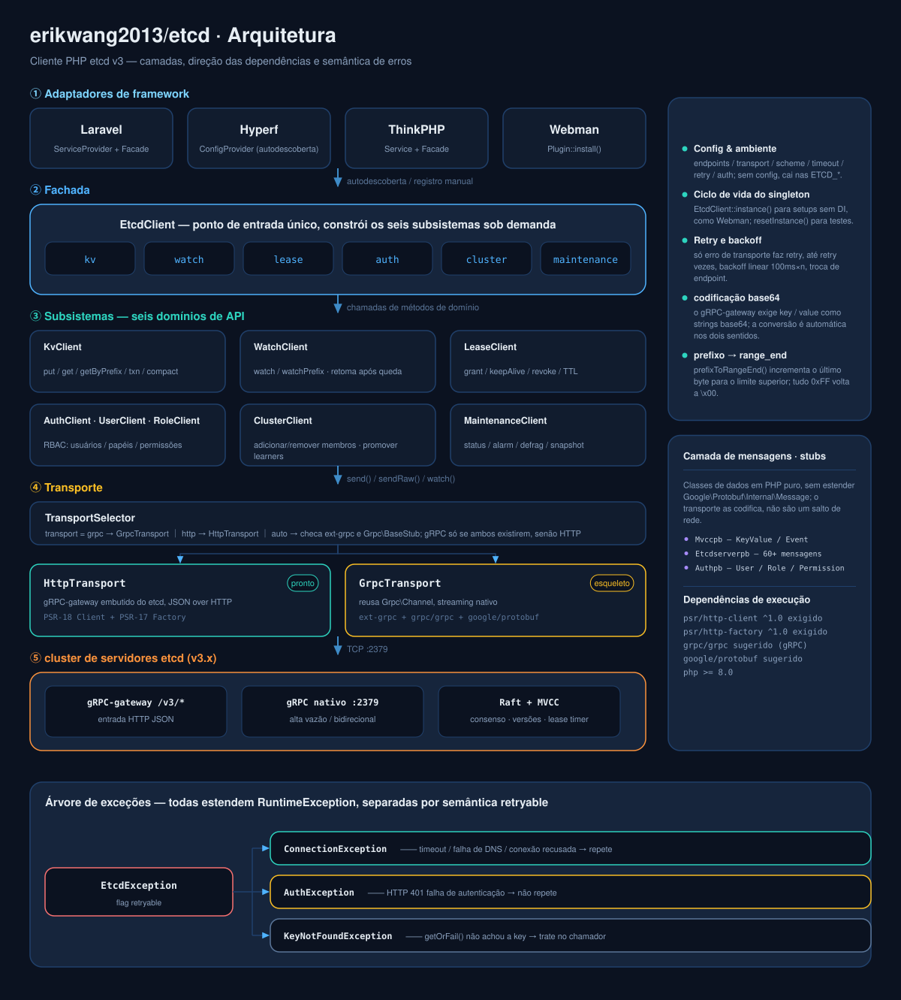
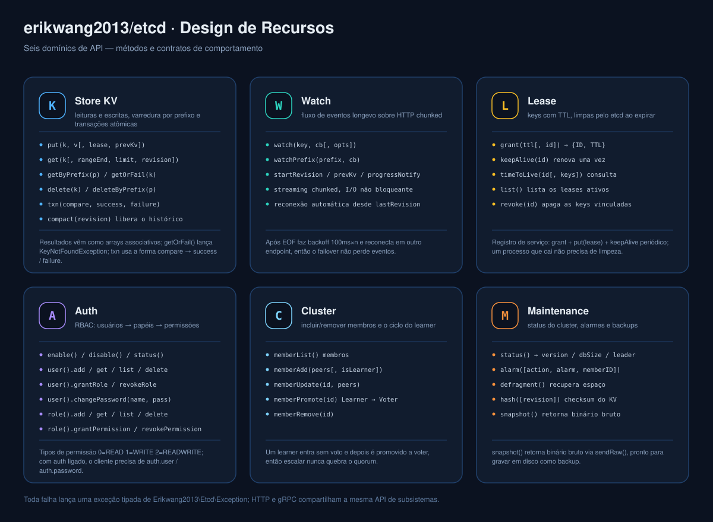
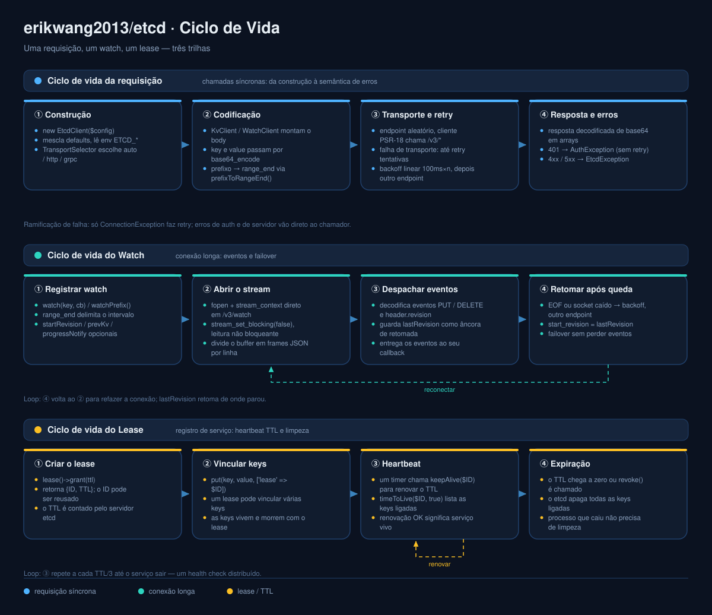

# erikwang2013/etcd

<p align="center">
  <a href="../../README.md">简体中文</a> ·
  <a href="README.en.md">English</a> ·
  <a href="README.ko.md">한국어</a> ·
  <a href="README.ru.md">Русский</a> ·
  <a href="README.de.md">Deutsch</a> ·
  <a href="README.fr.md">Français</a> ·
  <a href="README.es.md">Español</a> ·
  <a href="README.pt.md">Português</a> ·
  <a href="README.hi.md">हिन्दी</a> ·
  <a href="README.ar.md">العربية</a> ·
  <a href="README.bn.md">বাংলা</a> ·
  <a href="README.id.md">Bahasa Indonesia</a> ·
  <a href="README.ja.md">日本語</a>
</p>

<p align="center">
  
</p>

<p align="center">
  <b>Etchy</b> · um elefantinho com um cluster Raft de três nós na cabeça e <code>k/v</code> e <code>rev</code> na ponta da tromba —<br/>
  ele guarda sua config e seus leases: reconecta sozinho quando cai, limpa sozinho quando expira.
</p>

Cliente PHP para etcd v3 — transporte duplo (HTTP completo / gRPC para RPCs unários), cobrindo toda a API do etcd v3 (KV / Watch / Lease / Auth / Cluster / Maintenance / Election / Lock), com adaptadores prontos para **Laravel / Hyperf / ThinkPHP / Webman**.

## Requisitos

- PHP >= 8.1
- Servidor etcd v3.x
- Basta um caminho HTTP: ext-curl, o wrapper de streams do PHP (allow_url_fopen) ou seu próprio cliente PSR-18 — escolhido automaticamente, com erro claro quando nenhum existe

## Instalação

```bash
composer require erikwang2013/etcd
```

### PHP puro (sem framework)

Sem framework, sem implementação PSR-18 e sem ext-curl — se o ext-curl estiver carregado ele é usado, senão o cliente recorre ao wrapper de streams do PHP.

```php
<?php
require __DIR__ . '/vendor/autoload.php';   // seu autoload

use Erikwang2013\Etcd\EtcdClient;

$etcd = new EtcdClient(['endpoints' => ['127.0.0.1:2379']]);

$etcd->kv()->put('/app/config', '{"debug":true}');
echo $etcd->kv()->getOrFail('/app/config')['value'], "\n";

// qual caminho está em uso: curl / stream / none
var_dump(Erikwang2013\Etcd\Transport\HttpTransport::detectDriver());
```

Force um caminho com `'driver' => 'stream'` (padrão `auto`). Se nenhum dos três estiver disponível, a requisição lança uma `ConnectionException` capturável explicando o que habilitar.

## Início rápido

```php
use Erikwang2013\Etcd\EtcdClient;

$etcd = new EtcdClient(['endpoints' => ['127.0.0.1:2379']]);

// escreve
$etcd->kv()->put('/app/config', '{"debug":true}');

// lê
$result = $etcd->kv()->get('/app/config');
print_r($result['kvs'][0]);  // ['key' => '/app/config', 'value' => '{"debug":true}', ...]

// lança exceção quando não encontra
$kv = $etcd->kv()->getOrFail('/app/config');

// varredura por prefixo
$all = $etcd->kv()->getByPrefix('/app/');
echo "{$all['count']} chaves\n";

// exclui
$etcd->kv()->delete('/app/config');
$etcd->kv()->deleteByPrefix('/cache/');

// escreve com lease (excluído automaticamente após 60 segundos)
$lease = $etcd->lease()->grant(60);
$etcd->kv()->put('/session/123', 'active', ['lease' => $lease['ID']]);

// renova
$etcd->lease()->keepAlive($lease['ID']);
```

## Configuração

```php
$etcd = new EtcdClient([
    'endpoints' => ['192.168.1.10:2379', '192.168.1.11:2379'],  // vários nós
    'transport' => 'auto',  // auto (padrão) | http | grpc
    'driver'    => 'auto',  // auto (padrão) | curl | stream
    'scheme'    => 'http',  // http (padrão) | https
    'timeout'   => 5.0,     // segundos
    'retry'     => 3,       // tentativas em falha de conexão
    'auth'      => [        // opcional; trocar as credenciais por um token exige https
        'user'     => 'root',
        'password' => 'secret',
    ],
]);
```

### Variáveis de ambiente

Sem config, estas são lidas automaticamente:

| Variável | Padrão | Descrição |
|------|--------|------|
| `ETCD_ENDPOINTS` | `127.0.0.1:2379` | endereços de nós separados por vírgula |
| `ETCD_TRANSPORT` | `auto` | auto / http / grpc |
| `ETCD_TIMEOUT` | `5.0` | timeout da requisição (segundos) |
| `ETCD_SCHEME` | `http` | http / https |
| `ETCD_RETRY` | `2` | tentativas de conexão |
| `ETCD_DRIVER` | `auto` | caminho HTTP: auto / curl / stream |
| `ETCD_USER` | — | usuário do etcd |
| `ETCD_PASSWORD` | — | senha do etcd |

## Referência da API

### KV — operações de chave/valor

```php
// escreve
$etcd->kv()->put('key', 'value', [
    'lease'       => 12345,    // vincula um ID de lease
    'prevKv'      => true,     // retorna o valor anterior
    'ignoreValue' => false,
    'ignoreLease' => false,
]);

// lê uma única chave
$etcd->kv()->get('/exact/key');

// lança se não encontrar
$kv = $etcd->kv()->getOrFail('/exact/key');

// varredura por prefixo
$etcd->kv()->getByPrefix('/prefix/');

// consulta por faixa (todos os parâmetros)
$etcd->kv()->get('/start', [
    'rangeEnd'    => '/startz',      // fim da faixa
    'limit'       => 100,             // máximo de resultados
    'revision'    => 42,              // revisão do snapshot
    'sortOrder'   => 'ascend',        // none | ascend | descend
    'sortTarget'  => 'key',           // key | version | create | mod | value
    'serializable'=> true,            // pula o consenso Raft (mais rápido, pode estar desatualizado)
    'keysOnly'    => true,            // só keys, sem values
    'countOnly'   => false,           // somente a contagem
    'minModRevision'    => 100,       // só keys modificadas a partir desta revisão
    'maxModRevision'    => 200,
    'minCreateRevision' => 100,       // filtrar por revisão de criação
    'maxCreateRevision' => 200,
]);

// exclui
$etcd->kv()->delete('/key');
$etcd->kv()->deleteByPrefix('/prefix/');
$etcd->kv()->delete('/key', ['prevKv' => true]);  // também retorna o valor excluído

// transação (CAS atômico)
$etcd->kv()->txn(
    compare: [
        ['result' => 0, 'target' => 3, 'key' => '/counter', 'value' => '100']
    ],
    success: [
        ['request_put' => ['key' => '/counter', 'value' => '101']]
    ],
    failure: [
        ['request_put' => ['key' => '/counter', 'value' => '1']]
    ]
);

// transação aninhada: um ramo pode conter outra transação
$etcd->kv()->txn(
    compare: [['result' => 0, 'target' => 3, 'key' => '/lock', 'value' => 'free']],
    success: [[
        'request_put' => ['key' => '/lock', 'value' => 'mine'],
        'request_txn' => [                       // transação interna
            'compare' => [['result' => 0, 'target' => 1, 'key' => '/lock', 'create_revision' => 0]],
            'success' => [['request_put' => ['key' => '/log', 'value' => 'acquired']]],
            'failure' => [],
        ],
    ]],
    failure: []
);

// compacta o histórico (libera espaço)
$etcd->kv()->compact(1000);
```

**Alvos de comparação (target):** `0`=VERSION, `1`=CREATE, `2`=MOD, `3`=VALUE, `4`=LEASE  
**Resultados de comparação (result):** `0`=EQUAL, `1`=GREATER, `2`=LESS, `3`=NOT_EQUAL

### Watch — notificações de mudança

```php
// observa uma única key (bloqueante; rode em corrotina ou processo separado)
$etcd->watch()->watch('/config/key', function (array $events) {
    foreach ($events as $event) {
        // $event: ['type' => 'PUT'|'DELETE', 'kv' => [...], 'prev_kv' => [...]|null]
        echo "{$event['type']} {$event['kv']['key']} = {$event['kv']['value']}\n";
    }
});

// observa todos os keys sob um prefixo
$etcd->watch()->watchPrefix('/config/', $callback, [
    'startRevision' => 100,       // começa de uma revisão
    'prevKv'        => true,      // eventos DELETE trazem o valor antigo
    'progressNotify'=> true,      // eventos vazios periódicos (heartbeat)
]);
```

**Parar um watch:** `watch()` bloqueia indefinidamente; entregue-lhe um `WatchHandle` e você poderá pará-lo de fora (a necessidade comum de um processo de longa duração encerrando por SIGTERM):

```php
use Erikwang2013\Etcd\Support\WatchHandle;

$handle = new WatchHandle();
pcntl_async_signals(true);
pcntl_signal(SIGTERM, fn() => $handle->cancel());

$etcd->watch()->watchPrefix('/config/', $onEvent, ['handle' => $handle]);
```

Depois de `cancel()`, `watch()` **retorna normalmente** (sem exceção, nada a capturar). Mesmo numa key ociosa ele sai em cerca de um segundo — o driver curl percebe pelo callback periódico do cURL, o driver stream por um ciclo ocioso de 200 ms de timeout de leitura.

**Reconexão:** quando a conexão do watch cai, ela se reinscreve a partir de `lastRevision + 1` (`start_revision` é **inclusivo**, retomar com o valor antigo reproduziria o último evento). O failover não perde eventos nem os entrega duas vezes.

**Política de retentativas:** só são repetidas as falhas que provam que a conexão nunca chegou a ser estabelecida (conexão recusada / falha de DNS), e RPCs somente leitura (range, status, memberlist etc.) toleram ainda 5xx e timeouts. Escritas que recebem 5xx ou timeout de leitura **não** são repetidas — a requisição pode já ter surtido efeito, e repeti-la aplica um CAS duas vezes ou até devolve uma «resposta falsamente confiante» (a retentativa vê a própria primeira escrita e relata um CAS que falhou quando na verdade venceu).

### Lease — TTL

```php
// cria um lease
$lease = $etcd->lease()->grant(300);             // TTL de 300 segundos
$lease = $etcd->lease()->grant(300, 99999);      // com ID de lease explícito

// renova uma vez
$result = $etcd->lease()->keepAlive($lease['ID']);
echo "TTL restante: {$result['TTL']}s";

// consulta o lease
$info = $etcd->lease()->timeToLive($lease['ID']);
$info = $etcd->lease()->timeToLive($lease['ID'], true);  // inclui as keys vinculadas

// lista todos os leases ativos
$leases = $etcd->lease()->list();

// revoga (todas as keys vinculadas são excluídas na hora)
$etcd->lease()->revoke($lease['ID']);
```

**Uso típico:** ao registrar o serviço, crie um lease e escreva sua key; depois chame `keepAlive()` periodicamente. Quando o serviço para, o lease expira e tudo é limpo automaticamente.

### Auth — autenticação e permissões

```php
$auth = $etcd->auth();

// === gestão de usuários ===
$auth->user()->add('alice', 'password123');          // cria um usuário
$auth->user()->get('alice');                         // inspeciona um usuário e seus papéis
$auth->user()->list();                               // lista os usuários
$auth->user()->changePassword('alice', 'newpass');    // troca a senha
$auth->user()->grantRole('alice', 'admin');          // concede um papel
$auth->user()->revokeRole('alice', 'admin');         // revoga um papel
$auth->user()->delete('alice');                      // exclui um usuário

// === gestão de papéis ===
$auth->role()->add('reader');                        // cria um papel
$auth->role()->get('reader');                        // inspeciona as permissões
$auth->role()->list();                               // lista os papéis

// concede uma permissão (permType: 0=READ, 1=WRITE, 2=READWRITE)
$auth->role()->grantPermission('reader', 0, '/data/', "\0");   // leitura do prefixo /data/
$auth->role()->grantPermission('writer', 2, '/data/', "\0");   // leitura e escrita
$auth->role()->revokePermission('reader', '/data/', "\0");     // revoga
$auth->role()->delete('reader');

// === chave de autenticação ===
$auth->enable();           // liga a autenticação
$auth->disable();          // desliga a autenticação
$status = $auth->status(); // ['enabled' => true, 'authRevision' => 5]
```

**Como a autenticação acontece:** o etcd v3 não aceita HTTP Basic — ele exige primeiro trocar as credenciais por um token (`POST /v3/auth/authenticate`) e depois enviar o token puro em `Authorization: <token>` (um prefixo `Bearer` também é recusado). Com `auth.user` / `auth.password` configurados, o cliente faz isso **automaticamente** e guarda o token em cache, reautenticando uma vez em um 401, sem chamada manual. Você também pode trocar por conta própria:

```php
$token = $etcd->auth()->authenticate('root', 'secret');  // o token obtido é reutilizado nas requisições seguintes
```

Enviar credenciais exige `scheme => 'https'`: em http puro o construtor recusa de imediato (para a senha nunca trafegar em claro).

### Cluster — gerenciamento do cluster

```php
// lista os membros
$members = $etcd->cluster()->memberList();

// adiciona um membro
$etcd->cluster()->memberAdd(['http://node3:2380']);        // membro votante
$etcd->cluster()->memberAdd(['http://node4:2380'], true);  // learner

// altera a peer URL de um membro
$etcd->cluster()->memberUpdate(123456, ['http://newnode:2380']);

// promove um learner a voter
$etcd->cluster()->memberPromote(789012);

// remove um membro
$etcd->cluster()->memberRemove(345678);
```

### Election — eleição de líder

```php
// candidatura: pegue um lease primeiro e entre na disputa; só retorna ao vencer, os perdedores esperam (limitado por $timeout)
$lease  = $etcd->lease()->grant(30);
$leader = $etcd->election()->campaign('/my-election', 'node-a', $lease['ID'], 5.0);
// → ['name' => ..., 'key' => ..., 'rev' => ..., 'lease' => ...]

// líder atual (null quando ninguém venceu)
$current = $etcd->election()->leader('/my-election');

// renunciar
$etcd->election()->resign($leader);
```

No gateway HTTP, `campaign()` é uma **resposta em buffer** — só retorna depois que você vence, então use `$timeout` para limitar a espera. Para acompanhar trocas de líder ao longo do tempo, use `observe()`.

**Atenção (armadilha silenciosa medida):** `proclaim()` / `resign()` exigem um **array descritor de líder completo** (name, key e rev, todos presentes). Faltando qualquer um, o etcd responde **HTTP 200 sem fazer nada** — parece liberação bem-sucedida, mas o líder continua lá. Por isso os dois métodos validam o descritor antes de enviar e lançam exceção se estiver incompleto; use sempre os retornos de `campaign()` / `leader()`, não monte o seu.

**Outros comportamentos medidos:** uma candidatura que falha no meio da requisição é **retirada** pelo servidor (então um timeout de `acquire()` pode relatar falha com segurança, sem virar um «detentor oculto»); sem ninguém eleito, `leader()` retorna `null` (o servidor responde 500 `election: no leader`, um estado normal e não um erro).

### Lock — lock distribuído

```php
$lock = $etcd->lock()->acquire('/my-lock', ttl: 30, timeout: 5.0);
// ... seção crítica ...
$etcd->lock()->release($lock);
```

**Esta é uma implementação no cliente sobre o Election, não um lock do servidor.** O gateway HTTP do etcd 3.5 **não expõe** `/v3/lock/*` (medido: 404), então a exclusão mútua vem de «candidatura Election + lease» — a mesma abordagem do pacote Go `concurrency` do próprio etcd. Se o detentor levar `SIGKILL`, o lock é liberado sozinho quando o lease expira, sem limpeza manual.

### Maintenance — operações

```php
// status do nó
$status = $etcd->maintenance()->status();
// ['version' => '3.5.0', 'dbSize' => 24576, 'leader' => 123, 'raftIndex' => 1000, ...]

// alarmes
$alarms = $etcd->maintenance()->alarm();                    // inspeciona os alarmes
$etcd->maintenance()->alarm(action: 2, alarm: 1);           // limpa o alarme NOSPACE

// desfragmenta (recupera espaço)
$etcd->maintenance()->defragment();

// verificação de hash do KV
$hash = $etcd->maintenance()->hash();

// snapshot (binário bruto, grave em arquivo)
$snapshot = $etcd->maintenance()->snapshot();
file_put_contents('/backup/etcd-snapshot.db', $snapshot);

// para bases grandes, grave em streaming para o disco: não leia a base inteira na memória
$bytes = $etcd->maintenance()->snapshotTo('/backup/etcd-snapshot.db');
// grava primeiro um arquivo temporário e só renomeia depois que o digest sha256
// dos últimos 32 bytes confere, então uma escrita interrompida nunca deixa um arquivo com cara de backup; retorna os bytes gravados.
```

## Modos de transporte

| Modo | Status | Requer | Ideal para |
|------|--------|------|---------|
| **HTTP** | disponível | ext-curl / streams / PSR-18 (qualquer um) | zero dependências de extensão, funciona na hora |
| **gRPC** | RPCs unários | ext-grpc + grpc/grpc + mensagens protobuf geradas | alta vazão; streaming e Election ainda exigem HTTP |
| **auto** | padrão | — | hoje equivale a `http` (veja abaixo) |

`auto` equivale a `http`: hoje o gRPC cobre apenas RPCs unários — chamadas de streaming como watch / snapshot, e também o Election, continuam tendo de passar por HTTP, então trocar automaticamente tiraria em silêncio metade dos recursos de quem tem a extensão instalada. Apenas um `'transport' => 'grpc'` explícito o seleciona.

**Estado atual do transporte gRPC (atenção):**
- **Implementado**: RPCs unários (`send()`) — classes de mensagem geradas com `protoc` a partir do `rpc.proto` do etcd v3.5; o corpo da requisição é montado como mensagens tipadas, e nomes e tipos de campo são garantidos pelo proto.
- **Não implementado**: chamadas de streaming como watch e snapshot, e `/v3/election/*` (esse é outro proto, `v3electionpb`) — esses caminhos são **recusados pelo nome** com a razão, sem falha silenciosa.
- **Sem verificação de ponta a ponta**: o ambiente de desenvolvimento deste projeto não tem `ext-grpc`, então abertura do canal, metadata de credenciais, `_simpleRequest`, timeouts e mapeamento de códigos de status são **escritos à mão seguindo o padrão de saída do grpc_php_plugin e nunca passaram por uma chamada real**. A geração de mensagens e a montagem das requisições têm testes; a ida e volta pela rede, não. Se for usar gRPC, valide você mesmo antes de ir para produção.

### Configurar um cliente HTTP PSR-18 manualmente

```php
use Erikwang2013\Etcd\Transport\HttpTransport;
use GuzzleHttp\Client;
use GuzzleHttp\Psr7\HttpFactory;

$transport = new HttpTransport(['127.0.0.1:2379'], ['timeout' => 3.0]);
$transport->setHttpClient(
    new Client(['timeout' => 3]),
    new HttpFactory(),
    new HttpFactory()
);
```

## Integração com frameworks

### Laravel

Instala e já funciona — o `extra.laravel` do composer.json descobre o ServiceProvider e o Facade automaticamente.

```php
// via Facade
use Etcd;
Etcd::kv()->put('/foo', 'bar');
$val = Etcd::kv()->get('/foo');

// via injeção de dependência
use Erikwang2013\Etcd\EtcdClient;

class MyService
{
    public function __construct(private EtcdClient $etcd) {}

    public function work(): void
    {
        $this->etcd->kv()->put('/key', 'value');
    }
}
```

Publique o arquivo de config:

```bash
php artisan vendor:publish --tag=etcd-config
# → config/etcd.php
```

`.env`:

```env
ETCD_ENDPOINTS=10.0.0.1:2379,10.0.0.2:2379
ETCD_USER=root
ETCD_PASSWORD=secret
```

### Hyperf

Instala e já funciona — o Hyperf descobre o `ConfigProvider` automaticamente.

```php
use Erikwang2013\Etcd\EtcdClient;
use Hyperf\Di\Annotation\Inject;

class MyService
{
    #[Inject]
    private EtcdClient $etcd;

    public function work(): void
    {
        $this->etcd->kv()->put('/key', 'value');
    }
}

// ou resolva direto
$etcd = make(EtcdClient::class);
```

Publique a config:

```bash
php bin/hyperf.php vendor:publish erikwang2013/etcd
# → config/autoload/etcd.php
```

### ThinkPHP

1. Depois de instalar, registre o service em `app/service.php`:

```php
return [
    Erikwang2013\Etcd\Adapter\ThinkPHP\Service::class,
];
```

2. Crie o arquivo `config/etcd.php`.

Uso:

```php
// via Facade
use think\facade\Etcd;
Etcd::kv()->put('/key', 'value');

// via container
app('etcd')->kv()->get('/key');
```

### Webman

Instala e já funciona, sem configuração extra.

```php
use Erikwang2013\Etcd\EtcdClient;

$etcd = EtcdClient::instance();
$etcd->kv()->put('/key', 'value');
```

Para personalizar, edite `plugin/erikwang2013/etcd/config/etcd.php`.

## Tratamento de erros

```php
use Erikwang2013\Etcd\Exception\{
    EtcdException,
    ConnectionException,
    AuthException,
    KeyNotFoundException,
};

try {
    $etcd->kv()->put('/key', 'value');
} catch (ConnectionException $e) {
    // o nó etcd está inacessível (falha de rede, nó fora do ar)
} catch (AuthException $e) {
    // falha de autenticação (usuário ou senha errados)
} catch (KeyNotFoundException $e) {
    // a key não existe (via getOrFail())
} catch (EtcdException $e) {
    // qualquer outro erro do servidor etcd
}
```

## Estrutura do projeto

```
erikwang2013/etcd/
├── composer.json                    # definição do pacote: autoload PSR-4 + descoberta Laravel / Hyperf
├── phpunit.xml.dist                 # config do PHPUnit (suítes unit / integration)
├── protos/                          # proto upstream do etcd v3.5 + script de geração + saída gerada (para gRPC)
├── .github/workflows/ci.yml         # portão antes do merge: matriz unit / base de sintaxe / integração / docs i18n
├── config/etcd.php                  # config padrão publicada em cada framework (lê as variáveis ETCD_*)
├── .github/workflows/release.yml    # publicação automática ao criar a tag
├── scripts/i18n/                    #   ferramentas de docs: catálogos, gerador de diagramas, verificação
├── docs/                            # documentação e diagramas
│   ├── design-cn.md                 #   documento de design
│   ├── i18n/                        #   READMEs e diagramas localizados em 13 idiomas
│   ├── pet.svg                      #   mascote do projeto Etchy
│   ├── architecture.svg             #   diagrama de arquitetura
│   ├── features.svg                 #   diagrama de design de recursos
│   └── lifecycle.svg                #   diagrama de ciclo de vida
├── src/
│   ├── EtcdClient.php               # fachada principal + singleton: acessores dos oito subsistemas
│   ├── Mascot.php                   # acesso ao mascote Etchy (svg / dataUri / path)
│   ├── Install.php                  # hook do plugin Webman (WEBMAN_PLUGIN)
│   ├── Transport/                   # camada de transporte
│   │   ├── TransportInterface.php   #   abstração: send / sendRaw / watch
│   │   ├── TransportSelector.php    #   seleção auto / http / grpc
│   │   ├── HttpTransport.php        #   transporte HTTP JSON (completo, pronto para uso)
│   │   ├── GrpcTransport.php        #   transporte gRPC (RPCs unários; streaming recusado com a razão)
│   │   └── GrpcStub.php             #   subclasse de Grpc\BaseStub (arquivo separado, não é carregado sem a extensão)
│   ├── Kv/KvClient.php              # leitura/escrita KV / varredura por prefixo / transações / compactação
│   ├── Watch/WatchClient.php        # notificações de Watch + retomada após queda
│   ├── Lease/LeaseClient.php        # lease grant / keepAlive / revoke
│   ├── Auth/                        # autenticação e autorização
│   │   ├── AuthClient.php           #   chave de autenticação e status
│   │   ├── UserClient.php           #   CRUD de usuários + vínculo de papéis
│   │   └── RoleClient.php           #   CRUD de papéis + permissões
│   ├── Cluster/ClusterClient.php    # gerenciamento de membros do cluster
│   ├── Election/                    # Election — eleição (campaign / leader / observe / resign)
│   ├── Lock/LockClient.php          # Lock — lock distribuído (sobre Election; o gateway não tem /v3/lock/*)
│   ├── Maintenance/                 # operações: status / alarm / defrag / snapshot
│   ├── Exception/                   # hierarquia de exceções
│   ├── Support/                     # decodificação compartilhada: KeyValue / Int64, WatchHandle de cancelamento
│   └── Adapter/                     # adaptadores de framework
│       ├── Laravel/                 #   ServiceProvider + Facade
│       ├── Hyperf/                  #   ConfigProvider
│       ├── ThinkPHP/                #   Service + Facade
│       └── Webman/                  #   Plugin
└── tests/
    ├── Unit/                        # testes unitários (por cliente / transporte / adaptador / classe de mensagem)
    ├── Integration/                 # testes de integração (contra um etcd real)
    └── Support/                     # FakeTransport, stubs HTTP PSR
```

## Arquitetura e diagramas de design

Três diagramas, organizados como estrutura → capacidades → linha do tempo. Clique em qualquer um para abrir o arquivo em tamanho real:

| Diagrama | Que pergunta responde | Arquivo |
|----|-----------|------|
| Arquitetura | em quais camadas se divide, para onde apontam as dependências, como os erros se ramificam | [`diagrams/pt/architecture.svg`](diagrams/pt/architecture.svg) |
| Design de recursos | quais métodos cada subsistema oferece e quais contratos de comportamento tem | [`diagrams/pt/features.svg`](diagrams/pt/features.svg) |
| Ciclo de vida | como uma requisição / um watch / um lease se desenrola | [`diagrams/pt/lifecycle.svg`](diagrams/pt/lifecycle.svg) |

### Arquitetura



### Design de recursos



### Ciclo de vida



### Usando o Etchy no código

A arte vem junto com o pacote e o `Mascot` é o único ponto de acesso, então um painel admin ou uma página de status não precisa de uma cópia própria:

```php
use Erikwang2013\Etcd\Mascot;

echo Mascot::svg();                                          // SVG bruto, inline direto
echo '';    // data URI, sem precisar de web root
copy(Mascot::path(), __DIR__ . '/public/etcd.svg');          // ou copie para onde você serve os assets
```

No Laravel você pode publicar direto em `public/`:

```bash
php artisan vendor:publish --tag=etcd-assets
# → public/vendor/etcd/pet.svg
```

## Apoie este projeto

<p align="center">
  <table>
    <tr>
      <td align="center"><b>WeChat</b></td>
      <td align="center"><b>Alipay</b></td>
    </tr>
    <tr>
      <td align="center"></td>
      <td align="center"></td>
    </tr>
  </table>
</p>

---

## License

MIT — Copyright (c) 2026 [erik](https://erik.xyz) <erik@erik.xyz>
