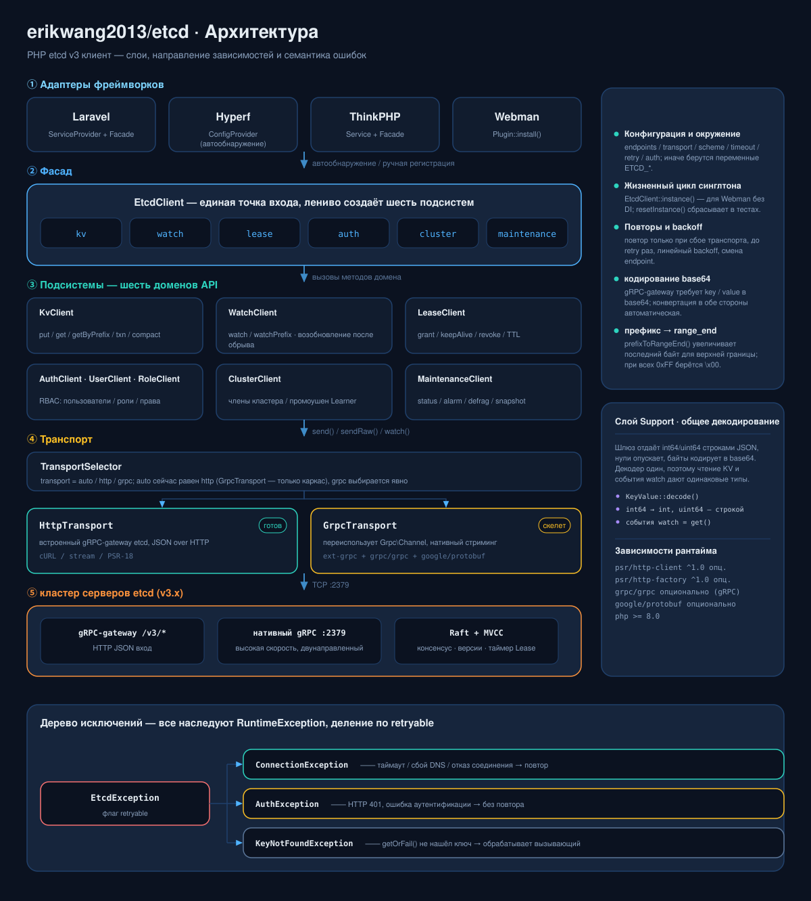
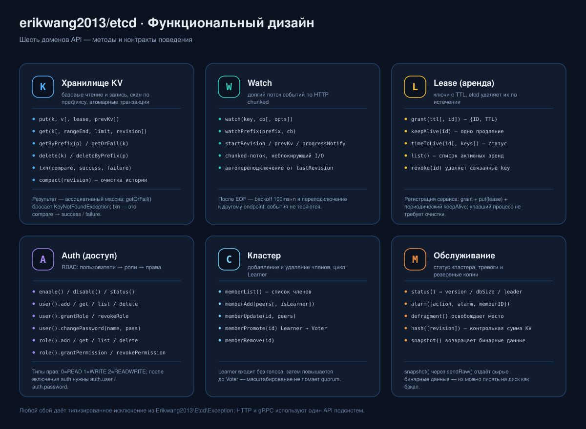
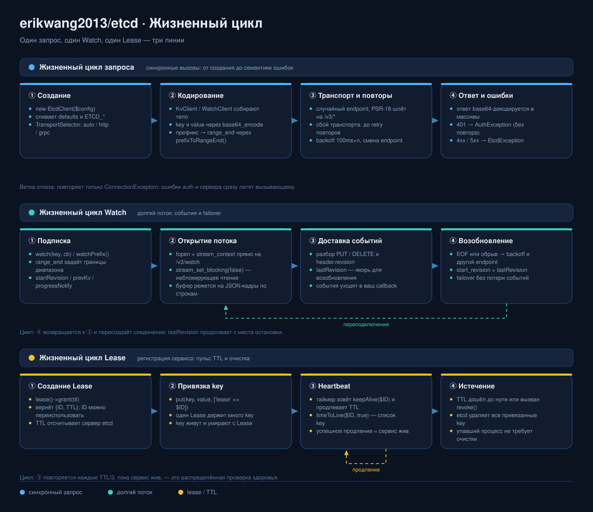

# erikwang2013/etcd

<p align="center">
  <a href="../../README.md">简体中文</a> ·
  <a href="README.en.md">English</a> ·
  <a href="README.ko.md">한국어</a> ·
  <a href="README.ru.md">Русский</a> ·
  <a href="README.de.md">Deutsch</a> ·
  <a href="README.fr.md">Français</a> ·
  <a href="README.es.md">Español</a> ·
  <a href="README.pt.md">Português</a> ·
  <a href="README.hi.md">हिन्दी</a> ·
  <a href="README.ar.md">العربية</a> ·
  <a href="README.bn.md">বাংলা</a> ·
  <a href="README.id.md">Bahasa Indonesia</a> ·
  <a href="README.ja.md">日本語</a>
</p>

<p align="center">
  
</p>

<p align="center">
  <b>Etchy</b> · слонёнок с трёхузловым кластером Raft на голове и <code>k/v</code> с <code>rev</code> на кончике хобота ——<br/>
  он бережёт ваши конфиги и Lease: оборвалась связь — переподключится, истёк срок — уберёт за собой.
</p>

PHP-клиент etcd v3 — двухрежимный транспорт gRPC + HTTP, покрывает весь API etcd v3 (KV / Watch / Lease / Auth / Cluster / Maintenance), из коробки работает с **Laravel / Hyperf / ThinkPHP / Webman**.

## Требования

- PHP >= 8.1
- сервер etcd v3.x
- Достаточно одного HTTP-пути: ext-curl, потоковая обёртка PHP (allow_url_fopen) или свой клиент PSR-18 — выбирается автоматически, при отсутствии всех выдаётся понятная ошибка

## Установка

```bash
composer require erikwang2013/etcd
```

### Чистый PHP (без фреймворка)

Не нужны ни фреймворк, ни реализация PSR-18, ни ext-curl: если ext-curl загружен, используется он, иначе клиент автоматически переходит на потоковую обёртку PHP.

```php
<?php
require __DIR__ . '/vendor/autoload.php';   // ваш autoload

use Erikwang2013\Etcd\EtcdClient;

$etcd = new EtcdClient(['endpoints' => ['127.0.0.1:2379']]);

$etcd->kv()->put('/app/config', '{"debug":true}');
echo $etcd->kv()->getOrFail('/app/config')['value'], "\n";

// какой путь используется сейчас: curl / stream / none
var_dump(Erikwang2013\Etcd\Transport\HttpTransport::detectDriver());
```

Принудительно задать путь: `'driver' => 'stream'` (по умолчанию `auto`). Если недоступны все три, запрос выбрасывает перехватываемый `ConnectionException` с подсказкой, что включить.

## Быстрый старт

```php
use Erikwang2013\Etcd\EtcdClient;

$etcd = new EtcdClient(['endpoints' => ['127.0.0.1:2379']]);

// запись
$etcd->kv()->put('/app/config', '{"debug":true}');

// чтение
$result = $etcd->kv()->get('/app/config');
print_r($result['kvs'][0]);  // ['key' => '/app/config', 'value' => '{"debug":true}', ...]

// если ключ не найден — исключение
$kv = $etcd->kv()->getOrFail('/app/config');

// сканирование по префиксу
$all = $etcd->kv()->getByPrefix('/app/');
echo "всего {$all['count']} записей\n";

// удаление
$etcd->kv()->delete('/app/config');
$etcd->kv()->deleteByPrefix('/cache/');

// запись с арендой (удаляется автоматически через 60 с)
$lease = $etcd->lease()->grant(60);
$etcd->kv()->put('/session/123', 'active', ['lease' => $lease['ID']]);

// продление
$etcd->lease()->keepAlive($lease['ID']);
```

## Конфигурация

```php
$etcd = new EtcdClient([
    'endpoints' => ['192.168.1.10:2379', '192.168.1.11:2379'],  // несколько узлов
    'transport' => 'auto',  // auto (по умолчанию) | http | grpc
    'driver'    => 'auto',  // auto (по умолчанию) | curl | stream
    'scheme'    => 'http',  // http (по умолчанию) | https
    'timeout'   => 5.0,     // секунды
    'retry'     => 3,       // число повторов при сбое подключения
    'auth'      => [        // необязательно, Basic Auth
        'user'     => 'root',
        'password' => 'secret',
    ],
]);
```

### Переменные окружения

Если конфиг не передан, переменные окружения читаются автоматически:

| Переменная | По умолчанию | Описание |
|------|--------|------|
| `ETCD_ENDPOINTS` | `127.0.0.1:2379` | Адреса нескольких узлов через запятую |
| `ETCD_TRANSPORT` | `auto` | auto / http / grpc |
| `ETCD_TIMEOUT` | `5.0` | Таймаут запроса (секунды) |
| `ETCD_SCHEME` | `http` | http / https |
| `ETCD_RETRY` | `2` | Число повторов подключения |
| `ETCD_DRIVER` | `auto` | путь HTTP: auto / curl / stream |
| `ETCD_USER` | — | Имя пользователя etcd |
| `ETCD_PASSWORD` | — | Пароль etcd |

## Справочник API

### KV — операции с ключами

```php
// запись
$etcd->kv()->put('key', 'value', [
    'lease'       => 12345,    // ID привязанной аренды
    'prevKv'      => true,     // вернуть значение до записи
    'ignoreValue' => false,
    'ignoreLease' => false,
]);

// чтение одного ключа
$etcd->kv()->get('/exact/key');

// не найдено — исключение
$kv = $etcd->kv()->getOrFail('/exact/key');

// сканирование по префиксу
$etcd->kv()->getByPrefix('/prefix/');

// запрос диапазона (все параметры)
$etcd->kv()->get('/start', [
    'rangeEnd'    => '/startz',      // key конца диапазона
    'limit'       => 100,             // максимум записей в ответе
    'revision'    => 42,              // номер версии снимка
    'sortOrder'   => 'ascend',        // none | ascend | descend
    'sortTarget'  => 'key',           // key | version | create | mod | value
    'serializable'=> true,            // пропустить консенсус Raft (быстрее, может устареть)
    'keysOnly'    => true,            // вернуть только key, без value
    'countOnly'   => false,           // вернуть только количество
]);

// удаление
$etcd->kv()->delete('/key');
$etcd->kv()->deleteByPrefix('/prefix/');
$etcd->kv()->delete('/key', ['prevKv' => true]);  // заодно вернуть удалённое значение

// транзакция (атомарный CAS)
$etcd->kv()->txn(
    compare: [
        ['result' => 0, 'target' => 3, 'key' => '/counter', 'value' => '100']
    ],
    success: [
        ['request_put' => ['key' => '/counter', 'value' => '101']]
    ],
    failure: [
        ['request_put' => ['key' => '/counter', 'value' => '1']]
    ]
);

// сжатие истории версий (освобождает место)
$etcd->kv()->compact(1000);
```

**Константы цели сравнения (target):** `0`=VERSION, `1`=CREATE, `2`=MOD, `3`=VALUE, `4`=LEASE  
**Константы результата сравнения (result):** `0`=EQUAL, `1`=GREATER, `2`=LESS, `3`=NOT_EQUAL

### Watch — отслеживание изменений

```php
// подписка на один key (блокирующий режим; лучше в корутине или отдельном процессе)
$etcd->watch()->watch('/config/key', function (array $events) {
    foreach ($events as $event) {
        // $event: ['type' => 'PUT'|'DELETE', 'kv' => [...], 'prev_kv' => [...]|null]
        echo "{$event['type']} {$event['kv']['key']} = {$event['kv']['value']}\n";
    }
});

// подписка на изменения всех key под префиксом
$etcd->watch()->watchPrefix('/config/', $callback, [
    'startRevision' => 100,       // начать с указанной версии
    'prevKv'        => true,      // событие DELETE вернёт прежнее значение
    'progressNotify'=> true,      // периодически шлёт пустые события (пульс)
]);
```

**Переподключение:** при обрыве соединения Watch автоматически продолжает с последней полученной revision — события не теряются.

### Lease — аренда

```php
// создание аренды
$lease = $etcd->lease()->grant(300);             // TTL 300 секунд
$lease = $etcd->lease()->grant(300, 99999);      // задать ID аренды

// продление (однократное)
$result = $etcd->lease()->keepAlive($lease['ID']);
echo "TTL осталось: {$result['TTL']} с";

// состояние аренды
$info = $etcd->lease()->timeToLive($lease['ID']);
$info = $etcd->lease()->timeToLive($lease['ID'], true);  // со списком привязанных key

// список всех активных аренд
$leases = $etcd->lease()->list();

// отзыв аренды (все привязанные key удаляются сразу)
$etcd->lease()->revoke($lease['ID']);
```

**Типичный сценарий:** при регистрации сервиса создаётся Lease и пишется key, по таймеру вызывается `keepAlive()` для продления; после остановки сервиса Lease истекает и всё убирается автоматически.

### Auth — аутентификация и права

```php
$auth = $etcd->auth();

// === управление пользователями ===
$auth->user()->add('alice', 'password123');          // создать пользователя
$auth->user()->get('alice');                         // пользователь и его роли
$auth->user()->list();                               // все пользователи
$auth->user()->changePassword('alice', 'newpass');    // смена пароля
$auth->user()->grantRole('alice', 'admin');          // выдать роль
$auth->user()->revokeRole('alice', 'admin');         // отозвать роль
$auth->user()->delete('alice');                      // удалить пользователя

// === управление ролями ===
$auth->role()->add('reader');                        // создать роль
$auth->role()->get('reader');                        // права роли
$auth->role()->list();                               // все роли

// выдача прав (permType: 0=READ, 1=WRITE, 2=READWRITE)
$auth->role()->grantPermission('reader', 0, '/data/', "\0");   // право чтения для префикса /data/
$auth->role()->grantPermission('writer', 2, '/data/', "\0");   // право чтения и записи
$auth->role()->revokePermission('reader', '/data/', "\0");     // отозвать права
$auth->role()->delete('reader');

// === включение и выключение auth ===
$auth->enable();           // включить auth
$auth->disable();          // выключить auth
$status = $auth->status(); // ['enabled' => true, 'authRevision' => 5]
```

**Внимание:** после включения auth клиент обязан задать `auth.user` и `auth.password`, иначе работать не сможет.

### Cluster — управление кластером

```php
// члены кластера
$members = $etcd->cluster()->memberList();

// добавить член
$etcd->cluster()->memberAdd(['http://node3:2380']);        // добавить Voting-член
$etcd->cluster()->memberAdd(['http://node4:2380'], true);  // добавить Learner-член

// изменить peer URL члена
$etcd->cluster()->memberUpdate(123456, ['http://newnode:2380']);

// повысить Learner до Voter
$etcd->cluster()->memberPromote(789012);

// удалить член
$etcd->cluster()->memberRemove(345678);
```

### Maintenance — обслуживание

```php
// состояние узла
$status = $etcd->maintenance()->status();
// ['version' => '3.5.0', 'dbSize' => 24576, 'leader' => 123, 'raftIndex' => 1000, ...]

// управление тревогами
$alarms = $etcd->maintenance()->alarm();                    // посмотреть тревоги
$etcd->maintenance()->alarm(action: 2, alarm: 1);           // снять тревогу NOSPACE

// дефрагментация (возвращает место)
$etcd->maintenance()->defragment();

// проверка хеша KV
$hash = $etcd->maintenance()->hash();

// снимок (бинарные данные, можно писать в файл)
$snapshot = $etcd->maintenance()->snapshot();
file_put_contents('/backup/etcd-snapshot.db', $snapshot);
```

## Режимы транспорта

| Режим | Состояние | Зависимости | Когда применять |
|------|------|------|---------|
| **HTTP** | готов | ext-curl / streams / PSR-18 (любой) | без расширений, доступен сразу |
| **gRPC** | скелет | ext-grpc + grpc/grpc + google/protobuf | высокая скорость, нативный стриминг |
| **auto** | по умолчанию | автоопределение | есть gRPC — используем gRPC, иначе HTTP |

Логика определения режима `auto`:
1. `extension_loaded('grpc')` — C-расширение загружено?
2. `class_exists('Grpc\BaseStub')` — composer-пакет `grpc/grpc` установлен?

gRPC используется, только если выполнено и то и другое; иначе — откат на HTTP.

### Ручная настройка HTTP-клиента PSR-18

```php
use Erikwang2013\Etcd\Transport\HttpTransport;
use GuzzleHttp\Client;
use GuzzleHttp\Psr7\HttpFactory;

$transport = new HttpTransport(['127.0.0.1:2379'], ['timeout' => 3.0]);
$transport->setHttpClient(
    new Client(['timeout' => 3]),
    new HttpFactory(),
    new HttpFactory()
);
```

## Интеграция с фреймворками

### Laravel

Работает сразу после установки. `extra.laravel` в composer.json автоматически обнаруживает ServiceProvider и Facade.

```php
// через Facade
use Etcd;
Etcd::kv()->put('/foo', 'bar');
$val = Etcd::kv()->get('/foo');

// через внедрение зависимостей
use Erikwang2013\Etcd\EtcdClient;

class MyService
{
    public function __construct(private EtcdClient $etcd) {}

    public function work(): void
    {
        $this->etcd->kv()->put('/key', 'value');
    }
}
```

Публикация файла конфигурации:

```bash
php artisan vendor:publish --tag=etcd-config
# → config/etcd.php
```

Конфигурация `.env`:

```env
ETCD_ENDPOINTS=10.0.0.1:2379,10.0.0.2:2379
ETCD_USER=root
ETCD_PASSWORD=secret
```

### Hyperf

Работает сразу после установки. Hyperf сам обнаруживает `ConfigProvider`.

```php
use Erikwang2013\Etcd\EtcdClient;
use Hyperf\Di\Annotation\Inject;

class MyService
{
    #[Inject]
    private EtcdClient $etcd;

    public function work(): void
    {
        $this->etcd->kv()->put('/key', 'value');
    }
}

// или сразу make
$etcd = make(EtcdClient::class);
```

Публикация конфига:

```bash
php bin/hyperf.php vendor:publish erikwang2013/etcd
# → config/autoload/etcd.php
```

### ThinkPHP

1. После установки зарегистрируйте сервис в `app/service.php`:

```php
return [
    Erikwang2013\Etcd\Adapter\ThinkPHP\Service::class,
];
```

2. Создайте файл конфигурации `config/etcd.php`.

Использование:

```php
// через Facade
use think\facade\Etcd;
Etcd::kv()->put('/key', 'value');

// через контейнер
app('etcd')->kv()->get('/key');
```

### Webman

Работает сразу после установки, дополнительная настройка не нужна.

```php
use Erikwang2013\Etcd\EtcdClient;

$etcd = EtcdClient::instance();
$etcd->kv()->put('/key', 'value');
```

Если нужен свой конфиг, отредактируйте `plugin/erikwang2013/etcd/config/etcd.php`.

## Обработка исключений

```php
use Erikwang2013\Etcd\Exception\{
    EtcdException,
    ConnectionException,
    AuthException,
    KeyNotFoundException,
};

try {
    $etcd->kv()->put('/key', 'value');
} catch (ConnectionException $e) {
    // узел etcd недоступен (сеть, падение)
} catch (AuthException $e) {
    // ошибка аутентификации (неверный логин или пароль)
} catch (KeyNotFoundException $e) {
    // при getOrFail() ключа нет
} catch (EtcdException $e) {
    // прочие ошибки сервера etcd
}
```

## Структура проекта

```
erikwang2013/etcd/
├── composer.json                    # описание пакета: автозагрузка PSR-4 + автообнаружение Laravel / Hyperf
├── phpunit.xml                      # конфиг PHPUnit (наборы unit / integration)
├── config/etcd.php                  # конфиг по умолчанию для публикации (читает переменные ETCD_*)
├── .github/workflows/release.yml    # автопубликация при создании тега
├── scripts/i18n/                    #   инструменты документации: каталоги, сборка схем, проверка переводов
├── docs/                            # документация и схемы
│   ├── design-cn.md                 #   документ с дизайном
│   ├── i18n/                        #   README и локализованные схемы на 13 языках
│   ├── pet.svg                      #   талисман проекта Etchy
│   ├── architecture.svg             #   схема архитектуры
│   ├── features.svg                 #   схема функционального дизайна
│   └── lifecycle.svg                #   схема жизненного цикла
├── src/
│   ├── EtcdClient.php               # верхний фасад + синглтон: kv / watch / lease / auth / cluster / maintenance
│   ├── Mascot.php                   # точка доступа к талисману Etchy (svg / dataUri / path)
│   ├── Install.php                  # хук плагина Webman (WEBMAN_PLUGIN)
│   ├── Transport/                   # транспортный слой
│   │   ├── TransportInterface.php   #   абстракция транспорта: send / sendRaw / watch
│   │   ├── TransportSelector.php    #   автовыбор auto / http / grpc
│   │   ├── HttpTransport.php        #   транспорт HTTP JSON (полностью готов)
│   │   └── GrpcTransport.php        #   транспорт gRPC (скелет)
│   ├── Kv/KvClient.php              # чтение и запись KV / скан по префиксу / транзакции / сжатие
│   ├── Watch/WatchClient.php        # отслеживание изменений Watch + возобновление после обрыва
│   ├── Lease/LeaseClient.php        # аренда Lease: grant / keepAlive / revoke
│   ├── Auth/                        # аутентификация и права Auth
│   │   ├── AuthClient.php           #   включение и состояние auth
│   │   ├── UserClient.php           #   CRUD пользователей + привязка ролей
│   │   └── RoleClient.php           #   CRUD ролей + права
│   ├── Cluster/ClusterClient.php    # управление членами кластера Cluster
│   ├── Maintenance/                 # обслуживание Maintenance: status / alarm / defrag / snapshot
│   ├── Exception/                   # иерархия исключений
│   ├── Protobuf/                    # стабы сообщений (чистые PHP-классы данных, не наследуют Message)
│   │   ├── Mvccpb/                  #   KeyValue, Event
│   │   ├── Etcdserverpb/            #   60+ сообщений запроса / ответа
│   │   └── Authpb/                  #   User, Role, Permission
│   └── Adapter/                     # адаптеры фреймворков
│       ├── Laravel/                 #   ServiceProvider + Facade
│       ├── Hyperf/                  #   ConfigProvider
│       ├── ThinkPHP/                #   Service + Facade
│       └── Webman/                  #   Plugin
└── tests/
    ├── Unit/                        # unit-тесты (по клиентам / транспорту / адаптерам / классам сообщений)
    ├── Integration/                 # интеграционные тесты (против настоящего etcd)
    └── Support/                     # FakeTransport, HTTP-стабы PSR
```

## Архитектура и схемы

Три схемы выстроены как «структура → возможности → сценарии», каждую можно открыть отдельно:

| Схема | На какой вопрос отвечает | Файл |
|----|-----------|------|
| Архитектура | на какие слои делится, куда направлены зависимости, как делятся ошибки | [`docs/architecture.svg`](diagrams/ru/architecture.svg) |
| Функциональная схема | какие методы даёт каждая подсистема и какие у них контракты | [`docs/features.svg`](diagrams/ru/features.svg) |
| Жизненный цикл | как проходит один запрос / один Watch / один Lease | [`docs/lifecycle.svg`](diagrams/ru/lifecycle.svg) |

### Архитектура



### Функциональная схема



### Жизненный цикл



### Использование Etchy в коде

Графика поставляется вместе с пакетом, `Mascot` — единственная точка входа: для админ-панели или страницы статуса не нужно копировать файлы себе.

```php
use Erikwang2013\Etcd\Mascot;

echo Mascot::svg();                                          // исходник SVG, вставляется инлайном
echo '';    // data URI, не зависит от web-каталога
copy(Mascot::path(), __DIR__ . '/public/etcd.svg');          // или положить в статический каталог
```

В Laravel можно опубликовать прямо в `public/`:

```bash
php artisan vendor:publish --tag=etcd-assets
# → public/vendor/etcd/pet.svg
```

## Поддержать проект

<p align="center">
  <table>
    <tr>
      <td align="center"><b>微信 / WeChat</b></td>
      <td align="center"><b>支付宝 / Alipay</b></td>
    </tr>
    <tr>
      <td align="center"></td>
      <td align="center"></td>
    </tr>
  </table>
</p>

---

## License

MIT — Copyright (c) 2026 [erik](https://erik.xyz) <erik@erik.xyz>
