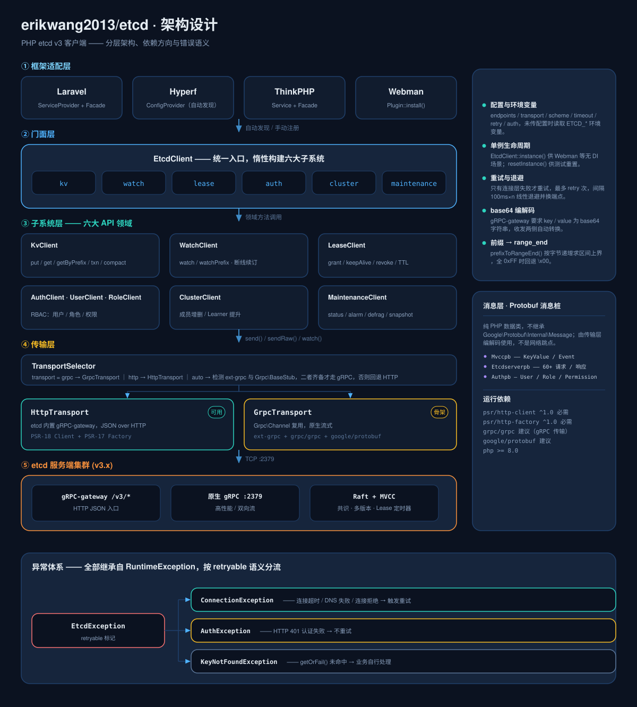
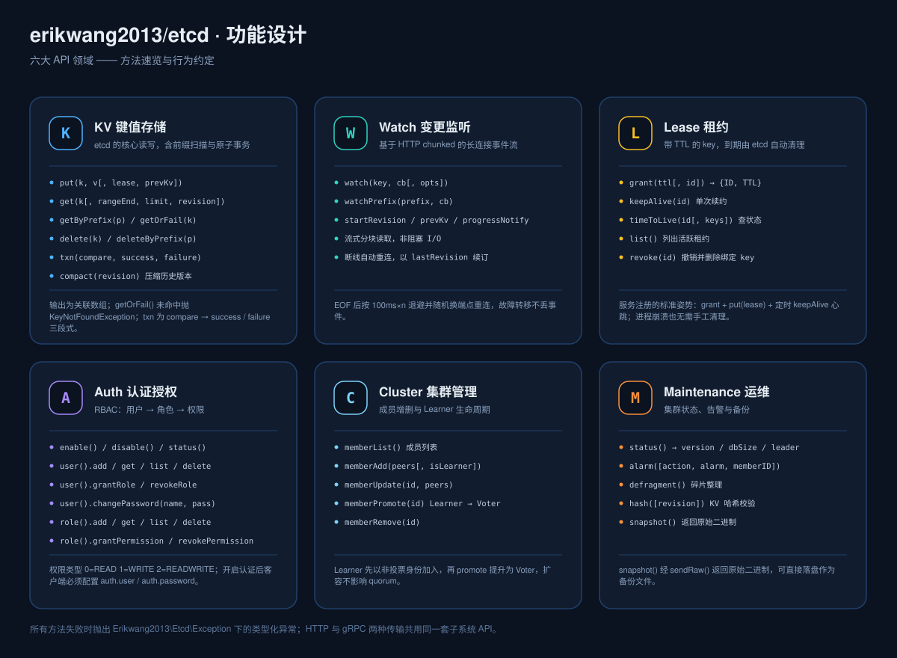
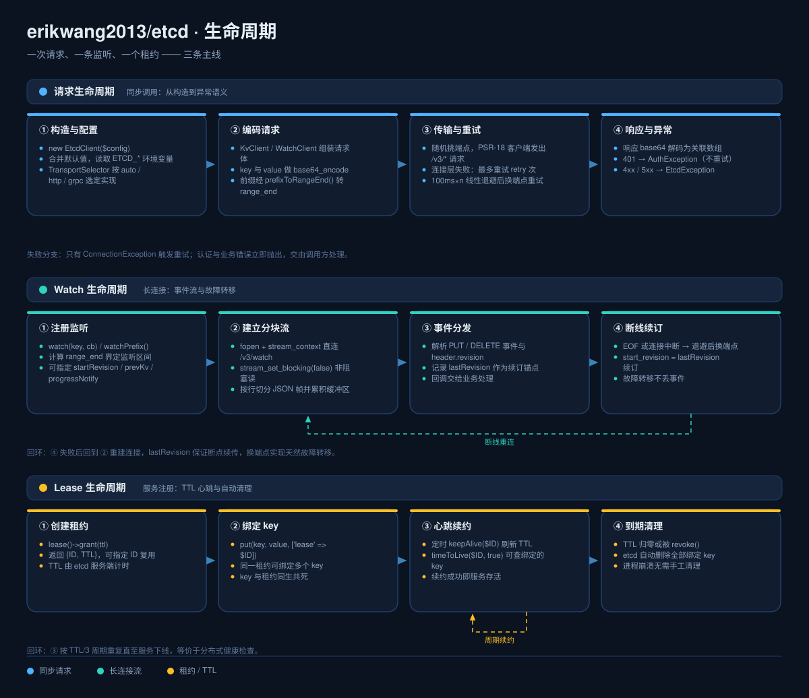

# erikwang2013/etcd

<p align="center">
  <a href="../../README.md">简体中文</a> ·
  <a href="README.en.md">English</a> ·
  <a href="README.ko.md">한국어</a> ·
  <a href="README.ru.md">Русский</a> ·
  <a href="README.de.md">Deutsch</a> ·
  <a href="README.fr.md">Français</a> ·
  <a href="README.es.md">Español</a> ·
  <a href="README.pt.md">Português</a> ·
  <a href="README.hi.md">हिन्दी</a> ·
  <a href="README.ar.md">العربية</a> ·
  <a href="README.bn.md">বাংলা</a> ·
  <a href="README.id.md">Bahasa Indonesia</a> ·
  <a href="README.ja.md">日本語</a>
</p>


<p align="center">
  <b>简体中文</b> ·
  <a href="../i18n/README.en.md">English</a> ·
  <a href="../i18n/README.ko.md">한국어</a> ·
  <a href="../i18n/README.ru.md">Русский</a> ·
  <a href="../i18n/README.de.md">Deutsch</a> ·
  <a href="../i18n/README.fr.md">Français</a> ·
  <a href="../i18n/README.es.md">Español</a> ·
  <a href="../i18n/README.pt.md">Português</a> ·
  <a href="../i18n/README.hi.md">हिन्दी</a> ·
  <a href="../i18n/README.ar.md">العربية</a> ·
  <a href="../i18n/README.bn.md">বাংলা</a> ·
  <a href="../i18n/README.id.md">Bahasa Indonesia</a> ·
  <a href="../i18n/README.ja.md">日本語</a>
</p>

<p align="center">
  
</p>

<p align="center">
  <b>Etchy</b> · 头顶三节点 Raft 集群、鼻尖挂着 <code>k/v</code> 与 <code>rev</code> 的小象 ——<br/>
  守着你的配置和租约：掉线自己重连，过期自己清理。
</p>

PHP etcd v3 客户端 —— 双模传输（HTTP 全功能 / gRPC 一元 RPC），覆盖 etcd v3 全部 API（KV / Watch / Lease / Auth / Cluster / Maintenance / Election / Lock），开箱适配 **Laravel / Hyperf / ThinkPHP / Webman**。

## 要求

- PHP >= 8.1
- etcd v3.x 服务端
- HTTP 通道任选其一即可：ext-curl、PHP 流封装（allow_url_fopen）、或自备 PSR-18 客户端 —— 自动选择，都不可用时给出明确提示

## 安装

```bash
composer require erikwang2013/etcd
```

### 裸 PHP（无框架）

不需要框架、不需要 PSR-18 实现、也不需要 ext-curl —— 加载了 ext-curl 就用它，缺失时自动回退到 PHP 自带的流封装。

```php
<?php
require __DIR__ . '/vendor/autoload.php';   // 你的 autoload

use Erikwang2013\Etcd\EtcdClient;

$etcd = new EtcdClient(['endpoints' => ['127.0.0.1:2379']]);

$etcd->kv()->put('/app/config', '{"debug":true}');
echo $etcd->kv()->getOrFail('/app/config')['value'], "\n";

// 当前实际使用哪条通道：curl / stream / none
var_dump(Erikwang2013\Etcd\Transport\HttpTransport::detectDriver());
```

强制指定通道用 `'driver' => 'stream'`（默认 `auto`）；三条通道都不可用时，请求抛出可捕获的 `ConnectionException` 并说明如何启用。

## 快速开始

```php
use Erikwang2013\Etcd\EtcdClient;

$etcd = new EtcdClient(['endpoints' => ['127.0.0.1:2379']]);

// 写入
$etcd->kv()->put('/app/config', '{"debug":true}');

// 读取
$result = $etcd->kv()->get('/app/config');
print_r($result['kvs'][0]);  // ['key' => '/app/config', 'value' => '{"debug":true}', ...]

// 找不到时抛异常
$kv = $etcd->kv()->getOrFail('/app/config');

// 前缀扫描
$all = $etcd->kv()->getByPrefix('/app/');
echo "共 {$all['count']} 条\n";

// 删除
$etcd->kv()->delete('/app/config');
$etcd->kv()->deleteByPrefix('/cache/');

// 带租约写入（60 秒后自动删除）
$lease = $etcd->lease()->grant(60);
$etcd->kv()->put('/session/123', 'active', ['lease' => $lease['ID']]);

// 续约
$etcd->lease()->keepAlive($lease['ID']);
```

## 配置

```php
$etcd = new EtcdClient([
    'endpoints' => ['192.168.1.10:2379', '192.168.1.11:2379'],  // 多节点
    'transport' => 'auto',  // auto（默认）| http | grpc
    'driver'    => 'auto',  // auto（默认）| curl | stream
    'scheme'    => 'http',  // http（默认）| https
    'timeout'   => 5.0,     // 秒
    'retry'     => 3,       // 连接失败重试次数
    'auth'      => [        // 可选；凭据换 token 需要 https
        'user'     => 'root',
        'password' => 'secret',
    ],
]);
```

### 环境变量

不传配置时自动读取环境变量：

| 变量 | 默认值 | 说明 |
|------|--------|------|
| `ETCD_ENDPOINTS` | `127.0.0.1:2379` | 逗号分隔的多节点地址 |
| `ETCD_TRANSPORT` | `auto` | auto / http / grpc |
| `ETCD_TIMEOUT` | `5.0` | 请求超时（秒） |
| `ETCD_SCHEME` | `http` | http / https |
| `ETCD_RETRY` | `2` | 连接重试次数 |
| `ETCD_DRIVER` | `auto` | HTTP 通道：auto / curl / stream |
| `ETCD_USER` | — | etcd 用户名 |
| `ETCD_PASSWORD` | — | etcd 密码 |

## API 参考

### KV — 键值操作

```php
// 写入
$etcd->kv()->put('key', 'value', [
    'lease'       => 12345,    // 绑定租约 ID
    'prevKv'      => true,     // 返回写入前的旧值
    'ignoreValue' => false,
    'ignoreLease' => false,
]);

// 读取单键
$etcd->kv()->get('/exact/key');

// 找不到即抛异常
$kv = $etcd->kv()->getOrFail('/exact/key');

// 前缀扫描
$etcd->kv()->getByPrefix('/prefix/');

// 范围查询（完整参数）
$etcd->kv()->get('/start', [
    'rangeEnd'    => '/startz',      // 范围结束 key
    'limit'       => 100,             // 最大返回条数
    'revision'    => 42,              // 快照版本号
    'sortOrder'   => 'ascend',        // none | ascend | descend
    'sortTarget'  => 'key',           // key | version | create | mod | value
    'serializable'=> true,            // 跳过 Raft 共识（更快，可能过期）
    'keysOnly'    => true,            // 只返回 key，不返回 value
    'countOnly'   => false,           // 只返回计数
    'minModRevision'    => 100,       // 只要修改版本 >= 100 的
    'maxModRevision'    => 200,
    'minCreateRevision' => 100,       // 按创建版本过滤
    'maxCreateRevision' => 200,
]);

// 删除
$etcd->kv()->delete('/key');
$etcd->kv()->deleteByPrefix('/prefix/');
$etcd->kv()->delete('/key', ['prevKv' => true]);  // 同时返回被删的值

// 事务（原子 CAS）
$etcd->kv()->txn(
    compare: [
        ['result' => 0, 'target' => 3, 'key' => '/counter', 'value' => '100']
    ],
    success: [
        ['request_put' => ['key' => '/counter', 'value' => '101']]
    ],
    failure: [
        ['request_put' => ['key' => '/counter', 'value' => '1']]
    ]
);

// 嵌套事务：分支里可以再放事务
$etcd->kv()->txn(
    compare: [['result' => 0, 'target' => 3, 'key' => '/lock', 'value' => 'free']],
    success: [[
        'request_put' => ['key' => '/lock', 'value' => 'mine'],
        'request_txn' => [                       // 内层事务
            'compare' => [['result' => 0, 'target' => 1, 'key' => '/lock', 'create_revision' => 0]],
            'success' => [['request_put' => ['key' => '/log', 'value' => 'acquired']]],
            'failure' => [],
        ],
    ]],
    failure: []
);

// 压缩历史版本（释放存储空间）
$etcd->kv()->compact(1000);
```

**比较目标（target）常量：** `0`=VERSION, `1`=CREATE, `2`=MOD, `3`=VALUE, `4`=LEASE  
**比较结果（result）常量：** `0`=EQUAL, `1`=GREATER, `2`=LESS, `3`=NOT_EQUAL

### Watch — 变更监听

```php
// 监听单个 key（阻塞模式，建议在协程/独立进程中运行）
$etcd->watch()->watch('/config/key', function (array $events) {
    foreach ($events as $event) {
        // $event: ['type' => 'PUT'|'DELETE', 'kv' => [...], 'prev_kv' => [...]|null]
        echo "{$event['type']} {$event['kv']['key']} = {$event['kv']['value']}\n";
    }
});

// 监听前缀下所有 key 的变更
$etcd->watch()->watchPrefix('/config/', $callback, [
    'startRevision' => 100,       // 从指定版本开始
    'prevKv'        => true,      // DELETE 事件返回原值
    'progressNotify'=> true,      // 定期发送空事件（心跳）
]);
```

**停止监听：** `watch()` 会一直阻塞，给它一个 `WatchHandle` 就能从外部停（长驻进程按 SIGTERM 收尾的常规需求）：

```php
use Erikwang2013\Etcd\Support\WatchHandle;

$handle = new WatchHandle();
pcntl_async_signals(true);
pcntl_signal(SIGTERM, fn() => $handle->cancel());

$etcd->watch()->watchPrefix('/config/', $onEvent, ['handle' => $handle]);
```

`cancel()` 之后 `watch()` **正常返回**（不抛异常，不需要 catch）。空闲的 key 上也会在一秒内退出——curl 驱动靠 cURL 的周期回调发现，stream 驱动靠 200ms 的读超时空闲周期。

**断线重连：** Watch 连接断开时自动从 `lastRevision + 1` 续订（`start_revision` 是**闭区间**语义，
用原值续订会重放最后一个事件）。故障转移不丢事件，也不重复投递。

**重试策略：** 只有**连接根本没建立**（拒绝连接 / DNS 失败）才会重试，且只读接口（range、status、memberlist 等）
额外容忍 5xx 与超时。写操作遇到 5xx 或读超时**不重试**——那可能已经生效，重放会让 CAS 这类请求被应用两次，
甚至拿到一个"自信的错答案"（重试看到自己第一次写入的结果，报告 CAS 失败而它其实赢了）。

### Lease — 租约

```php
// 创建租约
$lease = $etcd->lease()->grant(300);             // 300 秒 TTL
$lease = $etcd->lease()->grant(300, 99999);      // 指定租约 ID

// 续约（单次）
$result = $etcd->lease()->keepAlive($lease['ID']);
echo "TTL 剩余: {$result['TTL']} 秒";

// 查看租约状态
$info = $etcd->lease()->timeToLive($lease['ID']);
$info = $etcd->lease()->timeToLive($lease['ID'], true);  // 含绑定的 key 列表

// 列出所有活跃租约
$leases = $etcd->lease()->list();

// 撤销租约（绑定的所有 key 立即删除）
$etcd->lease()->revoke($lease['ID']);
```

**典型场景：** 服务注册时创建租约 + 写入 key，定时调用 `keepAlive()` 心跳续约；服务停止后租约到期自动清理。

### Auth — 认证与权限

```php
$auth = $etcd->auth();

// === 用户管理 ===
$auth->user()->add('alice', 'password123');          // 创建用户
$auth->user()->get('alice');                         // 查看用户及其角色
$auth->user()->list();                               // 列出所有用户
$auth->user()->changePassword('alice', 'newpass');    // 修改密码
$auth->user()->grantRole('alice', 'admin');          // 授权角色
$auth->user()->revokeRole('alice', 'admin');         // 撤销角色
$auth->user()->delete('alice');                      // 删除用户

// === 角色管理 ===
$auth->role()->add('reader');                        // 创建角色
$auth->role()->get('reader');                        // 查看角色权限
$auth->role()->list();                               // 列出所有角色

// 授予权限（permType: 0=READ, 1=WRITE, 2=READWRITE）
$auth->role()->grantPermission('reader', 0, '/data/', "\0");   // 对 /data/ 前缀的读权限
$auth->role()->grantPermission('writer', 2, '/data/', "\0");   // 读写权限
$auth->role()->revokePermission('reader', '/data/', "\0");     // 撤销权限
$auth->role()->delete('reader');

// === 认证开关 ===
$auth->enable();           // 开启认证
$auth->disable();          // 关闭认证
$status = $auth->status(); // ['enabled' => true, 'authRevision' => 5]
```

**认证是怎么发生的：** etcd v3 不接受 HTTP Basic —— 它要求先用凭据换取 token
（`POST /v3/auth/authenticate`），随后以裸 token 发送 `Authorization: <token>`（加 `Bearer` 前缀同样会被拒）。
配置了 `auth.user` / `auth.password` 后，客户端会**自动**完成这一步并缓存 token，401 时自动重新认证一次，
无需手工调用。也可以自己换：

```php
$token = $etcd->auth()->authenticate('root', 'secret');  // 换到的 token 会被后续请求复用
```

发送凭据需要 `scheme => 'https'`：明文 http 下构造函数会直接拒绝（避免密码裸奔）。

### Cluster — 集群管理

```php
// 查看集群成员
$members = $etcd->cluster()->memberList();

// 添加成员
$etcd->cluster()->memberAdd(['http://node3:2380']);        // 添加 Voting 成员
$etcd->cluster()->memberAdd(['http://node4:2380'], true);  // 添加 Learner 成员

// 修改成员 peer URL
$etcd->cluster()->memberUpdate(123456, ['http://newnode:2380']);

// Learner 提升为 Voter
$etcd->cluster()->memberPromote(789012);

// 移除成员
$etcd->cluster()->memberRemove(345678);
```

### Election — leader 选举

```php
// 竞选：拿到租约后参选；当选才返回，输着的人会等（用 $timeout 兜底）
$lease  = $etcd->lease()->grant(30);
$leader = $etcd->election()->campaign('/my-election', 'node-a', $lease['ID'], 5.0);
// → ['name' => ..., 'key' => ..., 'rev' => ..., 'lease' => ...]

// 当前 leader（无人当选返回 null）
$current = $etcd->election()->leader('/my-election');

// 让位
$etcd->election()->resign($leader);
```

`campaign()` 在 HTTP 网关上是一个**缓冲响应**——当选之前不返回，所以用 `$timeout` 约束等待。需要长期跟踪 leader 变化用 `observe()`。

**注意（实测的静默陷阱）：** `proclaim()` / `resign()` 需要**完整的 leader 描述数组**（name、key、rev 三者齐全）。少任何一个，etcd 会返回 **HTTP 200 却什么都不做**——看起来"释放成功"，leader 其实还在。所以这两个方法会在发送前校验描述符，不完整直接抛异常；请一律使用 `campaign()` / `leader()` 的返回值，不要自己拼。

**其它实测行为：** 请求中途失败的竞选会被服务端**撤回**（所以 `acquire()` 超时可以安全地报告失败，不会变成"隐藏的持有者"）；无人当选时 `leader()` 返回 `null`（服务端回 500 `election: no leader`，属正常状态而非错误）。

### Lock — 分布式锁

```php
$lock = $etcd->lock()->acquire('/my-lock', ttl: 30, timeout: 5.0);
// ... 临界区 ...
$etcd->lock()->release($lock);
```

**这是建在 Election 之上的客户端实现，不是服务端锁。** etcd 3.5 的 HTTP 网关**不暴露** `/v3/lock/*`（实测 404），所以互斥由「Election 竞选 + 租约」提供——与 etcd 自家 Go 的 `concurrency` 包同一做法。持有者被 `SIGKILL` 时，租约到期后锁自动释放，无需人工清理。

### Maintenance — 运维

```php
// 查看节点状态
$status = $etcd->maintenance()->status();
// ['version' => '3.5.0', 'dbSize' => 24576, 'leader' => 123, 'raftIndex' => 1000, ...]

// 告警管理
$alarms = $etcd->maintenance()->alarm();                    // 查看告警
$etcd->maintenance()->alarm(action: 2, alarm: 1);           // 清除 NOSPACE 告警

// 碎片整理（回收存储空间）
$etcd->maintenance()->defragment();

// KV 哈希校验
$hash = $etcd->maintenance()->hash();

// 获取快照（返回二进制数据，写入文件即可）
$snapshot = $etcd->maintenance()->snapshot();
file_put_contents('/backup/etcd-snapshot.db', $snapshot);

// 大库请用流式落盘：不把整个数据库读进内存
$bytes = $etcd->maintenance()->snapshotTo('/backup/etcd-snapshot.db');
// 先写临时文件、校验末尾 32 字节的 sha256 摘要通过后才改名，
// 所以中断不会留下一个"看着像备份"的残file；返回写入字节数。
```

## 传输模式

| 模式 | 状态 | 依赖 | 适用场景 |
|------|------|------|---------|
| **HTTP** | 可用 | ext-curl / 流封装 / PSR-18 任选其一 | 零扩展依赖，即刻可用 |
| **gRPC** | 一元 RPC | ext-grpc + grpc/grpc + 生成的 protobuf 消息 | 高性能；流式与 Election 需走 HTTP |
| **auto** | 默认 | — | 目前等同 `http`（见下） |

`auto` 与 `http` 等价：gRPC 目前只覆盖一元 RPC，watch / snapshot 这类流式调用以及 Election 都还必须走 HTTP，自动切过去只会让装了扩展的用户突然少一半功能。显式传 `'transport' => 'grpc'` 才会选中它。

**gRPC 传输的现状（请注意）：**
- **已实现**：一元 RPC（`send()`）——从 etcd v3.5 的 `rpc.proto` 用 `protoc` 生成消息类，请求体按类型化消息组装，字段名/类型由 proto 保证。
- **未实现**：watch、snapshot 等流式调用，以及 `/v3/election/*`（那是另一个 proto，`v3electionpb`）——这些路径会被**按名字拒绝**并说明原因，不会静默失败。
- **未端到端验证**：本项目的开发环境没有 `ext-grpc`，所以信道打开、凭据 metadata、`_simpleRequest`、超时与状态码映射都是**照 grpc_php_plugin 的输出模式手写、未跑过真实调用**。消息生成与请求组装有测试，网络往返没有。要走 gRPC 请自行验证后再上生产。

### 手动配置 PSR-18 HTTP 客户端

```php
use Erikwang2013\Etcd\Transport\HttpTransport;
use GuzzleHttp\Client;
use GuzzleHttp\Psr7\HttpFactory;

$transport = new HttpTransport(['127.0.0.1:2379'], ['timeout' => 3.0]);
$transport->setHttpClient(
    new Client(['timeout' => 3]),
    new HttpFactory(),
    new HttpFactory()
);
```

## 框架集成

### Laravel

安装即用。composer.json 的 `extra.laravel` 自动发现 ServiceProvider 和 Facade。

```php
// Facade 方式
use Etcd;
Etcd::kv()->put('/foo', 'bar');
$val = Etcd::kv()->get('/foo');

// 依赖注入方式
use Erikwang2013\Etcd\EtcdClient;

class MyService
{
    public function __construct(private EtcdClient $etcd) {}

    public function work(): void
    {
        $this->etcd->kv()->put('/key', 'value');
    }
}
```

发布配置文件：

```bash
php artisan vendor:publish --tag=etcd-config
# → config/etcd.php
```

`.env` 配置：

```env
ETCD_ENDPOINTS=10.0.0.1:2379,10.0.0.2:2379
ETCD_USER=root
ETCD_PASSWORD=secret
```

### Hyperf

安装即用。Hyperf 自动发现 `ConfigProvider`。

```php
use Erikwang2013\Etcd\EtcdClient;
use Hyperf\Di\Annotation\Inject;

class MyService
{
    #[Inject]
    private EtcdClient $etcd;

    public function work(): void
    {
        $this->etcd->kv()->put('/key', 'value');
    }
}

// 或者直接 make
$etcd = make(EtcdClient::class);
```

发布配置：

```bash
php bin/hyperf.php vendor:publish erikwang2013/etcd
# → config/autoload/etcd.php
```

### ThinkPHP

1. 安装后，在 `app/service.php` 中注册：

```php
return [
    Erikwang2013\Etcd\Adapter\ThinkPHP\Service::class,
];
```

2. 创建 `config/etcd.php` 配置文件。

使用：

```php
// Facade 方式
use think\facade\Etcd;
Etcd::kv()->put('/key', 'value');

// 容器方式
app('etcd')->kv()->get('/key');
```

### Webman

安装即用，无需额外配置。

```php
use Erikwang2013\Etcd\EtcdClient;

$etcd = EtcdClient::instance();
$etcd->kv()->put('/key', 'value');
```

如需自定义配置，编辑 `plugin/erikwang2013/etcd/config/etcd.php`。

## 异常处理

```php
use Erikwang2013\Etcd\Exception\{
    EtcdException,
    ConnectionException,
    AuthException,
    KeyNotFoundException,
};

try {
    $etcd->kv()->put('/key', 'value');
} catch (ConnectionException $e) {
    // etcd 节点无法连接（网络故障、宕机）
} catch (AuthException $e) {
    // 认证失败（用户名密码错误）
} catch (KeyNotFoundException $e) {
    // getOrFail() 时 key 不存在
} catch (EtcdException $e) {
    // 其他 etcd 服务端错误
}
```

## 项目结构

```
erikwang2013/etcd/
├── composer.json                    # 包定义：PSR-4 自动加载 + Laravel / Hyperf 自动发现
├── phpunit.xml.dist                 # PHPUnit 配置（unit / integration 两套套件）
├── protos/                          # etcd v3.5 上游 proto + 生成脚本 + 生成产物（gRPC 用）
├── .github/workflows/ci.yml         # 合并前门禁：单测矩阵 / 语法底线 / 集成 / i18n 文档
├── config/etcd.php                  # 默认配置，供各框架发布（读取 ETCD_* 环境变量）
├── .github/workflows/release.yml    # 打 tag 时自动发布
├── scripts/i18n/                    #   文档工具：词条目录、设计图生成、翻译校验
├── docs/                            # 文档与设计图
│   ├── design-cn.md                 #   设计文档
│   ├── i18n/                        #   13 种语言的 README 与本地化设计图
│   ├── pet.svg                      #   项目宠物 Etchy
│   ├── architecture.svg             #   架构设计图
│   ├── features.svg                 #   功能设计图
│   └── lifecycle.svg                #   生命周期图
├── src/
│   ├── EtcdClient.php               # 顶层门面 + 单例：八大子系统访问器
│   ├── Mascot.php                   # 项目宠物 Etchy 的取值入口（svg / dataUri / path）
│   ├── Install.php                  # Webman 插件钩子（WEBMAN_PLUGIN）
│   ├── Transport/                   # 传输层
│   │   ├── TransportInterface.php   #   传输抽象：send / sendRaw / watch
│   │   ├── TransportSelector.php    #   auto / http / grpc 自动选择
│   │   ├── HttpTransport.php        #   HTTP JSON 传输（完整可用）
│   │   ├── GrpcTransport.php        #   gRPC 传输（一元 RPC；流式拒绝并说明）
│   │   └── GrpcStub.php             #   Grpc\BaseStub 子类（独立文件，缺扩展时不加载）
│   ├── Kv/KvClient.php              # KV 读写 / 前缀扫描 / 事务 / 压缩
│   ├── Watch/WatchClient.php        # Watch 变更监听 + 断线续订
│   ├── Lease/LeaseClient.php        # Lease 租约 grant / keepAlive / revoke
│   ├── Auth/                        # Auth 认证授权
│   │   ├── AuthClient.php           #   认证开关与状态
│   │   ├── UserClient.php           #   用户 CRUD + 角色绑定
│   │   └── RoleClient.php           #   角色 CRUD + 权限
│   ├── Cluster/ClusterClient.php    # Cluster 集群成员管理
│   ├── Election/                    # Election 选举（campaign / leader / observe / resign）
│   ├── Lock/LockClient.php          # Lock 分布式锁（建在 Election 之上，网关无 /v3/lock/*）
│   ├── Maintenance/                 # Maintenance 运维：status / alarm / defrag / snapshot
│   ├── Exception/                   # 异常层次
│   ├── Support/                     # KeyValue / Int64 共用解码，WatchHandle 取消句柄
│   └── Adapter/                     # 框架适配器
│       ├── Laravel/                 #   ServiceProvider + Facade
│       ├── Hyperf/                  #   ConfigProvider
│       ├── ThinkPHP/                #   Service + Facade
│       └── Webman/                  #   Plugin
└── tests/
    ├── Unit/                        # 单元测试（逐客户端 / 传输 / 适配器 / 消息类）
    ├── Integration/                 # 集成测试（对接真实 etcd）
    └── Support/                     # FakeTransport、PSR HTTP 桩
```

## 架构与设计图

三张图按「结构 → 能力 → 时序」组织，可点击单独查看：

| 图 | 回答的问题 | 文件 |
|----|-----------|------|
| 架构设计 | 分成哪几层、依赖朝哪走、错误怎么分流 | [`docs/architecture.svg`](diagrams/zh/architecture.svg) |
| 功能设计 | 每个子系统提供哪些方法、有哪些行为约定 | [`docs/features.svg`](diagrams/zh/features.svg) |
| 生命周期 | 一次请求 / 一条监听 / 一个租约 各自怎么走完 | [`docs/lifecycle.svg`](diagrams/zh/lifecycle.svg) |

### 架构设计



### 功能设计



### 生命周期



### 在代码里用 Etchy

图形随包发布，`Mascot` 是唯一取值入口，做管理面板 / 状态页时不必再拷一份：

```php
use Erikwang2013\Etcd\Mascot;

echo Mascot::svg();                                          // SVG 源码，直接内联
echo '';    // data URI，不依赖 web 目录
copy(Mascot::path(), __DIR__ . '/public/etcd.svg');          // 或自行落到静态目录
```

Laravel 下可直接发布到 `public/`：

```bash
php artisan vendor:publish --tag=etcd-assets
# → public/vendor/etcd/pet.svg
```

## 开源不易，欢迎支持 / Support This Project

<p align="center">
  <table>
    <tr>
      <td align="center"><b>微信 / WeChat</b></td>
      <td align="center"><b>支付宝 / Alipay</b></td>
    </tr>
    <tr>
      <td align="center"></td>
      <td align="center"></td>
    </tr>
  </table>
</p>

---

## License

MIT — Copyright (c) 2026 [erik](https://erik.xyz) <erik@erik.xyz>
